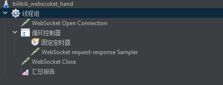

最近我针对自己项目里的 WebSocket 接口做了一次偏“建连与保活”方向的压测。原始目标很简单：

- 先验证 WebSocket 握手阶段是否稳定
- 再观察连接建立之后，心跳链路能不能持续工作

为了让结果不只停留在客户端视角，我同时在服务端加了 Micrometer 埋点，把握手次数、成功数、连接数、心跳收发情况都记录下来。这样一轮压测结束后，就可以把 JMeter 的客户端结果和服务端指标放在一起对照分析。

这篇文章就是对这次压测过程和结果的一次整理。

## 压测目标

这次压测并不是追求极限吞吐，而是想先回答两个更基础的问题：

1. 当前 WebSocket 握手链路是否稳定。
2. 建连成功后，心跳链路是否能可靠维持。

如果这两个基础能力都不稳定，那么后续无论继续优化 Spring WebSocket，还是切换到 Netty，都会缺少可靠的基线。

## 本轮压测配置

这次使用的是 JMeter 的 WebSocket 插件，通过 GUI 方式配置线程组、控制器和采样器。

核心配置如下：

- 线程数：`500`
- Ramp-Up：`60s`
- 线程组外层循环：`1`
- 单连接内部心跳循环：`10`
- 心跳间隔：`15000ms`
- WebSocket 读超时：`6000ms`
- 目标地址：`ws://150.158.146.80:8080/ws/im?token=...`

从测试行为上看，这轮压测大致等价于：

- `500` 个线程在 `60` 秒内逐步建立连接
- 每个连接最多发送 `10` 次心跳
- 最后再尝试主动关闭连接

下面这张图就是当时的 JMeter 脚本结构截图：



从结构上看，这次脚本比较聚焦，只覆盖了三类操作：

- `WebSocket Open Connection`
- `WebSocket request-response Sampler`
- `WebSocket Close`

也就是说，这轮结果主要反映的是“握手、心跳、关闭”这三个阶段的表现。

## 服务端埋点设计

为了避免只看客户端报错，我在服务端也补了一组 Micrometer 指标，用来观察真正到达后端的事件。

这次重点统计了下面这些指标：

- 握手尝试次数
- 握手成功次数
- 握手耗时
- 连接建立次数
- 心跳接收次数
- 心跳 ACK 发送成功/失败次数
- 非法消息次数
- 当前活跃会话数
- 当前在线用户数

当时对应的埋点代码大致如下：

```java
this.handshakeAttempts = Counter.builder("im.ws.handshake.attempts")
        .description("Total websocket handshake attempts")
        .register(meterRegistry);
this.handshakeSuccesses = Counter.builder("im.ws.handshake.success")
        .description("Successful websocket handshakes")
        .register(meterRegistry);
this.handshakeSuccessTimer = Timer.builder("im.ws.handshake.duration")
        .description("Websocket handshake duration")
        .tag("outcome", "success")
        .register(meterRegistry);
this.handshakeFailureTimer = Timer.builder("im.ws.handshake.duration")
        .description("Websocket handshake duration")
        .tag("outcome", "failure")
        .register(meterRegistry);

this.connectionOpenedCounter = Counter.builder("im.ws.connection.opened")
        .description("Opened websocket connections")
        .register(meterRegistry);
this.heartbeatReceivedCounter = Counter.builder("im.ws.heartbeat.received")
        .description("Received websocket heartbeats")
        .register(meterRegistry);
this.heartbeatAckSentCounter = Counter.builder("im.ws.heartbeat.ack.sent")
        .description("Sent websocket heartbeat acknowledgements")
        .register(meterRegistry);
this.heartbeatAckFailedCounter = Counter.builder("im.ws.heartbeat.ack.failed")
        .description("Failed websocket heartbeat acknowledgements")
        .register(meterRegistry);

Gauge.builder("im.ws.sessions.active", sessionRegistry, ImWebSocketSessionRegistry::countOpenSessions)
        .description("Current active websocket sessions")
        .register(meterRegistry);
Gauge.builder("im.ws.users.online", sessionRegistry, ImWebSocketSessionRegistry::countOnlineUsers)
        .description("Current online websocket users")
        .register(meterRegistry);
```

这样做的好处很明显：客户端看到的是“采样器是否成功”，服务端看到的是“请求是否真的到达并处理完成”。两边合在一起，才能把问题位置缩小。

## JMeter 客户端结果

### 核心统计

| 采样器 | 总次数 | 成功 | 失败 | 错误率 |
| --- | ---: | ---: | ---: | ---: |
| WebSocket Open Connection | 500 | 492 | 8 | 1.6% |
| WebSocket request-response Sampler | 5000 | 135 | 4865 | 97.3% |
| WebSocket Close | 500 | 0 | 500 | 100% |
| Total | 6000 | 627 | 5373 | 89.55% |

### 主要错误类型

| 错误类型 | 次数 |
| --- | ---: |
| `WebSocket I/O error: Connection reset by peer` | 4692 |
| `WebSocket I/O error: Read timed out` | 478 |
| `WebSocket I/O error: Connection reset` | 107 |
| `Sampler configured for using existing connection, but there is no connection` | 80 |
| `No connection; nothing to close.` | 8 |
| `WebSocket I/O error: Connect timed out` | 8 |

### 客户端视角下的第一结论

- 握手阶段整体可用，错误率只有 `1.6%`
- 心跳阶段几乎全部失败，错误率达到了 `97.3%`
- 关闭阶段全部失败，但这个结果更像前面连接已经失效后的连带现象

只看 JMeter 的话，很容易得出“后端 WebSocket 稳定性很差”的判断，但这还不够，因为客户端报错并不一定等于后端业务逻辑出错。

## 服务端埋点结果

### 服务端指标快照

会话与心跳：

- `im.ws.sessions.active = 1`
- `im.ws.users.online = 1`
- `im.ws.heartbeat.received = 143`
- `im.ws.heartbeat.ack.sent = 143`
- `im.ws.heartbeat.ack.failed = 0`

连接与握手：

- `im.ws.handshake.attempts = 494`
- `im.ws.handshake.success = 494`
- `im.ws.connection.opened = 494`
- `im.ws.connection.closed = 493`

关闭原因：

- `reason=code_1006`：`334`
- `reason=code_4500`：`158`
- `reason=code_1000`：`1`

### 服务端视角下的第一结论

- 握手阶段基本没有暴露出明显问题
- 只要心跳包真正到达后端，后端都成功返回了 ACK
- 大部分连接是在会话期内异常关闭，或者因为心跳不可靠而被清理

这说明“后端有没有收到消息”和“客户端最终有没有采样成功”并不是同一件事。

## 联合分析

### 为什么客户端和服务端数据会不一致

两边记录的不是同一个观察点：

- JMeter 记录的是客户端采样器结果
- 服务端记录的是真正到达应用侧之后的事件

因此：

- 客户端报错，不一定代表服务端处理逻辑出错
- 只有真正到达后端的握手和心跳，才会出现在服务端指标里

如果把一条握手请求拆开来看，它中间其实还隔着完整的一条链路：

`JMeter -> 本地网络 -> 公网链路 -> Nginx / 网关 -> 应用服务`

这就意味着，下面几种情况都会导致数字不一致：

- JMeter 发起了请求，但请求根本没到服务端
- 请求到了接入层，但还没真正进入应用
- 服务端已经判定握手成功，但客户端因为超时、连接抖动或插件行为，没有把它记成成功

所以客户端统计的是“我这边最终感知到的结果”，而服务端统计的是“真正进入应用并被处理的结果”。这两个数字接近时，通常说明大方向没问题；但它们不可能保证完全一致。

### 握手阶段基本正常

JMeter 结果：

- 建连 `500` 次
- 成功 `492` 次
- 失败 `8` 次

服务端结果：

- 握手尝试 `494` 次
- 成功 `494` 次
- 连接建立 `494` 次

把这两组数字放在一起看，其实能得到一个比较具体的解释：

- JMeter 一共发起了 `500` 次建连
- 服务端只看到了 `494` 次握手尝试

这说明至少有 `6` 次请求没有真正进入应用服务，它们更可能丢在客户端本地、网络链路或者接入层。

与此同时：

- JMeter 认为成功的是 `492`
- 服务端记录成功的是 `494`

这说明还有一小部分请求虽然已经被服务端成功处理，但客户端并没有把它们记成成功。这种情况通常和客户端插件的判定口径、超时设置、连接建立后立即断开等因素有关。

综合来看，握手阶段整体仍然是正常的。这里的差异更像发生在网络、接入层或者压测端本身，而不是应用里的握手逻辑。

### 真正的问题出在心跳维持阶段

JMeter 结果：

- 心跳采样总数 `5000`
- 成功 `135`
- 失败 `4865`

服务端结果：

- `heartbeat.received = 143`
- `heartbeat.ack.sent = 143`
- `heartbeat.ack.failed = 0`

这个对比非常关键，它说明了一件事：

> 后端 heartbeat 处理逻辑本身没有明显错误。只要心跳真正进入后端，后端就能稳定回 ACK。

所以问题不在“后端收到心跳之后处理失败”，而在“很多连接根本没能稳定地把心跳送到后端”，或者在发送前连接就已经失效了。

这一点和 JMeter 的错误类型也吻合：

- `Connection reset by peer`
- `Read timed out`
- `there is no connection to re-use`

### Close 全部失败并不是根因

JMeter 里 `WebSocket Close` 的失败率是 `100%`，但这并不代表服务端没有关闭连接。

服务端实际上记录到了：

- `connection.closed = 493`

这意味着更可能的情况是：当客户端执行到 `Close` 采样器时，连接早就已经断了，或者已经被服务端清理掉了。换句话说，`Close` 全部失败更像一个结果，而不是问题源头。

### 关闭原因也支持这个结论

从关闭原因看：

- `code_1006 = 334`
  说明大量连接属于异常关闭
- `code_4500 = 158`
  结合代码实现，极大概率对应 `SESSION_NOT_RELIABLE`
- `code_1000 = 1`
  正常关闭几乎没有

这进一步说明：当前问题集中在“会话稳定维持”这件事上，而不是单纯的握手或单条心跳处理。

## 最可能的问题位置


###  怀疑网络链路或接入层

第二个值得重点关注的是链路本身：

- 客户端到服务端之间存在公网抖动
- 入口层代理或网络设备对 WebSocket 长连接有额外影响
- 高并发下连接被中间层提前断开

如果压测机和服务端不在同地域、同 VPC 或同内网环境下，那么公网噪声会显著放大。


## 这轮压测是否有价值

我认为这轮压测方向本身是对的，因为它覆盖了两个很关键的能力：

- WebSocket 握手建连能力
- 建连后的心跳稳定性

这两个维度都很适合作为后续继续优化时的对照基线，比如：

- 当前 Spring WebSocket 实现的基线
- 未来切到 Netty 之后的对照数据

但这轮模型也有两个明显限制：

- 压测机和服务端看起来不在完全受控的同环境里
- `500` 连接共用同一个 token，和真实在线用户模型差距比较大

## 下一轮压测建议

如果我继续做下一轮，我会按这个顺序推进：

1. 把压测环境尽量放到和服务端同地域、同 VPC 或内网环境中，先降低公网噪声。
2. 改成多账号、多 token 模式，不再让 `500` 个连接共用一个 token。
3. 保持当前“线程组只跑 1 轮”的模型，避免无限循环污染结果。
4. 做分级并发压测：`20 -> 50 -> 100 -> 200 -> 500`。
5. 持续同时保留客户端报告和服务端埋点，对齐观察：
   - 握手成功数
   - 心跳收到数
   - ACK 成功数
   - 关闭原因分布
6. 如果后续要做 Spring 与 Netty 对比，务必保持相同场景、相同压测机和相同指标口径。

## 建议长期固定观察的关键指标

后续无论压 Spring 还是压 Netty，我都会固定关注这些指标：

- 握手成功率
- 握手 `p95` / `p99`
- 心跳成功率
- 心跳 ACK 发送成功率
- 异常关闭比例
- 心跳超时清理比例
- 峰值在线连接数
- JVM CPU / 内存 / GC
- Nginx 或入口层连接数与错误数

## 结论

这轮压测最终可以归纳成一句话：

> 当前服务端“握手能力基本正常，heartbeat 处理也基本正常”，真正暴露问题的是“长连接在会话维持阶段的稳定性”。

再往前推一步，其实还能得到一个更重要的判断：

> 在公网环境下直接做这类 WebSocket 压测，噪声会非常大，结果很容易混入压测端插件行为、网络抖动和接入层影响，因此很难单靠一轮结果判断到底是服务器问题还是压测链路问题。

所以这篇记录带给我的最大收获，不只是发现了“当前连接维持不稳定”，更是明确了下一轮压测应该优先先控制环境，再谈结论。  
