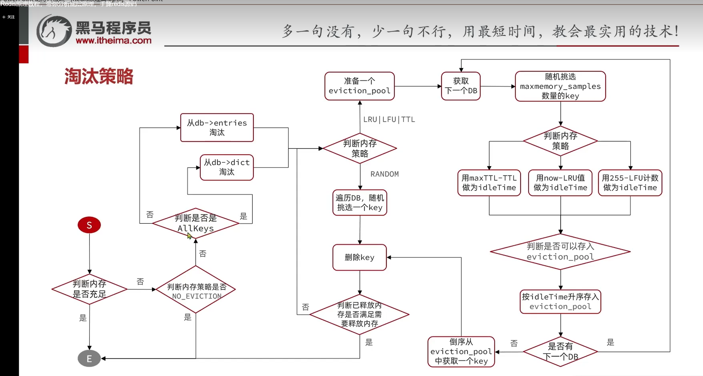

内存淘汰，是指当 Redis 的内存使用达到预设阈值后，主动挑选一部分键删除，以便继续为新的写入请求腾出空间。换句话说，它处理的不是“键是否过期”，而是“当前实例是否已经没有足够可用内存”这个问题。

在源码实现中，Redis 会在处理客户端命令的过程中尝试执行内存淘汰。也就是说，淘汰动作并不是一个完全独立于命令执行之外的后台流程，而是会在写请求推进过程中被触发，用来保证实例不会持续突破配置的内存上限。

Redis 在运行前就需要通过配置指定内存淘汰策略，而不同策略会影响对象内部如何记录访问信息。比如在采用 `LRU` 或 `LFU` 相关策略时，`redisObject` 结构中的关键字段就会承担“最近访问时间”或“访问频率”这类统计信息的存储职责：

```c
typedef struct redisObject {
    unsigned type:4;
    unsigned encoding:4;
    unsigned lru:LRU_BITS; /* 记录最后一次访问时间或访问频率 */
    int refcount;
    void *ptr;
} robj;
```

因此，内存淘汰策略并不只是“删除时选哪一个键”这么简单，它还会影响 Redis 在对象层面保存哪些元信息，以及后续如何根据这些信息判断淘汰目标。

## Redis 的内存淘汰策略

Redis 提供了多种内存淘汰策略，常见实现一共可以分为八种。理解这些策略时，可以先抓住两个维度：

- `allkeys` 表示淘汰范围是“所有键”；
- `volatile` 表示淘汰范围仅限于“设置了过期时间的键”。

在这个基础上，不同策略的区别主要体现在“按什么规则挑选要删除的键”：

- `noeviction`
  默认策略。不主动删除任何键；当内存达到上限后，新的写命令会直接报错，而读命令通常仍可继续执行。
- `allkeys-lru`
  在所有键中，优先淘汰最近最少使用的键。
- `volatile-lru`
  只在设置了过期时间的键中，优先淘汰最近最少使用的键。
- `allkeys-lfu`
  在所有键中，优先淘汰访问频率最低的键。
- `volatile-lfu`
  只在设置了过期时间的键中，优先淘汰访问频率最低的键。
- `allkeys-random`
  在所有键中随机选择一部分键进行淘汰。
- `volatile-random`
  只在设置了过期时间的键中随机淘汰。
- `volatile-ttl`
  只在设置了过期时间的键中进行选择，并优先淘汰那些“剩余存活时间更短”的键。

从分类上看，这些策略大致可以再分成两层：

- 第一层是“淘汰范围”，也就是在所有键里选择，还是只在带过期时间的键里选择；
- 第二层是“淘汰依据”，也就是按 `LRU`、`LFU`、随机，还是按剩余 `TTL` 来决定淘汰目标。

其中，真正需要额外维护访问信息的，主要是 `LRU` 和 `LFU` 两类策略。接下来可以先看 `LRU` 在 Redis 中是如何实现的。

### LRU

当一个键被访问时，Redis 会更新该对象内部用于记录访问信息的字段。对于 `LRU` 相关策略来说，这里的核心就是当前的全局 `LRU` 时钟，也就是 `server.lruclock`。

每次访问键时，Redis 都会把当前时钟值写入对应对象的 `redisObject->lru` 字段。这个动作本身非常轻量，本质上只是一次内存中的字段更新。

而在真正发生内存淘汰时，Redis 并不会对所有键做严格全量排序，而是通过采样的方式比较这些对象记录下来的 `lru` 值，从中挑选那些“距离当前时间更久没有被访问”的键，优先将它们淘汰出去。

### LFU

相比 `LRU` 记录“最近一次访问时间”，`LFU` 更关注的是“一个键被访问得有多频繁”。为了节省内存，Redis 并没有为 `LFU` 再额外增加一个新字段，而是继续复用了 `redisObject` 里原本那 `24 bit` 的 `lru` 字段。

在 `LFU` 模式下，这 `24 bit` 会被拆成两部分：

- 高 `16 bit` 用来记录上一次访问时间，精度是分钟级；
- 低 `8 bit` 用来记录访问频率计数器。

也就是说，在 `LFU` 策略下，这个字段虽然名字仍然叫 `lru`，但它保存的已经不再是单纯的“最近访问时钟”，而是“访问时间 + 频率计数器”的组合信息。

不过，`LFU` 的关键并不只是“访问一次就加一”。如果真的让计数器线性累加，那么高频热点键很快就会把计数打满，之后不同热点之间也就失去了区分度。为了解决这个问题，Redis 在底层实现里同时引入了“对数增长”和“定期衰减”两套机制。

#### 对数增长

在 `LFU` 模式下，计数器并不是每访问一次就必然加 `1`。Redis 使用的是一种近似对数增长的方式：计数器越大，继续增长就越困难。

源码里的核心逻辑可以概括为：

```text
p = 1 / (baseval * lfu-log-factor + 1)
```

Redis 会生成一个 `0` 到 `1` 之间的随机数，只有当这个随机数小于上面的概率时，计数器才会真正增加。这样一来，低频键在初期增长较快，而高频键想继续往上增长就会越来越难。

这里的增长速度还可以通过 `lfu-log-factor` 调整：

- `factor` 越大，计数器增长越慢；
- `factor` 越小，计数器增长越快。

因此，`LFU` 记录的并不是一个精确访问次数，而是一个经过压缩后的“访问热度近似值”。

#### 自动衰减

如果一个键曾经很热门，但后来几乎不再被访问，那么它的频率也不应该永久保持在高位。为此，Redis 还会在 `LFU` 中对计数器做衰减。

衰减的依据是高 `16 bit` 里记录的“上一次访问时间”。每次访问或参与淘汰比较时，Redis 都会先计算“距离上次访问已经过去了多少个衰减周期”，然后再把低 `8 bit` 的频率计数器减小。

这个衰减周期由 `lfu-decay-time` 控制，默认通常是 `1` 分钟。更准确地说：

- 如果经过了 `N` 个衰减周期，计数器就会减少 `N`；
- 如果减少后的结果小于 `0`，就直接归零。

也正因为存在这种衰减机制，`LFU` 并不是简单地“谁历史访问次数最多就永远保留谁”，而是会随着时间推移不断调整热点判断，让“过去的热点”逐渐失去优势。


## Redis 淘汰流程

接下来可以把 Redis 的实际淘汰流程串起来看一遍。整体上，它并不是“内存一满就立刻全量扫描所有键”，而是在写命令推进过程中检查当前内存是否超出限制；如果确实超过 `maxmemory`，才进入淘汰流程，按配置好的策略逐步删除键，直到内存重新回到目标范围内。



整个流程大致可以分成四步：

1. 触发淘汰  
   当 Redis 执行写命令时，会先检查当前实例的内存是否仍然充足。如果还没有达到 `maxmemory` 限制，那么命令继续正常执行；只有在内存不足时，才会真正进入淘汰逻辑。

2. 确定淘汰范围  
   Redis 会先根据当前策略判断，候选键到底来自哪里：
   - 如果是 `allkeys-*` 系列策略，候选键来自各个数据库保存实际数据的 `dict`；
   - 如果是 `volatile-*` 系列策略，候选键则来自保存过期键信息的字典，也就是带 `TTL` 的那部分键。

3. 判断是“随机淘汰”还是“按规则淘汰”  
   如果当前策略是 `allkeys-random` 或 `volatile-random`，Redis 就会在候选范围内随机选择键并删除，然后再次检查释放出的内存是否已经满足要求；如果还不够，就继续重复这个过程。

4. 使用 `eviction pool` 进行筛选  
   如果当前策略属于 `LRU`、`LFU` 或 `TTL` 这类“需要比较优先级”的淘汰方式，Redis 就不会简单随机删除，而是会先构造一个 `eviction pool`。它会遍历各个数据库，在每个数据库中随机抽取 `maxmemory_samples` 个候选键，对这些键执行对应的策略计算，例如比较最近访问时间、访问频率，或者剩余过期时间。然后，Redis 会把“更应该被淘汰”的键放入 `eviction pool` 中。

这里的 `eviction pool` 大小是有限的，因此并不是所有候选键都能进入这个池子，只有那些在当前比较结果里更接近淘汰条件的键，才会被保留下来。需要注意的是，`eviction pool` 本身是一个复用的候选池，而不是每轮淘汰都重新创建、结束后再整体清空的临时结构。Redis 会持续复用这块固定大小的空间，只是在取出候选键、发现候选键失效，或插入更合适的新候选项时，逐步更新池中的内容。

等所有数据库都完成一轮采样之后，Redis 再从 `eviction pool` 中取出最合适的目标键执行删除，并在每次删除后重新判断当前内存是否已经降到目标范围内。

因此，Redis 的淘汰流程本质上是一种“边采样、边筛选、边删除”的机制：

- 随机策略走的是“随机挑一个就删”的路径；
- `LRU`、`LFU`、`TTL` 这类策略走的是“先进入 `eviction pool` 比较，再挑最合适的删”的路径。

这样设计的目的，就是避免为了一次内存淘汰去全量扫描所有键，同时又能尽可能接近目标策略想要表达的语义。


