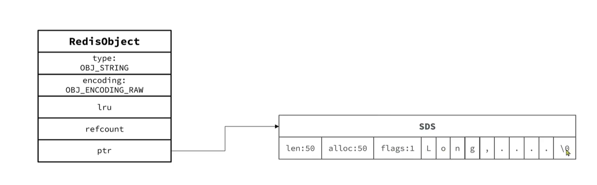
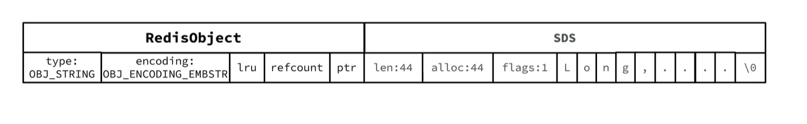
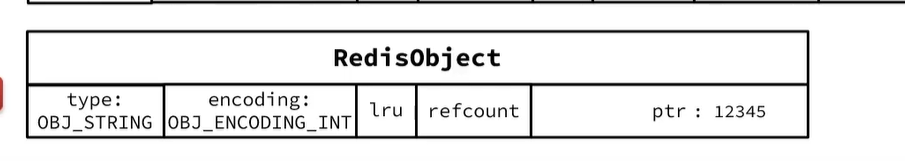
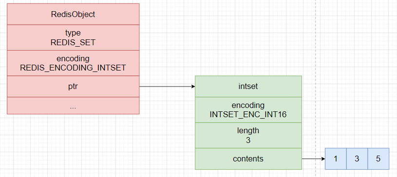
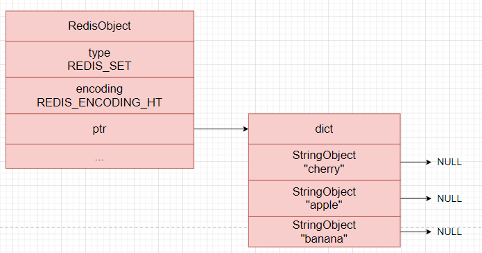
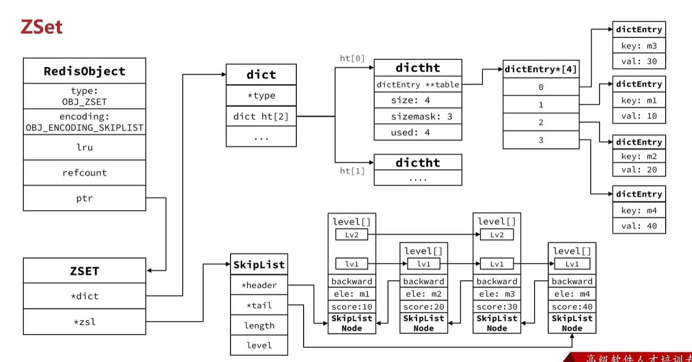
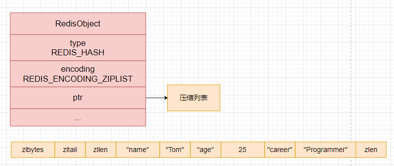
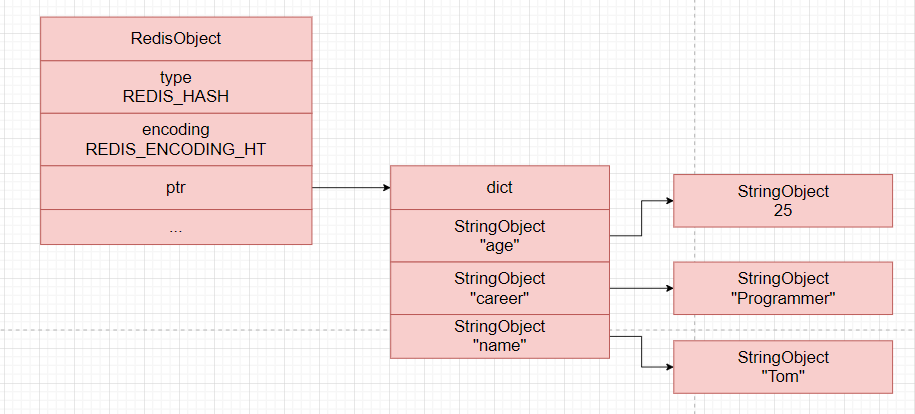

在理解了 Redis 常见底层数据结构之后，还需要继续往上一层看一个问题：Redis 对外提供的字符串、列表、哈希、集合和有序集合，究竟是怎样在对象层被统一管理的？

答案就是 `redisObject`。Redis 并不是直接把底层结构裸露给上层命令使用，而是先用一个统一的对象结构，把类型信息、编码方式、引用计数以及实际数据指针封装起来。也正因为有这一层抽象，Redis 才能在同一种逻辑数据类型下，根据数据规模和使用场景选择不同的底层编码实现。

## redisObject

`redisObject` 可以看作 Redis 对象系统的入口。对外暴露的数据值，最终都会以这个结构体为外层包装；而对象内部真正的数据内容，则由 `ptr` 指针指向具体的底层实现。

需要注意的是，数据库中的键名本身通常是 `sds`，并不是一个完整的 `redisObject`；真正与数据类型、编码方式直接关联的，主要是键对应的值对象。

源码中的定义大致如下：

```c
typedef struct redisObject {
    unsigned type:4;       // 对象的逻辑类型
    unsigned encoding:4;   // 对象当前采用的底层编码
    unsigned lru:24;       // LRU 时间戳或 LFU 统计信息
    int refcount;          // 引用计数
    void *ptr;             // 指向实际底层数据结构
} robj;
```

这个结构体里最值得关注的是下面几个字段：

- `type`  
  表示对象的逻辑类型，例如 `string`、`list`、`hash`、`set` 和 `zset`。它回答的是“这个值在 Redis 语义上是什么”。
- `encoding`  
  表示对象当前采用的底层编码方式。它回答的是“这个值此刻是以什么实现形式存放的”。同一种逻辑类型，可能会对应多种编码，例如字符串对象可能采用 `int`、`embstr`、`raw`，列表对象则可能采用 `quicklist`。更底层的具体数据结构，会继续由 `ptr` 指针指向。
- `lru`  
  这个字段名字虽然叫 `lru`，但它并不总是只服务于 `LRU`。在开启 `LFU` 相关策略时，这部分位还会被复用来记录访问频率和最近访问时间。
- `ptr`  
  指向真正的数据结构，例如 `sds`、`quicklist`、`dict`、`listpack` 或 `skiplist` 等。也就是说，`redisObject` 更像是“统一外壳”，而不是实际存储内容的全部本体。

因此，理解 Redis 数据类型时，不能只看“字符串底层是 `sds`”或“哈希底层可能是 `listpack` / `dict`”这样的结论，还要同时区分两个层次：

- 逻辑层：Redis 把它当作什么类型来处理；
- 编码层：Redis 当前选择了什么底层结构来承载这个对象。

后面再分析各种数据类型时，就可以沿着这条线展开：先看它的逻辑类型，再看它可能使用哪些编码，以及这些编码之间为什么会发生转换。

## String

`String` 是 Redis 中最基础、也最常用的数据类型。单个字符串值的最大长度上限是 `512MB`，但它在底层并不只有一种实现方式，而是会根据内容和长度在 `int`、`embstr`、`raw` 等编码之间切换。

当字符串较长，或者不再适合紧凑存储时，Redis 通常会使用 `raw` 编码。

### raw

在 `raw` 编码下，字符串对象的内容由 `SDS` 保存。此时，Redis 一般会分别分配两块内存：一块用于保存外层的 `redisObject`，另一块用于保存实际字符串内容对应的 `SDS` 结构。

`redisObject` 中的 `ptr` 指针指向 `SDS` 的字符数组起始位置。由于 `flags` 字段紧挨在字符数组前面，并且占用固定大小，Redis 可以通过偏移先取到 `flags`，再判断当前 `SDS` 属于哪一种 header 类型，进而继续解析前面头部中的 `len`、`alloc` 等元信息。



因此，`raw` 编码的关键点可以概括为两层：外层是负责记录类型和编码信息的 `redisObject`，内层则是负责真正存储字符串内容的 `SDS`。两者通过 `ptr` 连接起来，共同完成字符串对象的表示。

### embstr

在经典实现中，当字符串长度较短时，Redis 会使用 `embstr` 编码。一个常见阈值是字符串长度不超过 `44` 字节，此时 `redisObject` 和 `SDS` 会一次性分配在一段连续内存中。

这种布局的好处主要有两个：一是只需要一次内存分配，创建成本更低；二是对象头和字符串内容紧挨在一起，更容易提高缓存命中率。也正因为 `embstr` 更偏向“紧凑、只读式”的表示方式，当字符串发生修改时，Redis 往往会把它转换成 `raw` 编码。



### int

如果字符串对象保存的是一个可以用整数表示的值，Redis 还可能直接使用 `int` 编码。此时不会再单独创建 `SDS`，而是把整数值直接保存在 `redisObject` 的 `ptr` 中。

这种做法的重点不是“`ptr` 真的是一个普通指针”，而是 Redis 借用了这个字段的存储空间，把整数值按指针大小进行保存。对于纯整数场景，这样可以省掉额外的字符串结构和内存分配成本。



## List

从 Redis `3.2` 开始，`List` 的统一外层实现就是 `quicklist`。它把双向链表和紧凑存储块结合在一起，既保留了链表在头尾操作上的灵活性，又避免了传统链表“每个节点只存一个元素”带来的指针开销。

需要注意的是，`quicklist` 的节点内部在不同版本里会挂接不同的紧凑结构：较早版本通常是 `ziplist`，而较新版本中已经更多地演进为 `listpack`。不过从整体思路上看，它们都服务于同一个目标，就是把多个列表元素压缩地存放在一个节点内部。

## Set

`Set` 的语义特点是元素唯一、无序，并且支持高效的交集、并集和差集运算。也正因为如此，Redis 会根据集合中的元素类型和元素数量，在 `intset` 与 `hashtable` 两种底层结构之间切换。

### intset

当集合对象同时满足下面两个条件时，Redis 会使用 `intset` 编码：

1. 集合中的所有元素都是整数值。
2. 元素数量不超过配置项 `set-max-intset-entries`，默认值通常是 `512`。

`intset` 本质上是一段连续内存，内部元素按从小到大的顺序排列。这样既能节省空间，也方便 Redis 使用二分查找来定位成员。



### hashtable

当集合中出现了非整数元素，或者元素数量超过了 `intset` 的适用范围，Redis 就会把 `Set` 切换为 `hashtable` 编码。

在这种实现下，集合元素会作为字典的键保存下来，而字典的值通常并不承载实际业务数据，更多只是一个占位。也就是说，`Set` 主要利用的是字典“键唯一、查找快”的这一层能力。



## ZSet

`ZSet` 不仅要保证成员唯一，还要按照 `score` 维持有序性。因此它的底层实现也比普通集合更复杂，通常会根据数据规模选择“小对象紧凑编码”或“字典 + 跳表”的组合结构。

### ziplist / listpack

在较早版本的 Redis 中，如果有序集合同时满足下面两个条件，通常会使用 `ziplist` 编码：

1. 元素数量较少，经典阈值通常是 `128`。
2. 每个成员的长度都比较短，经典阈值通常是 `64` 字节。

在较新版本中，这种紧凑编码已经逐步由 `listpack` 取代，但整体思路没有变化，都是在“小而短”的场景里尽可能压缩内存占用。

### dict + skiplist

当不再满足紧凑编码条件时，Redis 会同时使用 `dict` 和 `skiplist` 来实现 `ZSet`：

- `dict` 用来保存成员到分值的映射，便于快速判断成员是否存在以及查询对应分值；
- `skiplist` 用来维护按分值排序后的有序视图，便于范围查询、排序遍历和排名计算。

这也是 `ZSet` 设计里最有代表性的地方: 用两套结构分别承担“快速定位”和“保持有序”两类职责。



## Hash

`Hash` 用来保存 field-value 形式的键值对。和 `ZSet` 类似，它在数据量较小时会优先采用更紧凑的连续存储；当字段较多或单个字段较长时，再切换为哈希表实现。

### ziplist / listpack

在较早版本中，小型 `Hash` 常用 `ziplist` 编码；而在较新版本中，这部分实现已经更多地由 `listpack` 接替。

这种紧凑表示的核心思路是：把一个个 field-value 对按顺序连续写入同一段内存中。也就是说，保存同一组键值对的两个节点总是紧挨在一起，前面是 field，后面是 value。这样做的好处是结构紧凑、指针开销小，适合字段数量不多、每个字段都比较短的场景。



### hashtable

当 `Hash` 的字段数量持续增大，或者字段和值本身已经不适合紧凑编码时，Redis 就会改用 `hashtable`。此时，哈希对象中的每一个 field-value 对都会对应字典中的一个键值对。

这样做的代价是会引入更多指针和结构体开销，但换来的好处是字段查找、插入和更新都会更加直接，也更适合大体量哈希对象。


