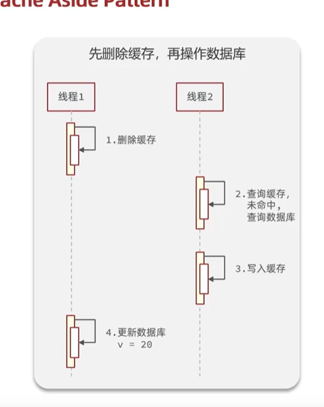
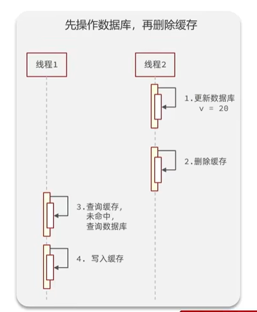
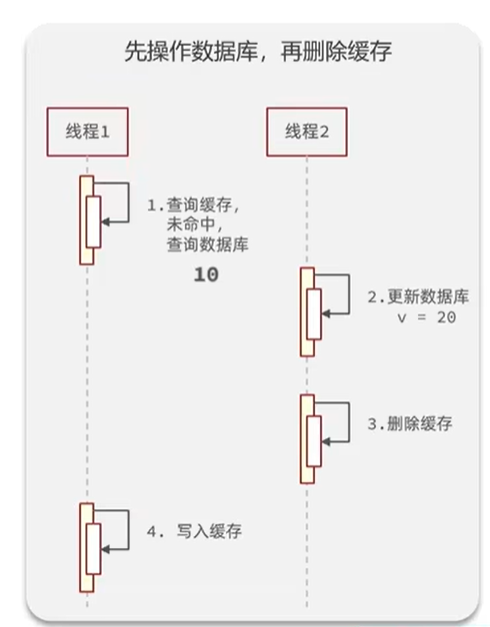
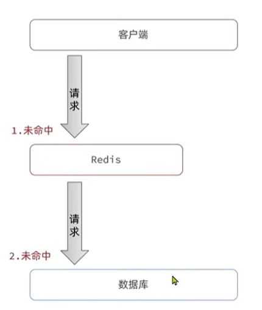
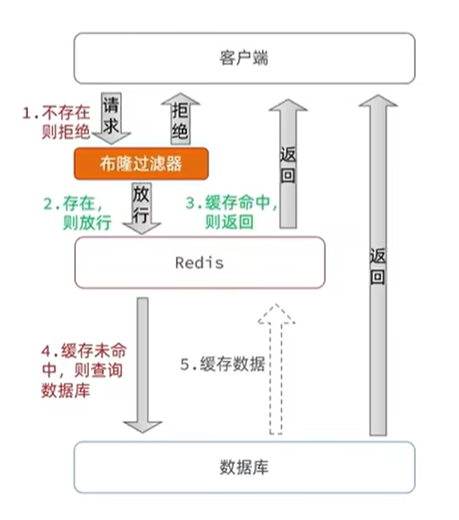
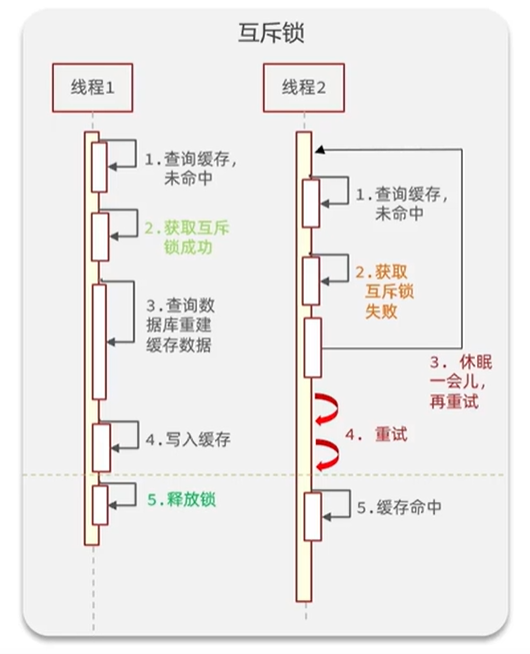
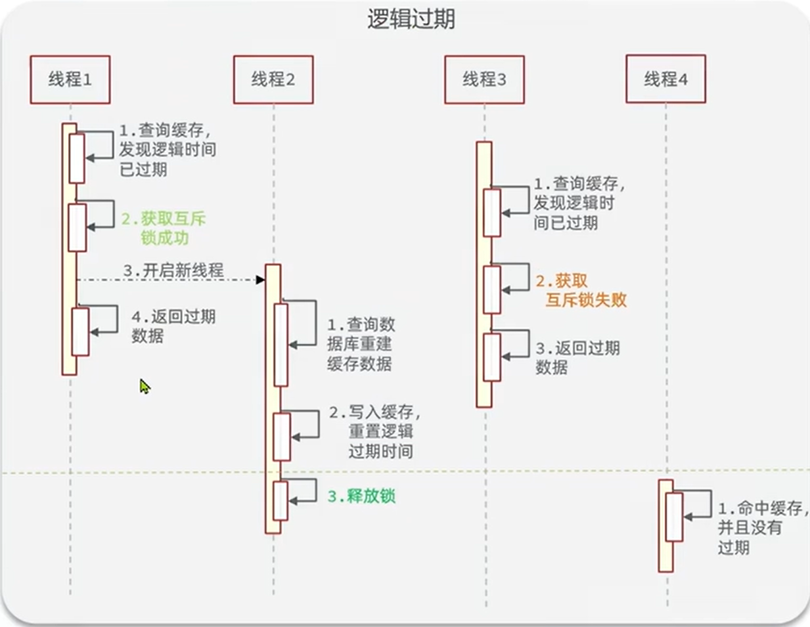
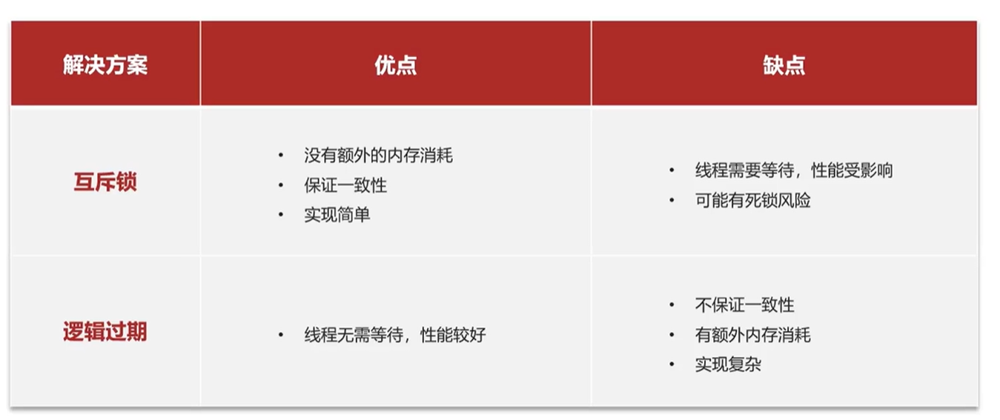

## 引言

在 Redis 的实际业务里，最容易出问题的地方通常不是 Redis 本身，而是缓存和数据库协作时的时序、命中率和热点流量控制。

这类问题大体可以分成四类：

1. 缓存更新时，数据库和缓存的写入顺序怎么安排。
2. 缓存穿透时，如何阻止不存在的数据不断打到数据库。
3. 缓存雪崩时，如何避免大量 key 同时失效。
4. 缓存击穿时，如何保护单个热点 key 在失效瞬间不把数据库压垮。

下面按这四类问题依次展开。

## 缓存更新策略

### 为什么写入时更常见的是“删缓存”

在缓存场景里，写请求通常不会直接“更新缓存”，而是采用 `Cache-Aside Pattern` 这类更常见的思路：先修改数据库，再删除缓存，让下一次读请求重新回源并重建缓存。

这样做的原因很直接。缓存的主要价值在于提升读性能，而不是承担所有写路径。如果一次数据变更后没有后续读请求命中这份数据，那么同步更新缓存只会带来额外开销。

真正麻烦的地方不在于“要不要动缓存”，而在于“数据库和缓存到底按什么顺序动”。只要读写并发存在，就一定会出现短暂的不一致窗口。

### 先删除缓存，再更新数据库

这个顺序的问题最典型：缓存先被删掉，但数据库还没来得及更新时，另一个读请求进来，就会发现缓存未命中，然后回源数据库，把旧值重新写回缓存。

如果这时第一个写请求随后才把数据库改掉，那么缓存里保存的就已经是旧数据了，数据库反而是新的，结果就是缓存脏化。

从时序上看，这个问题本质上是“读请求抢先把旧数据重新写回缓存”。因此，单纯依赖“先删缓存”并不能保证最终一致性。

### 先更新数据库，再删除缓存，但读请求先回填旧值

相比之下，更常见的做法是先更新数据库，再删除缓存。这样做的好处是，数据库会先落定为最新值，随后缓存失效，下一次读取会重新回源。

这条路径看起来更稳，但它仍然不是绝对安全的。原因在于，读请求和删缓存之间仍然存在并发窗口。

例如，某个读请求在缓存失效后去数据库读取了旧值，随后写回缓存；与此同时，写请求已经把数据库更新成新值，并在稍后删除了缓存。最终留下来的缓存，仍然可能是旧值。

也就是说，`先更新数据库，再删除缓存` 只是把风险从“写前删缓存导致旧值回填”转移到了“读请求在窗口期内回填旧值”。它比第一种顺序更常用，但并不天然等于强一致。

### 延迟双删

为降低上面这个窗口期带来的风险，工程上常见的补救方案是“延迟双删”。

它的做法是：在更新数据库并删除缓存之后，等待一个短暂的时间，再把同一个缓存键删除一次。这样做的目标，是尽量清掉刚才并发读请求可能写回来的旧缓存。

不过，延迟双删不是严格意义上的一致性协议，它只是一个概率上的修正手段。等待时间太短，可能来不及覆盖并发读；等待时间太长，又会增加缓存短暂失效的时间。实际间隔需要结合业务的读写延迟、数据库响应时间和一致性要求来调整。

## 缓存穿透

缓存穿透指的是，请求的数据在缓存和数据库中都不存在，导致每一次请求都绕过缓存直接打到数据库。

在正常的缓存访问路径里，缓存未命中后通常会回源数据库，再把结果回填到缓存中。但如果请求的 key 本来就不存在，那么缓存和数据库都会返回空结果，下一次同样的请求还会重复走这条路径。攻击者如果持续构造这类请求，就会把大量无效流量直接打到数据库上。

缓存穿透的问题不只是“查不到数据”，而是“查不到的数据没有被拦住”。因此，防护思路的核心不是让缓存命中所有请求，而是尽量在进入数据库之前就识别出无效请求。

### 缓存空值

最直接的做法，是在数据库查不到数据时，把这个 key 也缓存起来，只是 value 设为 `null`，并且设置一个较短的 TTL。

这样，后续如果再有人请求同一个不存在的 key，Redis 会直接返回空值，数据库就不会被反复击穿。这个方案实现简单，适合快速缓解穿透问题。

不过，它也有两个明显代价：

- 会额外消耗缓存空间，因为“本来不存在的数据”也占用了缓存条目。
- 如果这个 key 在空值缓存期间突然被写入了新数据，那么短时间内仍可能读到旧的空结果，直到缓存过期或被主动删除。

因此，缓存空值更像是一种“用空间换保护”的方案。它能挡住重复请求，但不适合把 TTL 设得过长，否则空值会拖慢新数据的可见性。

### 布隆过滤器

布隆过滤器是另一种更偏前置拦截的方案。它使用一个位数组和多个哈希函数来表示“某个 key 可能存在于集合中”。

对于一个已经存在的 key，布隆过滤器会把若干个位位置置为 `1`。查询时，只要这些位置里有任意一个是 `0`，就可以确定这个 key 一定不存在，于是请求可以直接被拒绝或返回空结果，不必再访问数据库。

需要注意的是，布隆过滤器只能判断“肯定不存在”或“可能存在”，不能做到百分之百准确。也就是说：

- `0` 一定表示不存在；
- `1` 只能表示可能存在，仍然可能是误判。

这也是布隆过滤器的典型特征。它的优点是空间效率很高，适合在大量 key 的场景下提前拦截明显无效的请求；缺点是存在一定的误判率，而且通常更适合“集合是否存在”这种问题，不适合直接保存业务值。

### 两种方案怎么选

如果业务只是想快速挡住重复的空请求，缓存空值实现最简单，上线成本也最低。

如果 key 规模很大、无效请求很多，而且希望尽量在进入数据库之前就做拦截，那么布隆过滤器通常更合适。它可以明显减少数据库压力，但需要接受少量误判，并且在数据增删时维护过滤器状态。

## 缓存雪崩

缓存雪崩是指在同一时段大量缓存 key 同时失效，或者 Redis 服务整体不可用，导致大量请求在短时间内集中打到数据库。

它和缓存穿透、缓存击穿不一样。穿透是请求的数据本来就不存在；击穿是某个热点 key 在失效瞬间被大量并发访问；雪崩则是“很多 key 一起失效”或者“缓存层整体失效”。

常见的处理思路有几类：

- 给不同 key 设置随机 TTL，避免同一批缓存同时过期。
- 对热点数据做预热，减少集中失效时的回源压力。
- 在缓存不可用或数据库压力过高时做限流和降级。
- 在业务允许的情况下引入多级缓存，先挡住一部分流量。
- 通过主从、哨兵或集群提高缓存服务可用性，但不要把“集群”误解为万能解法。

其中，随机 TTL 是最简单也最常见的手段，因为它能直接打散失效时间，降低同一时刻的峰值压力。

## 缓存击穿

缓存击穿也叫热点 key 问题。它指的是某个被高并发访问、而且重建成本较高的 key 在失效瞬间，突然被大量请求同时访问，从而把压力集中打到数据库上。

这类问题的关键不在于“有没有缓存”，而在于“热点 key 刚好失效的那一刻怎么办”。

### 互斥锁

最常见的做法是互斥锁。某个请求发现缓存未命中后，先尝试用 `SET key value NX EX` 这类原子方式抢锁；拿到锁的线程负责查询数据库并重建缓存，没拿到锁的线程则短暂休眠后重试。

这种方案的优点是简单，而且能够保证同一时刻只有一个线程回源数据库。缺点也很明显：热点数据一旦失效，其他请求都要等待，延迟会上升；如果锁处理不当，还可能带来死锁或锁超时问题。

### 逻辑过期

逻辑过期的思路是不把过期时间直接交给 Redis，而是把数据和过期时间一起存到 value 里。这样 Redis 中的 key 表面上一直存在，真正是否“过期”由业务代码判断。

当线程发现数据已经逻辑过期时，它不会阻塞所有请求，而是先尝试抢锁，抢到锁的线程异步去重建缓存，没抢到锁的线程则直接返回旧数据。

这种方案的核心取舍是：用“短时间返回旧值”换取“请求不阻塞”。它适合对实时性要求没那么极端、但对可用性和尾延迟更敏感的场景。

### 两种方案怎么选

互斥锁和逻辑过期各有侧重：

- 互斥锁更偏向保证一致性，但会让请求等待。
- 逻辑过期更偏向保证可用性，但可能短时间返回旧数据。

如果业务更在意“不能返回脏数据”，通常优先选互斥锁。如果业务更在意“请求不能卡住”，而且可以接受短暂陈旧结果，逻辑过期会更合适。

## 小结

Redis 常见缓存问题可以先概括成两条主线：

1. 一致性问题，例如缓存更新时的并发回填。
2. 流量和命中率问题，例如缓存穿透、缓存雪崩和缓存击穿。

对应的处理思路也可以记成一句话：

- 缓存更新阶段，重点是处理好数据库和缓存的时序。
- 缓存穿透阶段，重点是把不存在的请求挡在数据库前面。
- 缓存雪崩阶段，重点是打散失效时间并控制突发流量。
- 缓存击穿阶段，重点是保护热点 key 的重建过程。

这篇目前已经把四类问题都串起来了，后面如果还要继续补充案例或参数，可以直接在对应小节下往下接，不需要改整体结构。
