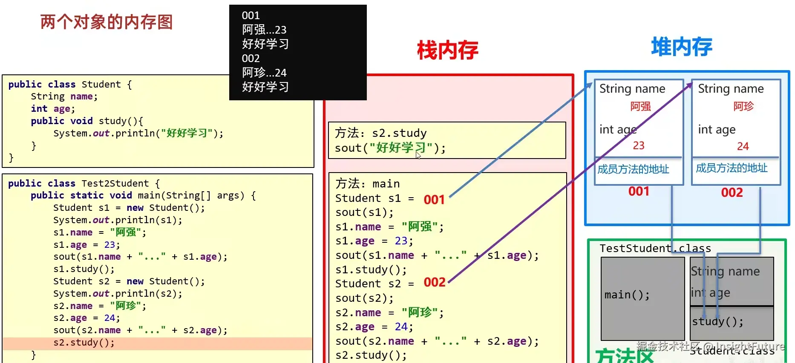

很多人第一次看 Java 对象创建时，最容易混淆的就是这几个概念：类信息放在哪里，对象实例放在哪里，局部变量放在哪里，成员方法又放在哪里。

`Student` 这个例子正好可以把这些位置拆开看清楚。

```java
public class Student {
    String name;
    int age;

    public void study() {
        System.out.println("好好学习");
    }
}

public class Test2Student {
    public static void main(String[] args) {
        Student s1 = new Student();
        s1.name = "阿强";
        s1.age = 23;
        s1.study();

        Student s2 = new Student();
        s2.name = "阿珍";
        s2.age = 24;
        s2.study();
    }
}
```



这张图里最重要的结论有三个：

1. `Student.class` 这类类元数据会先被 JVM 加载到方法区，HotSpot 8 以后主要对应元空间。
2. `s1` 和 `s2` 这样的局部变量，放在当前线程的栈帧里，它们保存的是对象引用，不是对象本体。
3. `new Student()` 创建出来的实例，实际分配在堆上，`name` 和 `age` 这类成员变量也属于对象实例的一部分。

## 类信息放在哪里

程序开始执行后，JVM 会先把 `Student` 这个类加载进来。类的结构信息、方法字节码、字段定义等内容，不是跟着某个对象实例一起保存的，而是作为类元数据保存在方法区。

所以，`study()` 这个方法并不属于 `s1` 或 `s2` 其中某一个对象。对象只负责保存自己的状态，方法本身属于类。

## 对象实例放在哪里

执行 `Student s1 = new Student();` 时，JVM 会在堆上开辟一块新的对象空间。

这块空间里会保存：

- `name`
- `age`
- 对象头

`s1` 本身只是一个引用变量，它存放在 `main` 方法对应的栈帧里。也就是说，`s1` 指向堆中的那一个 `Student` 实例，但它自己不是对象。

`Student s2 = new Student();` 也是同样的过程，只不过这次堆里又多了一个新的对象实例，`s2` 负责引用它。

## 成员变量和局部变量的区别

这段代码里有两种“变量”，它们位置完全不同：

- `s1`、`s2` 是局部变量，存放在栈中。
- `name`、`age` 是成员变量，跟着对象一起存放在堆中。

这也是初学者最容易混在一起的地方。`s1.name = "阿强";` 并不是把 `"阿强"` 直接塞进了栈里，而是让对象里的 `name` 引用指向了对应的字符串值。

严格来说，字符串字面量还会涉及字符串常量池。为了便于理解，这里可以先把它看成对象字段指向了一个字符串引用。

## 方法调用发生了什么

当执行 `s1.study();` 时，当前线程会进入 `study()` 的调用过程。这个方法调用对应的是一次新的栈帧入栈和出栈，而不是把方法代码复制到对象里。

换句话说：

- 方法字节码在类信息里；
- 方法调用记录在栈里；
- 真正执行的是 JVM 调用流程，而不是对象自己“携带了一份方法副本”。

所以，`s1.study()` 和 `s2.study()` 调用的是同一个 `study()` 方法，只是接收这个调用的对象不同。

## 一个容易误解的点

很多人会把“对象地址”“对象内容”和“引用变量”混为一谈。

其实更准确的理解应该是：

- `Student` 类先被加载，类信息放在方法区；
- `new Student()` 产生对象实例，放在堆中；
- `s1`、`s2` 只是引用，放在栈中；
- `study()` 是类的方法，不属于某一个单独对象。

如果把这四层关系分开，就不会再把“类”“对象”“引用”混成一团。


