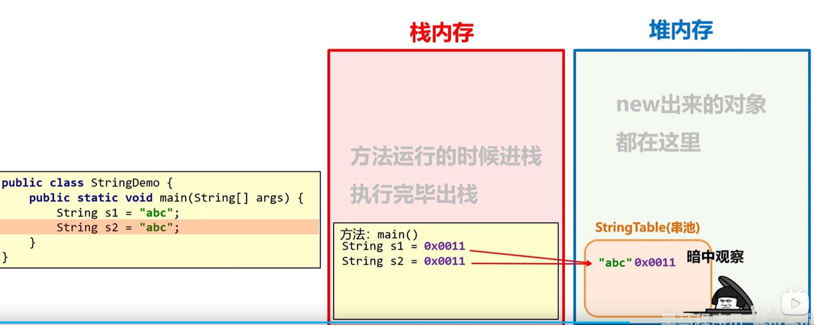
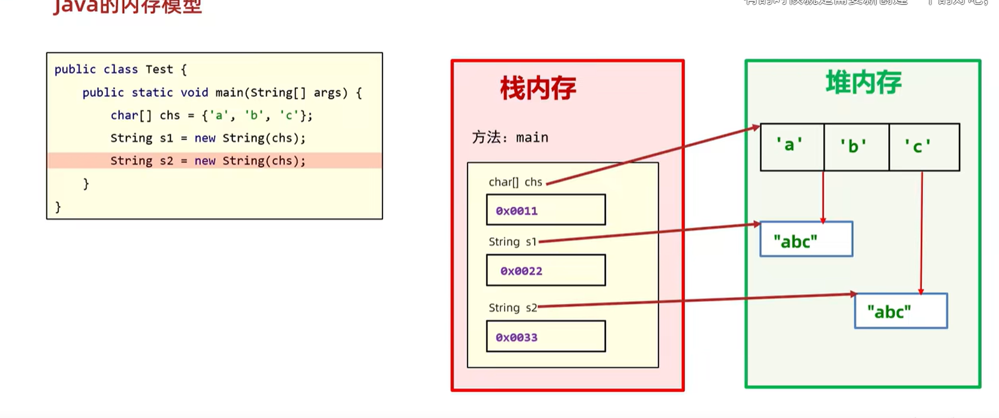

Java 里的 `String` 是一个非常常见，但也非常容易被低估的类。它表面上只是用来保存文本，实际上却承担了稳定性、复用性和安全性等多个职责。

这一章先从 `String` 的结构说起，再解释为什么它必须是 `final`。

## String 的结构

```java
public final class String
    implements java.io.Serializable, Comparable<String>, CharSequence {

    private final char[] value;
    private int hash; // 缓存 hashCode
}
```

可以先抓住两个关键词：

- `final class String`：`String` 本身不能被继承。
- `private final char[] value`：`String` 内部保存字符内容的引用不会被重新指向。

> 注：在较新的 Java 版本中，`String` 的内部实现已经从 `char[]` 演进为 `byte[] + coder`，但“不可变”这一设计思想没有变。这里先按经典写法来理解，最容易建立直觉。

`hash` 字段的作用是缓存 `hashCode()` 的结果。因为字符串经常被用作 `HashMap`、`HashSet` 的 key，缓存哈希值可以减少重复计算，提高性能。

## 为什么 String 必须是 final

`String` 之所以要被设计成 `final`，核心原因可以概括成两点：稳定和安全。

### 1. 复用字符串常量，避免内容被意外修改

Java 会把字符串字面量放到字符串常量池中。比如：

```java
String a = "test";
String b = "test";
```

这里的 `a` 和 `b` 实际上指向的是同一个常量池对象，而不是两份独立的内容。

如果 `String` 不是不可变的，那么其中一个引用一旦修改内容，另一个引用看到的值也会一起变化。这样字符串常量池就失去了“共享同一份内容”的意义，也会破坏很多依赖稳定字符串的逻辑。

所以，从复用角度看，`String` 必须保持不可变。

### 2. 防止继承带来的行为风险

Java 支持继承和方法重写。假设 `String` 允许被继承，那么子类就有机会修改某些关键行为，比如比较、转换、哈希计算等。

这会带来一个很大的问题：很多系统默认会把字符串当成可信、稳定的基础数据来使用，例如：

- 文件路径
- URL 和请求参数
- 配置项名称
- 业务标识
- 签名串、密钥片段等安全敏感文本

如果这些基础行为可以被子类偷偷改写，那么某些依赖 `String` 语义的场景就可能被注入额外逻辑，稳定性和安全性都会出问题。

把 `String` 设为 `final`，就是为了从类型层面切断这类风险。

## 为什么内部字段也要是 final

`String` 的不可变，不只是“类不能被继承”，还体现在它内部状态不能被轻易改写。

```java
private final char[] value;
```

这里的 `final` 表示：

- `value` 这个引用一旦初始化，就不能再指向别的数组
- `String` 对象创建完成后，它承载的文本内容就固定下来了

这样一来，`String` 才能真正做到“创建后不可变”。如果内部引用还能随意改写，字符串就不再可靠了。

## 不可变性带来的好处

`String` 之所以能成为 Java 中最常用的数据类型之一，和它的不可变性直接相关：

- 可以安全共享，节省内存
- 可以稳定作为 `HashMap` 的 key
- 可以放心用于字符串常量池
- 可以减少并发场景下的同步问题
- 可以让很多 API 默认把它当成可信文本处理

这也是为什么 Java 在设计 `String` 时，宁愿牺牲一点“可修改性”，也要换来更强的稳定性和复用性。

## 小结

`String` 不是简单的“字符数组包装类”，而是 Java 为了稳定性、安全性和复用性专门设计出来的基础类型。

它之所以是 `final`，本质上是为了保证两件事：

- 字符串内容不会被意外改变
- 字符串相关行为不会被子类偷偷改写

理解了这一点，后面再看字符串常量池、`hashCode` 缓存、`intern()`，就会顺很多。

## String 的构造方法

`String` 的构造方式很多，但在实际开发中，最常见的其实就两类：字符串字面量直接赋值，以及通过字符数组创建新对象。

### 1. 字符串字面量直接赋值

```java
String a = "test";
String b = "test";
```

这种写法并不是每次都创建一个新的字符串对象。JVM 会先去字符串常量池中检查是否已经存在 `"test"`。

- 如果不存在，就创建并放入字符串常量池
- 如果已经存在，就直接复用这份内容

所以，`a` 和 `b` 往往指向的是同一个字符串常量池对象。这也是字符串字面量最省内存、最常用的原因。



### 2. 使用 `new String(char[])`

```java
char[] chars = {'a', 'b', 'c'};
String s1 = new String(chars);
String s2 = new String(chars);
```

这种写法会根据传入的字符数组创建新的 `String` 对象。它的特点是每次调用都会生成一个新的实例，因此 `s1` 和 `s2` 的引用地址通常不同。

也就是说，即使它们的内容相同，只要是通过 `new String(char[])` 构造出来的，它们在堆中也会是两个独立的对象。



### 3. 其他构造方式

除了上面两种常见写法，`String` 还支持：

- `String()`
- `String(String original)`
- `String(byte[] bytes)`
- `String(byte[] bytes, Charset charset)`

这些构造方式本质上都是围绕“如何生成一个新的字符串对象”展开的。它们在具体行为上会有差异，但平时最常接触、也最值得先理解的，还是字面量赋值和数组构造这两种。

## 字面量和 `new` 的区别

这两种写法最核心的区别在于：

- 字面量写法会优先复用字符串常量池中的内容
- `new String(...)` 会显式创建新的对象

因此，如果只是想表达一个固定文本，通常优先使用字面量。只有在确实需要从字符数组、字节数组或已有字符串中重新构造对象时，才会使用 `new String(...)`。


## StringBuilder

`String` 是不可变的，所以在频繁拼接字符串的场景里，直接使用 `+` 往往会产生大量中间对象，性能也会受到影响。

比如下面这段代码：

```java
String s = "a";
s = s + "b";
s = s + "c";
```

这类写法在底层通常会被转换成字符串拼接流程，本质上仍然会创建新的中间结果。拼接次数越多，中间对象越多，内存分配和复制的开销也就越明显。

## 为什么需要 StringBuilder

为了解决频繁拼接带来的性能问题，Java 提供了 `StringBuilder`。

它和 `String` 最大的不同在于：`StringBuilder` 是可变的。它内部维护的是一块可以不断扩容的缓冲区，而不是每次拼接都重新生成一个新的字符串对象。

`AbstractStringBuilder` 的核心结构可以简化理解为：

```java
abstract class AbstractStringBuilder {
    byte[] value;   // 存储字符数据
    byte coder;     // 编码方式：LATIN1 或 UTF16
    int count;      // 当前字符串长度
}
```

可以看到，它没有像 `String` 那样被设计成不可变类型。`value` 这块数组会在容量不足时被扩容，并把旧内容复制到新数组中，从而继续承载后续追加的数据。

## StringBuilder 的工作流程

```java
StringBuilder sb = new StringBuilder();
sb.append("Hello");
sb.append(" ");
sb.append("World");
```

这段代码在执行时，通常会经历下面几个步骤：

1. 检查当前容量是否足够
2. 如果容量不足，就申请更大的数组
3. 将原有内容复制到新数组中
4. 把新追加的字符写入数组
5. 更新 `count`

这样做的好处是，拼接过程主要发生在同一个可变缓冲区里，不需要每一步都创建新的字符串对象。

## 和直接拼接相比的区别

直接用 `String` 拼接时，常见问题是：

- 每次拼接都会产生新的中间结果
- 中间结果越多，分配和复制的成本越高
- 在循环或大量拼接场景下，性能差异会更明显

而 `StringBuilder` 的思路是：

- 先准备一块可复用的缓冲区
- 后续追加内容时尽量在原数组上扩展
- 只有容量不足时才触发扩容

所以，如果是多次拼接文本，优先使用 `StringBuilder` 通常会更合适。

### 扩容原理

`StringBuilder` 在创建时会先分配一块默认缓冲区。

```java
StringBuilder sb1 = new StringBuilder();      // 默认容量 16
StringBuilder sb2 = new StringBuilder("abc");  // 容量 = 16 + 3 = 19
```

这里要注意一点：`new StringBuilder("abc")` 不是只给 `abc` 分配 3 个位置，而是会额外预留一段空间，方便后续继续追加。

当容量不足时，`StringBuilder` 会触发自动扩容。它的扩容思路可以概括为：

```text
新容量 = 旧容量 * 2 + 2
```

例如，假设当前容量是 16，那么下一次扩容后通常会变成 34；如果当前容量是 34，下一次通常会变成 70。这样设计的目的，是尽量减少频繁扩容带来的数组复制成本。

#### 扩容什么时候会生效

自动扩容只有在“当前容量不够用”的时候才会触发。

例如：

```java
StringBuilder sb = new StringBuilder(); // 容量 16
sb.append("1234567890123456");          // 正好写满 16
sb.append("7");                         // 触发扩容
```

第一句 `append` 之后，缓冲区刚好被写满；第二句再追加一个字符时，容量不够了，`StringBuilder` 就会申请更大的数组，把原内容复制过去，再写入新的字符。

这种场景下，自动扩容是生效的。

#### 扩容什么时候不会按默认公式生效

如果追加的内容太长，导致默认的 `旧容量 * 2 + 2` 仍然不够用，`StringBuilder` 就不会停留在这个结果上，而是直接把目标容量提升到 `minCapacity`，也就是：

```text
minCapacity = count + appendLen
```

这表示“至少要能装下当前内容加上这次要追加的内容”。

例如：

```java
StringBuilder sb = new StringBuilder(); // 当前容量 16，count = 0
sb.append("1234567890123456789012345678901234567890"); // 追加 40 个字符
```

这里 `minCapacity = 0 + 40 = 40`，而默认扩容结果是 `16 * 2 + 2 = 34`。因为 34 仍然装不下 40 个字符，所以最终不会采用 34，而是直接把容量扩到 40。

这就是默认扩容公式“不够用”的场景。更准确地说，不是扩容机制失效了，而是它先算出一个目标容量，再和 `minCapacity` 比较，最后取能满足需求的那个值。

如果剩余容量本身就足够，`StringBuilder` 还是不会扩容，只会直接把新内容写进原来的数组。

#### 具体流程

当 `append` 发生时，`StringBuilder` 大致会按下面的顺序处理：

1. 计算追加后的总长度
2. 判断现有容量是否足够
3. 如果不够，按照扩容策略申请更大的数组
4. 把旧内容复制到新数组
5. 把新内容写入数组尾部
6. 更新 `count`

所以，`StringBuilder` 的优势不是“完全不分配内存”，而是“尽量减少重复创建中间字符串对象”，把多次拼接收敛到同一块可变缓冲区里完成。


## Java 字符串拼接

字符串拼接可以分成两类：一类是纯常量拼接，另一类是包含变量的拼接。这两种情况的执行方式完全不同。

### 1. 纯常量拼接

像下面这种写法：

```java
String s = "a" + "b" + "c";
```

它属于编译期常量表达式。编译器会在编译阶段直接把它折叠成一个字符串常量，也就是 `"abc"`，运行时不会真的去执行三次拼接。

换句话说，这种拼接的开销只发生在编译期，运行时基本没有额外成本。


### 2. 含变量的拼接

如果拼接表达式里出现了变量，情况就不一样了。

例如：

```java
String s = "a";
s = s + "b";
s = s + "c";
```

在 JDK 9 之前，`javac` 通常会把这类拼接改写成 `StringBuilder` 的链式调用，先创建一个 `StringBuilder`，再不断 `append`，最后调用 `toString()` 得到最终的 `String`。

所以上面这段代码可以理解成：

```java
s = new StringBuilder("a").append("b").toString();
s = new StringBuilder(s).append("c").toString();
```

这样一来，每一轮拼接通常都会先生成一个 `StringBuilder`，最后再生成一个结果字符串。也就是说，单次拼接过程里会经历两次主要对象分配：一次是 `StringBuilder`，一次是最终的 `String`。

如果像上面这样连续拼接两次，就会重复走两轮这个流程。相比直接操作常量，这类写法会产生更多中间对象。

在 JDK 9 及之后，字符串拼接的编译实现改成了 `invokedynamic` + `StringConcatFactory`，但目标没有变，都是为了减少中间对象和提升拼接效率。
