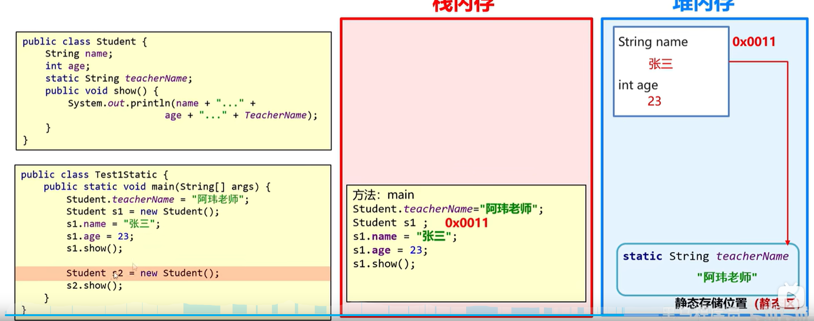
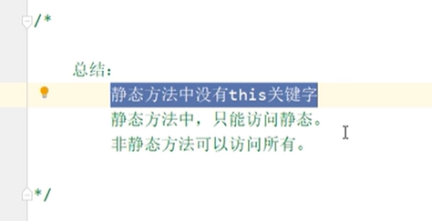
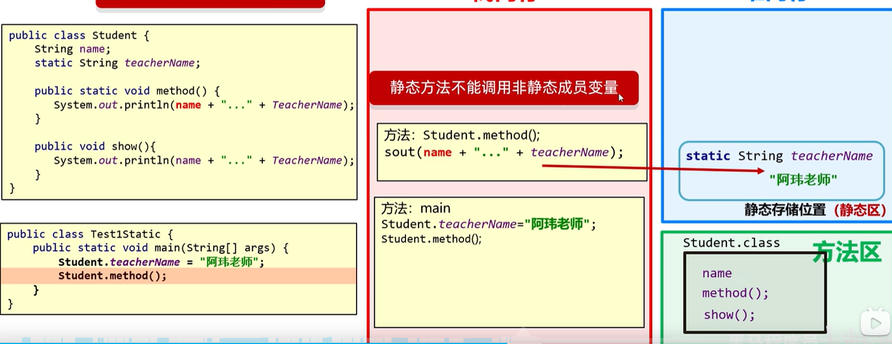
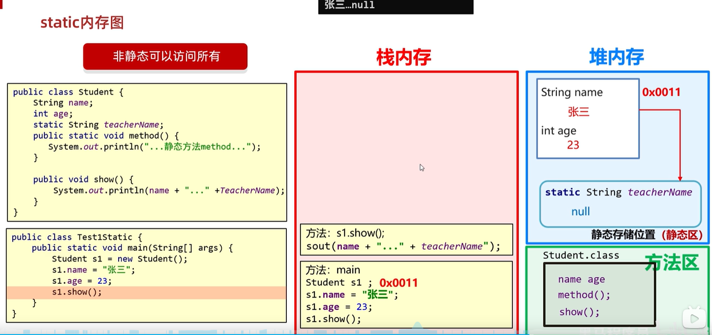
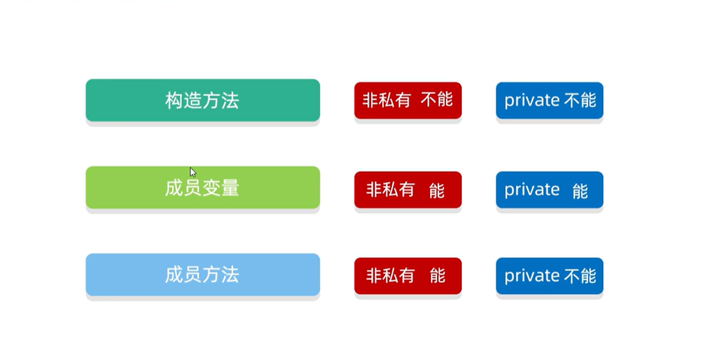
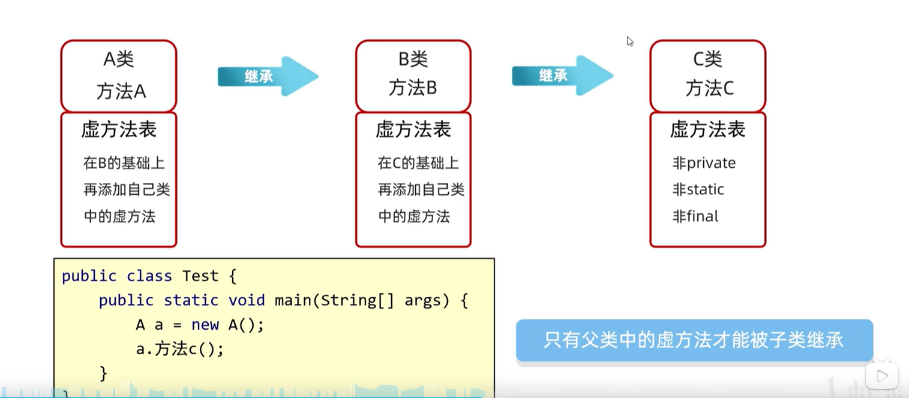
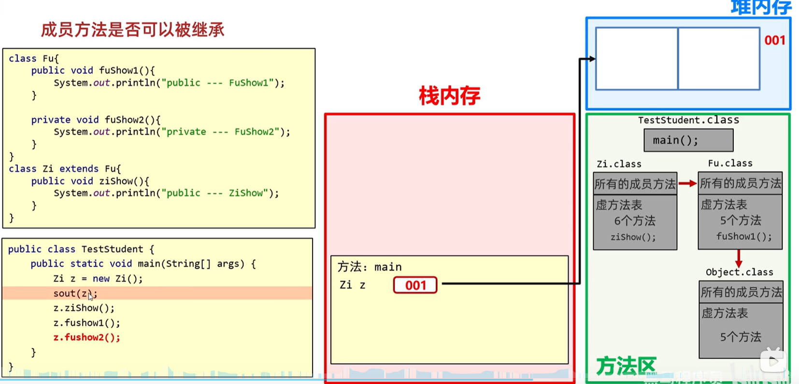
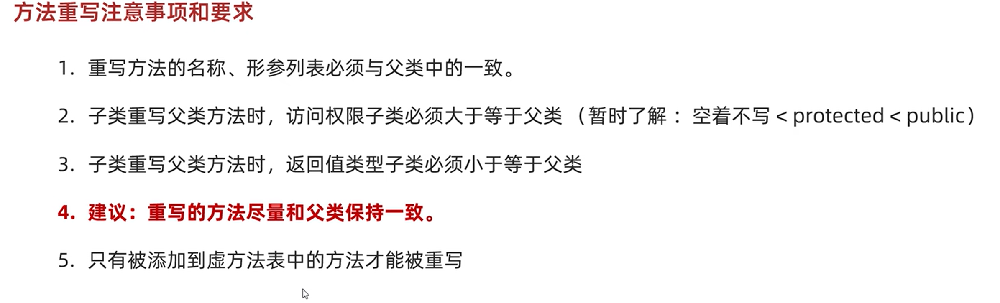
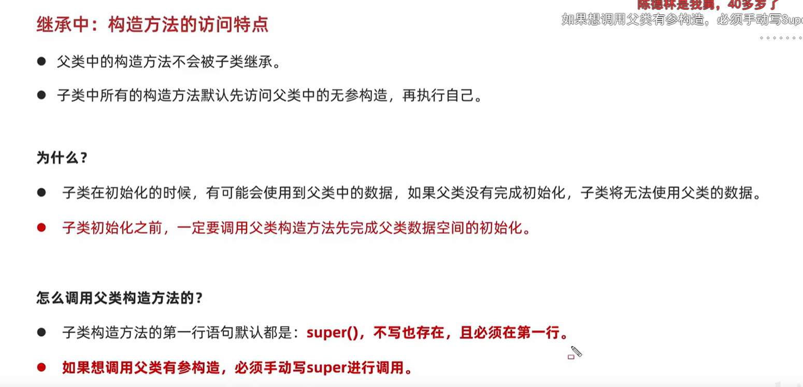

这篇笔记用来整理我在学习 Java 面向对象过程中的一些关键概念，主要围绕 `static`、继承、多态和 `final` 展开。先从最容易混淆的 `static` 成员变量开始。

## static

### 成员变量

在 Java 里，`static` 成员变量属于类，而不属于某个具体对象。普通成员变量会随着对象创建进入每个实例，因此每个对象各自持有一份；`static` 成员变量则只在类的层面保留一份，所有实例共享同一份数据。

也就是说，`static` 成员变量的生命周期依附于类，而不是依附于对象。它会随着类的加载、链接和初始化进入可用状态，而不是在每次创建对象时重新生成一份。

可以先把它和普通成员变量放在一起理解：

- 普通成员变量：每创建一个对象，就会生成一份对应的数据
- `static` 成员变量：无论创建多少个对象，类级别通常都只有一份共享数据

它的内存示意可以先按下图来理解：



对象实例本身并不直接持有这份 `static` 变量的数据，访问 `static` 字段时，本质上是在通过类去访问类级别的共享状态。

所以，`static` 成员变量最核心的特征，不是“某个对象里多了一个特殊字段”，而是“这份数据的归属从对象变成了类”。这也是为什么只要有一个对象修改了它，其他对象再去读取时，看到的仍然是同一份结果。

### 静态函数

静态方法同样是“属于类”的，而不是“属于某个对象”的。也正因为如此，它最常出现的场景就是工具类。像求数组最大值、平均值、排序辅助这类逻辑，本质上只是在完成一个功能，并不依赖某个具体对象的状态，这时候就没有必要先 `new` 一个对象再调用方法，直接通过 `类名.方法名` 使用会更自然。

先抓住静态方法最核心的一条结论：



这张图里的三句话可以整理成更严谨的表述：

- 静态方法里没有 `this`
- 静态方法只能直接访问静态成员
- 非静态方法既可以访问实例成员，也可以访问静态成员

其中最容易混淆的是第二条。很多人会把它记成一个规定，但更重要的是理解它为什么会这样。

下面这张图展示了一个典型场景：`Student` 类里既有实例变量 `name`，也有静态变量 `teacherName`。如果在静态方法 `method()` 里直接访问 `name`，就会出问题；而访问 `teacherName` 则是允许的。



原因在于，静态方法在调用时不依附于某个具体对象。比如 `Student.method()` 这种写法，本质上是“类在调用方法”，而不是“某个 `Student` 对象在调用方法”。既然当前并没有一个确定的对象实例，JVM 就无法知道你想取的是哪一个对象里的 `name`，因此不能直接访问实例变量。

但 `teacherName` 不一样。它本来就是类级别共享的一份数据，归属于 `Student` 这个类本身，所以静态方法可以直接访问它。

从运行时角度看，也可以这样理解：普通成员方法调用时，默认会带着一个隐含的 `this` 引用，`this` 指向当前对象。有了这个引用，方法内部才知道应该去哪个对象里取 `name`、`age` 这类实例字段。静态方法没有这个默认的 `this`，因此它不能直接读写实例成员，也不能直接调用实例方法。

当然，这里说的是“不能直接访问”。如果静态方法先明确拿到了某个对象，再通过这个对象去访问实例成员，是可以做到的。限制点不在于“静态方法永远碰不到对象”，而在于“它自身默认不绑定任何对象”。

和静态方法相对，非静态方法的访问范围会更大。因为非静态方法本来就是跟着对象走的，调用时天然带有 `this`，所以它既能访问当前对象的实例变量，也能访问类上的静态变量。



这也是为什么图里 `show()` 方法既能访问 `name`、`age` 这类实例数据，也能访问 `teacherName` 这样的静态数据。实例成员属于“当前对象”，静态成员属于“当前类”，而非静态方法同时具备这两侧的访问条件。


## 继承

继承可以先理解成：子类在保留父类已有能力的基础上，再扩展出自己的内容。讨论继承时，最常见的对象主要有三类：构造方法、成员变量和成员方法。不过，这三类东西在继承里的规则并不完全一样。

可以先用下面这张图建立一个整体印象：



把图里的信息整理一下，大致可以概括成下面三条：

- 构造方法不能被子类继承
- 成员变量可以跟着继承体系保留下来，但 `private` 成员变量不能被子类直接访问
- 非 `private` 的成员方法可以被子类继承，`private` 方法不能被子类继承

### 为什么构造方法不能继承

构造方法的作用，是在创建对象时完成初始化。它和类名强绑定，父类构造方法服务的是“父类对象的初始化”，子类构造方法服务的是“子类对象的初始化”，两者职责不同，所以构造方法本身不能直接被继承。

不过，不能继承不代表父类构造方法完全没用。子类在创建对象时，通常还是要先调用父类构造方法，把从父类继承下来的那部分状态先初始化好，然后再完成子类自己的初始化逻辑。也正因为如此，Java 里子类构造器的第一行往往会隐式或显式地调用 `super(...)`。

### 构造方法的访问特点

继承里的构造方法有一个很容易让人混淆的地方：父类构造方法不会被子类继承，但子类每次创建对象时，往往又都要先调用父类构造方法。这里看起来像矛盾，其实说的是两件不同的事。


- “不会被继承”说的是成员归属。父类的构造方法不会变成子类自己的构造方法。
- “创建子类对象时会先调用”说的是初始化顺序。子类对象里包含父类那部分状态，所以在执行子类自己的初始化逻辑之前，必须先把父类那部分先初始化好。

为什么一定要先做这一步？因为子类在初始化过程中，很可能会依赖父类中已经定义好的成员数据。如果父类那部分状态还没有建立完成，子类后续逻辑就没有稳定的基础可用。

从语法上看，子类构造方法的第一行默认都会有一个隐含的 `super()`。即使代码里没有手写，编译器也会默认补上这一步，用来先调用父类无参构造方法。并且，这个调用必须出现在构造方法的第一行，因为只有先完成父类部分的初始化，子类后续代码才有意义。

如果父类没有无参构造方法，或者你希望调用的是父类的有参构造方法，那么就不能依赖默认补出来的 `super()`，而是要在子类构造器里手动写出 `super(参数)`，明确指定要走哪一个父类构造方法。

### 成员变量的继承规则

成员变量和构造方法不一样。只要父类里定义了成员变量，这部分状态通常会随着继承关系进入子类对象中，所以从“对象组成”的角度看，子类对象里是包含父类那部分成员数据的。

但这里要区分“继承到了”与“能不能直接访问”。

- 对于非 `private` 成员变量，子类可以按访问权限规则直接使用
- 对于 `private` 成员变量，虽然它仍然属于父类那部分状态，但子类不能直接通过变量名访问它

也就是说，`private` 限制的不是“这份数据是否存在”，而是“子类能不能直接碰到这份数据”。如果父类愿意暴露 `getter`、`setter` 或其他受控方法，子类仍然可以间接操作这部分状态。

### 成员方法的继承规则

成员方法的规则和成员变量有点像，但又不完全一样。对于普通的非 `private` 方法，子类可以直接继承下来使用；如果有需要，子类还可以在规则允许的范围内进行重写。

但 `private` 方法不行。因为 `private` 方法本质上只属于父类自己的内部实现细节，子类既看不到它，也不能直接调用它，更谈不上把它当成可继承的方法来使用。

所以，继承这一节真正要记住的不是一句“子类继承父类”，而是要拆开来看：

- 构造方法：不能继承，但子类构造时要借助父类构造方法完成父类部分的初始化
- 成员变量：可以继承，`private` 变量不能直接访问
- 成员方法：非 `private` 方法可以继承，`private` 方法不能继承

## 继承的方法表以及内存空间

讨论继承时，如果只停留在“子类能不能调用父类方法”这一层，其实还不够。再往下一层看，就会涉及一个很重要的概念：虚方法表。

先说结论。父类中的成员方法，并不是所有方法都会进入子类可参与动态分派的那一部分。通常只有满足下面条件的方法，才会被当成虚方法来看待：

- 非 `private`
- 非 `static`
- 非 `final`

也就是说，只有父类中可以被子类正常继承、并且后续可能发生重写的方法，才会进入这套虚方法分派体系。



上面这张图可以帮助先建立两个直觉：

- `private` 方法不能被子类继承，因此不会成为子类可用的虚方法
- 子类对象创建出来以后，堆里存的是对象数据；而类的方法信息、方法表等内容，是跟着 `Class` 元数据走的，不是直接塞在对象实例里面

### 什么是虚方法

这里的“虚方法”，可以先理解成“运行时需要根据对象实际类型来决定调用哪个实现的方法”。如果父类定义了一个普通成员方法，子类也对它进行了重写，那么程序在运行时到底调用父类版本还是子类版本，就要靠这套动态分派机制来决定。

比如父类有一个 `show()`，子类也重写了 `show()`。当你拿着父类类型的引用去调用 `show()` 时，真正执行的往往不是“引用写成什么类就调什么类”，而是“对象实际是什么类型，就调用那个类型对应的方法实现”。这背后依赖的，就是虚方法表这类分派结构。子类可以重写这些虚方法。
### 虚方法表是怎么跟着继承关系组织起来的

每个类在运行时都可以理解为有一份属于自己的虚方法表。子类在形成自己的虚方法表时，并不是完全从零开始，而是会以父类的虚方法表为基础，再把自己新增的虚方法补进去；如果子类对父类某个虚方法进行了重写，那么对应位置会替换成子类自己的实现。



可以把这张图概括成一句话：**子类的虚方法表，是在父类虚方法表基础上扩展和覆盖出来的。**

这也是为什么：

- 父类里的普通可继承方法，子类通常也能直接调用
- 子类重写父类方法后，运行时会优先落到子类实现
- `private`、`static`、`final` 这些不参与重写的方法，不会按这套虚方法规则处理

### 方法表和对象内存的关系

这一节名字里还有“内存空间”，这里也要区分清楚。

对象创建出来以后，实例字段会进入对象本身的内存布局中；而方法代码、类的结构信息、虚方法表这类内容，更适合理解为它们归属于类，而不是归属于某一个具体对象。对象只是通过自己的实际类型，关联到对应类的这套方法分派信息。

所以，从运行时角度看，可以粗略理解成：

- 堆中的对象：主要保存实例数据
- 类对应的元数据区域：保存类结构、方法信息、虚方法表等内容

这样再回头看继承，就会更容易理解：子类对象之所以能调用继承而来的方法，不是因为这些方法被“复制进了对象实例”，而是因为这个对象所属的类，已经在类级别准备好了对应的方法表和分派关系。

## 多态

多态可以从“为什么要有它”这个角度来理解。只有继承还不够，因为如果没有多态，程序在面对同一类事物的不同子类时，往往只能在外部写大量 `if-else` 来判断类型，再决定该调用哪一个实现。

这样写的问题是很明显的：调用方会和具体子类强绑定，代码越来越难扩展；每新增一个子类，原来的判断逻辑往往也要跟着修改。换句话说，本来应该由对象自己决定“该怎么做”的事情，最后却变成了外部代码在不断猜测和分支。

多态要解决的，正是这个问题。它让我们可以先统一按父类或接口来编程，把“真正执行哪一个实现”交给运行时根据对象的实际类型来决定。这样一来，调用方式可以保持一致，但不同对象仍然能够表现出不同的行为。

### 多态访问成员的特点

多态在真正使用时，有一个特别容易混淆的点：**成员变量**和**成员方法**的访问规则并不一样。



上面这张图最值得先记住的，其实就是两句话：

- 调用成员变量：编译看左边，运行也看左边
- 调用成员方法：编译看左边，运行看右边

这里的“左边”和“右边”，指的是这类写法：

```java
Animal a = new Dog();
```

- 左边是引用类型，也就是 `Animal`
- 右边是实际创建出来的对象类型，也就是 `Dog`

如果访问的是成员变量，比如 `a.name`，编译器会先检查 `Animal` 里有没有这个字段；真正运行时，取值也仍然按左边的引用类型来处理，所以最后看到的是父类里的 `name`。

但如果调用的是成员方法，比如 `a.show()`，情况就不一样了。编译阶段仍然先看左边，确认 `Animal` 里确实声明了 `show()`；可一旦进入运行阶段，真正执行的会是右边实际对象对应的方法实现，也就是 `Dog` 重写后的 `show()`。

所以，多态最核心的表现其实就落在这里：**字段访问更偏向“引用类型”，方法调用更偏向“对象实际类型”。** 这也是为什么同样是 `Animal a = new Dog();`，`a.name` 和 `a.show()` 的最终表现会不一样。

## final

`final` 可以理解成 Java 里一个很直接的“收口”关键字。它的核心作用，就是告诉编译器和阅读代码的人：这个地方到此为止，不再允许继续改动或扩展。



放到具体语境里，`final` 最常见的有三种用法：

- 修饰方法：表示这个方法不能被子类重写
- 修饰类：表示这个类不能再被继承
- 修饰变量：表示这个变量只能被赋值一次

其中，修饰方法和修饰类，本质上都是在限制继承体系继续向下扩展。比如一个方法如果被 `final` 修饰，就不会再参与后续的重写；一个类如果被 `final` 修饰，那么这个类本身就被封住了，别人不能再通过 `extends` 去继承它。

修饰变量时，`final` 更接近“常量”这个概念。对于基本类型来说，它表示值不能再次变化；对于引用类型来说，它表示引用不能再指向别的对象，但对象内部的内容是否还能变化，还要看这个对象本身是不是可变的。
