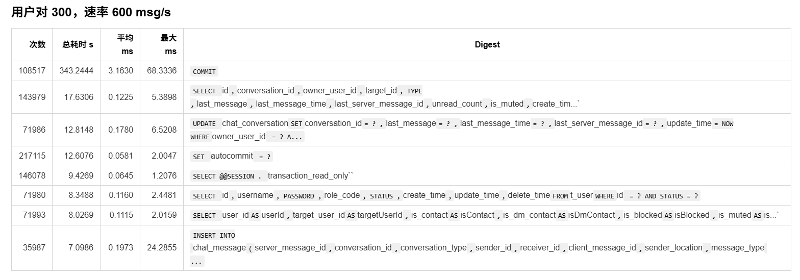
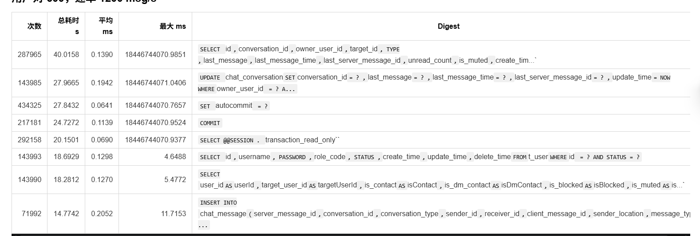

这篇文章记录了我最近在调试和压测 `bilibili-im` 过程中，定位并修复一个 WebSocket 并发写问题的过程以及性能优化相关。

## WebSocket Session 并发写入问题

项目里使用了 Spring Boot WebSocket 处理 IM 消息。一次消息发送大致会经过两个阶段：

- WebSocket 回调在完成身份校验和权限校验后，会先给发送方返回一个“服务端已接收”的确认消息。
- 消息写入 MQ 后，消费者再把真正的业务消息分发给发送方和接收方。

如果 MQ 处理得足够快，这两条发送链路就可能几乎同时命中同一个 `WebSocketSession`。一旦两个执行流并发向同一个 Session 写文本消息，就会触发 Tomcat 的状态机保护，并进一步进入 Spring Boot 的 WebSocket 异常处理逻辑，表现为连接异常断开。

从日志里可以看到一个很典型的报错：

```text
java.lang.IllegalStateException: send websocket json message failed
...
Caused by: java.lang.IllegalStateException: The remote endpoint was in state [TEXT_PARTIAL_WRITING] which is an invalid state for called method
	at org.apache.tomcat.websocket.WsRemoteEndpointImplBase$StateMachine.checkState(WsRemoteEndpointImplBase.java:1213)
	at org.apache.tomcat.websocket.WsRemoteEndpointImplBase$StateMachine.textPartialStart(WsRemoteEndpointImplBase.java:1178)
	at org.apache.tomcat.websocket.WsRemoteEndpointImplBase.sendPartialString(WsRemoteEndpointImplBase.java:225)
	at org.apache.tomcat.websocket.WsRemoteEndpointBasic.sendText(WsRemoteEndpointBasic.java:48)
	at org.springframework.web.socket.adapter.standard.StandardWebSocketSession.sendTextMessage(StandardWebSocketSession.java:206)
```

`TEXT_PARTIAL_WRITING` 说明前一次文本消息还没有写完，新的文本写操作又进来了。也就是说，这里的根因并不是连接突然断开，而是同一个 `WebSocketSession` 被并发写入了。

### 解决方法

这里我最终使用了 `ConcurrentWebSocketSessionDecorator`。

它并不是普通的 `WebSocketSession`，而是对原始 Session 做了一层并发保护。可以把它理解为给 WebSocket Session 增加了一层发送队列和串行化能力：

- 业务线程先把消息提交给 `ConcurrentWebSocketSessionDecorator`
- 装饰器负责把消息按顺序写到底层 Session
- 从而避免多个线程同时直接操作同一个连接

这样处理之后，即使 MQ 消费速度很快，确认消息和业务消息也不会再并发写入同一个 Session，`TEXT_PARTIAL_WRITING` 异常也就不会再出现。

### 问题本质

这个问题的本质不是 MQ 太快，而是消息发送路径上存在多个可能同时触发写操作的执行流，而底层 `WebSocketSession` 又不是线程安全的。只要一个 Session 可能被多个线程同时写入，就需要在应用层显式做串行化保护。

## MQ 入口可靠性

在解决 WebSocket 并发写问题之后，我继续检查了消息链路的可靠性，发现 MQ 入口本身也需要补齐确认机制。

最开始的实现里，业务线程只是把消息直接投递到 MQ，并没有等待 Broker 的确认结果。这样做虽然发送路径短，但前链路无法准确判断这条消息是否真正进入了 MQ，也就很难在失败时做重试、补偿或者明确告警。

后来我补上了 ACK 确认机制，但第一版实现仍然不够理想。当时的做法是让用户线程同步等待 ACK 回传。这个方案能拿到确认结果，却把业务线程阻塞在等待过程中，线程利用率很差，在并发压力上来之后尤其浪费。

后面我把这一段改成了异步确认模型：

```java
try {
    rabbitTemplate.convertAndSend(
            imMqProperties.getExchange(),
            pendingConfirm.routingKey(),
            pendingConfirm.event(),
            mdcHeadersPostProcessor(pendingConfirm),
            correlationData
    );

    correlationData.getFuture().whenComplete((confirm, ex) ->
            handleConfirm(pendingConfirm.correlationId(), attempt, sentNanos, confirm, ex));
} catch (Exception ex) {
    // ...
}
```

这里的关键点在于，`convertAndSend(...)` 和 `correlationData.getFuture().whenComplete(...)` 虽然是顺序执行的，但不会因为“ACK 回来得太快”而漏掉确认结果。

`whenComplete(...)` 的语义可以理解为“注册回调并检查完成状态”：

- 如果对应的确认结果还没有到达，它就把回调挂到这个 `Future` 上，等 MQ 确认完成后再触发。
- 如果确认结果在注册之前其实已经完成了，那么这个回调会在注册时直接进入执行，不会丢失这次 ACK。

也就是说，这里不存在“先收到 ACK、后注册回调，所以回调丢了”的竞态窗口。`Future` 保存的是完成状态，而 `whenComplete(...)` 既能处理未完成的情况，也能处理已经完成的情况。

相比同步阻塞等待，这种方式的优势在于：业务线程只负责发消息和注册回调，不需要一直卡在那里等 ACK 返回。确认结果到达后，再由 `Future` 的完成流程触发 `handleConfirm(...)`。这样可以明显减少线程空等，提高吞吐量，也让发送链路的失败检测和重试逻辑更自然。


### 压测指标

在 `RATE=2000` 的恒定速率下，我对“同步 confirm”和“异步 confirm”分别做了一轮复测，结果如下：

| 指标 | 同步 confirm | 异步 confirm |
| --- | ---: | ---: |
| sent | 60000 | 60000 |
| accepted | 47738 | 59817 |
| 成功率 | 79.56% | 99.70% |
| timeout/error | 12262 | 183 |
| accepted P95 | 9764.15ms | 12ms |
| im.send.accept.total P95 bucket | 8.389ms | 4.194ms |
| 队列总残留 | 99964 | 85997 |

从这组数据看，异步 confirm 带来的改进非常明显。

首先，`accepted` 从 `47738` 提升到了 `59817`，成功率也从 `79.56%` 提升到了 `99.70%`。这说明在相同发送压力下，前链路能够更稳定地完成消息接收，不再因为同步等待 ACK 而大量堆积和超时。

其次，`timeout/error` 从 `12262` 降到了 `183`，而 `accepted P95` 更是从 `9764.15ms` 下降到 `12ms`。这说明优化之后，`accept` 这条路径的尾延迟被大幅压缩，绝大多数请求都能在很短时间内返回。

`im.send.accept.total` 的 P95 bucket 也从 `8.389ms` 降到了 `4.194ms`，说明系统内部这段处理链路本身也变得更短了。与此同时，队列总残留从 `99964` 降到 `85997`，虽然仍然存在积压，但相比同步 confirm 方案已经有所缓解。

整体来看，把 MQ confirm 从同步阻塞等待改成异步回调之后，前链路的吞吐能力和稳定性都有了明显提升。这一轮优化最直接的收益，就是把业务线程从“等待确认结果”中释放出来，让它们更专注于处理真正的请求流量。


## 消息持久化消费者

在前链路优化之后，我继续把注意力放到 MQ 消费端。之前我对消费者的理解比较保守，后来才进一步意识到：RabbitMQ 的消费者不仅可以配置并发线程数，也可以通过相关参数控制单次拉取和处理的节奏。于是我尝试把消息持久化相关的消费者改成多线程消费，并对串行和并行两种模式做了对比。

### 消费吞吐量对比

先看最直观的结果。在相同时间窗口内，并行消费者能够处理掉更多消息，因此队列残留明显下降。

| 队列 | serial after-20s 剩余 | parallel after-20s 剩余 | 说明 |
| --- | ---: | ---: | --- |
| `im.message.persist.queue` | 12456 | 8083 | 并行多消费了约 4373 条 |
| `im.message.conversation.queue` | 14155 | 4701 | 并行多消费了约 9454 条 |

这说明把消费者改成并行后，系统在 20 秒窗口内的总体消费能力确实提升了，消息积压下降得更快。

### 单条消息处理耗时对比

不过，并行并不意味着“每一条消息都会处理得更快”。从单条消费者平均耗时来看，并行模式下反而略有上升：

| Consumer | serial 平均耗时 | parallel 平均耗时 |
| --- | ---: | ---: |
| `single_message_persist` | 3.294ms | 5.515ms |
| `single_conversation_persist` | 6.522ms | 7.150ms |
| `single_realtime_push` | 1.804ms | 5.622ms |

这个现象并不意外。消费者线程数增加之后，数据库连接、缓存、锁、CPU 调度以及对象分配等共享资源上的竞争也会随之增加，因此单条消息的平均处理时间可能会上升。

### 结果解读

这组数据说明，多线程消费者带来的收益主要体现在整体吞吐量，而不是单条消息的绝对处理时延。

换句话说，并行化之后，单个线程未必更快，但系统能够同时处理更多任务，因此总消费速度更高，队列积压下降更明显。对于消息持久化这类更关注总体处理能力的场景，这种取舍通常是值得的。但如果后续要继续优化，就不能只盯着消费者线程数，还需要进一步分析并发之后到底是数据库、锁竞争还是其他共享资源成了新的瓶颈。


## 消费者缓存

继续往下分析时，我发现消息持久化消费者仍然是整条消费链路里最慢的一段，平均执行时间大约在 `4ms` 左右。进一步拆解后，主要耗时集中在两个步骤上：

- `chat_message_insert`：约 `1.37ms`
- `contact_relation_upsert`：约 `2.86ms`

其中，`chat_message_insert` 比较直接，就是把消息内容写入数据库；真正更重的是 `contact_relation_upsert`。这条 SQL 的作用，是在用户 A 给用户 B 发消息时补齐联系人关系，并更新相关标志位，这样当 B 回复 A 之后，后续通信链路才能按预期工作。

问题在于，`contact_relation_upsert` 本质上是一个“插入，如果重复则更新”的操作。第一次建立关系时它是必要的，但在关系已经存在之后，后续大量重复执行这条 SQL 的收益就非常有限了。换句话说，这一步在很多场景下已经变成了高频、但价值不高的重复写操作。

既然第一次写入之后，关系状态在很长一段时间内都不会发生关键变化，那么它就很适合做缓存优化。我的处理方式是：

- 第一次 `contact_relation_upsert` 成功后，把结果回写到 Redis
- 后续消费者处理同类消息时，先查询 Redis
- 如果缓存命中，就跳过这条高成本的重复 `upsert`

这样做之后，消费者不再频繁把时间花在重复维护联系人关系上，而是把更多时间留给真正必要的消息持久化逻辑。

### 优化结果

从平均处理时长来看，这次缓存优化的收益非常明显：

| 版本 | 平均处理时长 |
| --- | ---: |
| 缓存前 | 4.549ms |
| 缓存后 | 0.827ms |

也就是说，这一段消费者逻辑的平均处理时间从 `4.549ms` 降到了 `0.827ms`。这不仅说明 `contact_relation_upsert` 确实是之前的主要瓶颈，也说明把“首次建立关系”和“后续重复判断”拆开处理，是这条链路上非常有效的一次优化。


## 减少commit双刷次数
继续分析 SQL 监控数据时，我发现这时最耗时的语句已经不是业务 SQL，而是 `COMMIT` 本身。也就是说，前面的优化把业务逻辑压缩下去之后，事务提交阶段反而变成了新的热点。

我当时的数据库配置是：

- `innodb_flush_log_at_trx_commit = 1`
- `sync_binlog = 1`

这组配置的特点是事务提交时会尽可能立即把持久化相关的数据刷盘，安全性最高，但代价也很直接：对于 IM 这种高频、小事务、强实时的场景，提交成本会被显著放大。消息持久化链路里有大量短事务时，`COMMIT` 的累计开销很容易被放大成系统瓶颈。

在这个前提下，我做了一个偏性能取向的调整：

- 把 `innodb_flush_log_at_trx_commit` 从 `1` 调整为 `2`
- 把 `sync_binlog` 从 `1` 调整为 `0`

这样做的含义是，把“每次事务提交都尽量同步刷盘”改成“由系统按周期回刷”。代价是极端故障场景下会牺牲一部分数据持久性保证，但收益是显著降低每个小事务的提交开销。对于 IM 这种更强调实时响应、允许在极小窗口内接受一定持久化风险的业务，这个取舍是有意义的。

### SQL 热点变化

从系统表统计结果可以直接看到，调整前 `COMMIT` 的耗时非常突出：



在继续提高压力之后，`COMMIT` 虽然仍然存在，但已经不再像之前那样成为绝对主导的热点：



这说明提交阶段的开销确实被压下去了，数据库能够把更多时间花在真正的业务读写上，而不是频繁做高成本的同步提交。

### 压测结果

从压测表现看，这次调整带来的提升也很直观：

| 指标 | 调整前 | 调整后 |
| --- | --- | --- |
| 第一次出现运行中积压 | 300 对，600 msg/s | 600 对，1200 msg/s |
| 说明 | 600 msg/s 时 persist 最大 1135，conversation 最大 111 | 600 msg/s 时最大只有 6，1200 msg/s 才超过 100 |

这意味着系统从原来在 `300` 对用户、`600 msg/s` 左右就开始明显积压，提升到了大约 `600` 对用户、`1200 msg/s` 才进入类似状态，整体承载能力接近翻倍。

### 结果解读

这一轮优化说明，在大量小事务场景下，数据库默认的“最强持久化”配置未必就是最合适的选择。适当降低每次提交的刷盘强度，确实可以换来更高的吞吐量和更好的实时表现。

当然，这种优化不是没有代价。它本质上是用一部分极端故障下的数据安全性，换取更高的运行时性能。因此是否采用，仍然要看业务对持久性和实时性的优先级排序。对 IM 这样的系统来说，这种权衡通常比在所有场景下无条件追求最强一致性更实际。
