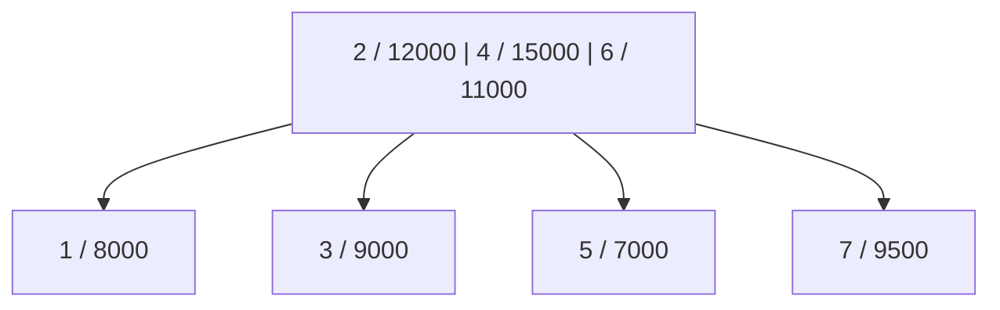
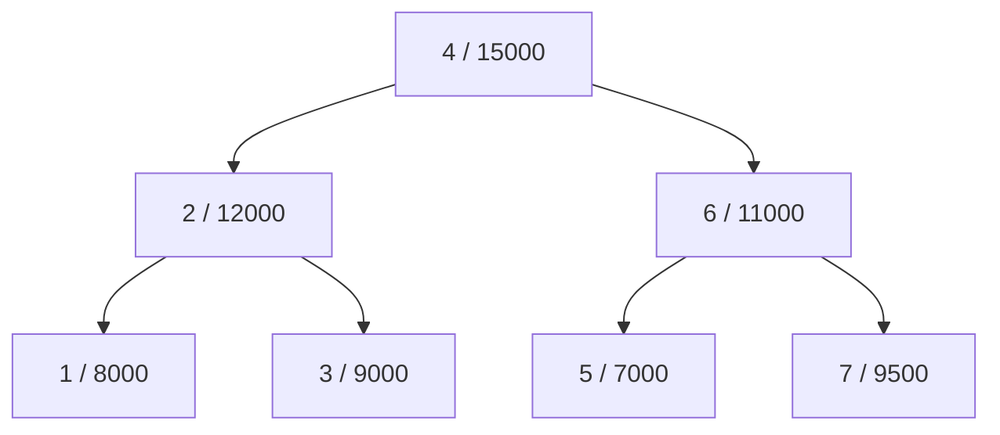
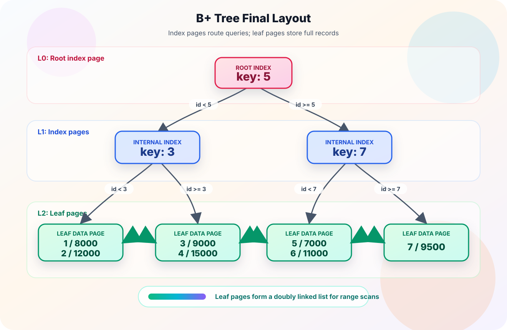

## 树结构
对于有序数据的查找，树结构天然适合作为索引。只要树的高度能够保持相对平衡，查询路径的长度通常就可以控制在 `O(log n)` 量级，也就是通过少量节点跳转逐步缩小搜索范围，最终定位到目标数据。

但在数据库这类以磁盘或页缓存为主要访问对象的场景中，普通二叉搜索树并不理想。以红黑树为例，一个节点通常只保存一个关键字，数据量变大后树高仍然偏高；而磁盘访问的成本主要不在比较次数，而在随机 I/O 和页加载次数。一次节点跳转可能就意味着一次新的页访问，树越高，整体查询成本越不可控。

B 树和 B+ 树的核心思路，就是让一个节点保存多个关键字，并尽量让一个节点对应一个磁盘页。这样每次 I/O 都能带回更多索引信息，树的分叉数更大，高度更低，查找过程需要访问的页数也更少。这也是它们比普通二叉搜索树更适合做数据库索引的根本原因。

## B 树
B 树相比红黑树的核心优势，是一个节点可以保存多个关键字和对应数据。数据库索引通常会让一个节点尽量贴近一个磁盘页的大小，这样一次页读取就能拿到一组有序关键字，再根据关键字范围决定下一次跳转到哪个子节点。

换句话说，B 树不是通过“每次只二分到左子树或右子树”来降低查找范围，而是通过更大的分叉数降低树高。树高降低以后，查询过程中需要访问的页数也会减少。实际数据库中的阶数通常很大，因此两三层的 B 树就可以管理非常多的数据。

假设有下面这组数据，每条记录包含 `id` 和 `salary`，并且以 `id` 作为主键建立 B 树索引。为了方便演示，先假设一个节点最多存放 2 条记录：

| id | salary |
| --- | ---: |
| 1 | 8000 |
| 2 | 12000 |
| 3 | 9000 |
| 4 | 15000 |
| 5 | 7000 |
| 6 | 11000 |
| 7 | 9500 |

插入 `1` 和 `2` 时，两个记录可以直接放在同一个节点中：

```text
[1 / 8000 | 2 / 12000]
```

继续插入 `3` 时，节点已经超过了最多 2 条记录的限制，此时需要把中间记录提升为父节点，左右两侧记录分别放到子节点中：

```text
        [2 / 12000]
       /           \
[1 / 8000]     [3 / 9000]
```

后续继续插入 `4` 和 `5`，新的记录会沿着关键字范围落到右侧节点；当右侧节点再次溢出时，中间记录 `4` 会被提升到父节点：

```text
        [2 / 12000 | 4 / 15000]
       /            |            \
[1 / 8000]     [3 / 9000]     [5 / 7000]
```

接着插入 `6`。因为 `6` 大于根节点中的 `2` 和 `4`，所以它会落到最右侧子节点中。此时最右侧节点还没有超过容量限制，只需要把 `5` 和 `6` 按顺序放在一起：

```text
        [2 / 12000 | 4 / 15000]
       /            |                 \
[1 / 8000]     [3 / 9000]     [5 / 7000 | 6 / 11000]
```

继续插入 `7` 时，`7` 仍然会落到最右侧子节点。插入之后，最右侧节点临时变成 `[5, 6, 7]`，超过了最多 2 条记录的限制：

```text
        [2 / 12000 | 4 / 15000]
       /            |                       \
[1 / 8000]     [3 / 9000]     [5 / 7000 | 6 / 11000 | 7 / 9500]
```

这个节点需要分裂。中间记录 `6` 被提升到父节点，`5` 和 `7` 分别成为它左右两侧的子节点。提升之后，父节点会临时变成 `[2, 4, 6]`：

```text
        [2 / 12000 | 4 / 15000 | 6 / 11000]
       /            |             |             \
[1 / 8000]     [3 / 9000]    [5 / 7000]    [7 / 9500]
```

此时还没有结束。父节点也超过了最多 2 条记录的限制，因此需要继续分裂。分裂前的中间状态可以看成这样：



根节点分裂时，中间记录 `4` 会成为新的根节点；`2` 留在左子节点，`6` 留在右子节点。分裂后的结构如下：



所以插入 `7` 时实际发生了两次分裂：第一次是最右侧叶子节点分裂并把 `6` 上提；第二次是原根节点继续分裂并把 `4` 上提。第二次分裂发生在根节点上，因此整棵树的高度增加了一层。

这个例子里的节点容量被刻意设得很小，所以树很快就发生了分裂。真实数据库索引中的一个节点通常可以容纳大量关键字，分叉数远大于这里的演示值，因此树高增长得很慢。B 树正是通过“节点内有序查找 + 节点间范围跳转”的方式，把磁盘 I/O 次数控制在较低水平。

从这个插入过程可以看出，B 树在插入时可能会先出现一个短暂的“节点溢出”状态，然后再通过分裂和关键字上提恢复平衡。这个溢出状态只是插入算法中的中间过程，不是 B 树最终允许长期存在的结构。

同时，B 树的每个节点既保存索引关键字，也可以保存对应的数据记录。如果记录本身包含很多字段，节点中能容纳的关键字数量就会减少，树的分叉数也会下降，最终可能导致树更高、页访问次数更多。也正因为这个问题，数据库索引中更常见的是 B+ 树：它把内部节点主要用于索引导航，把完整数据集中放在叶子节点中，从而让内部节点更轻、更适合做多路查找。

## B+ 树

对应地再来看 B+ 树。它的插入过程和 B 树一样，也会在节点溢出时发生分裂，并把分裂后的分隔关键字放到上层节点中。但 B+ 树和 B 树有几个关键区别：

1. 非叶子节点只保存索引关键字，不保存完整数据记录。
2. 叶子节点保存全部数据记录，并且叶子节点之间会按主键顺序连接起来，常见实现中会使用双向链表。
3. 非叶子节点中出现的关键字，在叶子节点中仍然会保留一份；真正完整的数据集合只存在于叶子层。

还是沿用上面的数据，并继续假设一个节点最多保存 2 条记录。为了突出 B+ 树的结构差异，图中的内部节点只写 `id`，叶子节点写完整的 `id / salary` 记录。插入 `1` 到 `7` 之后，最终结构可以表示为：



这张图里，红色的根节点 `5` 只是第一层索引分隔点，用来判断查询应该进入左侧还是右侧内部索引页；蓝色的 `3` 和 `7` 继续缩小查询范围。绿色的叶子页才保存完整的 `id / salary` 记录，并且叶子页之间通过双向链表连接。

因此，B+ 树的内部节点可以放下更多索引关键字，树的分叉数更大，高度更低。查找单条记录时，查询会从根节点一路走到叶子节点；做范围查询时，只要先定位到范围起点所在的叶子节点，就可以沿着叶子节点链表顺序向后扫描。
