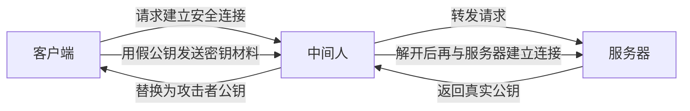
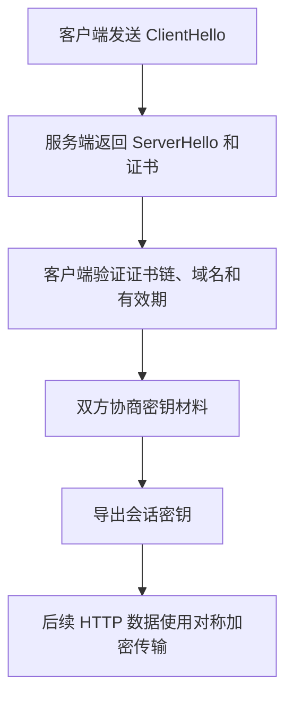
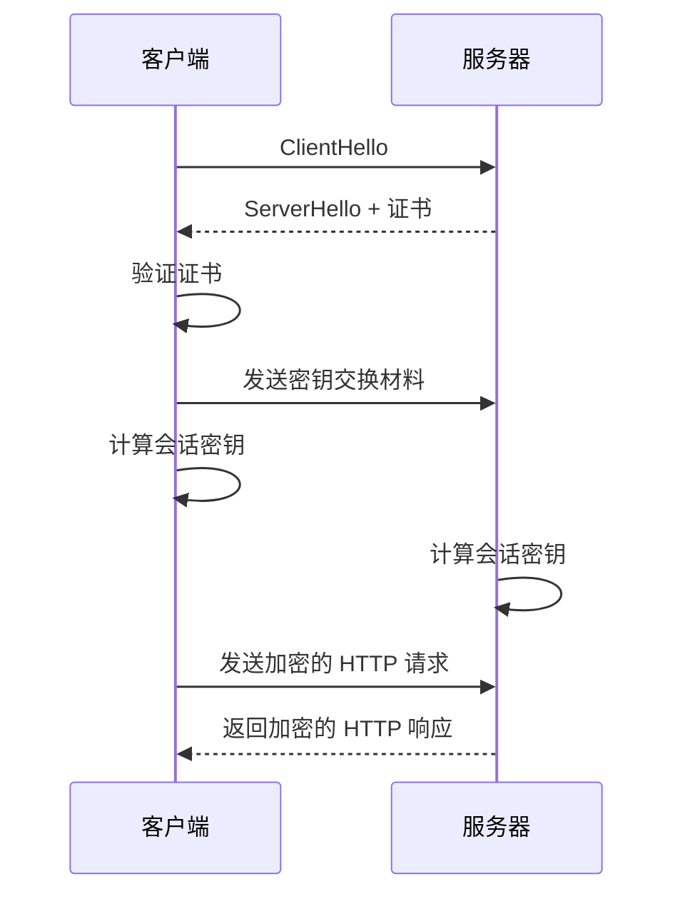

HTTP 本身不提供加密能力。如果账号密码、Cookie 或业务数据直接以明文在网络上传输，链路中的中间节点就可以窃听，甚至篡改内容。因此，HTTPS 的本质并不是“更安全的 HTTP 版本号”，而是在 HTTP 之下引入 TLS，让通信同时具备机密性、完整性和身份认证能力。

## 为什么不能只靠对称加密

对称加密的特点是加密和解密使用同一把密钥。它的优点很明显：计算开销相对更低，适合在正式传输阶段持续处理大量应用数据。

但它有一个关键问题：密钥怎么安全地发给对方？

如果客户端和服务器还没有建立可信信道，那么“把对称密钥直接发过去”这件事本身就会暴露密钥。一旦密钥在传输途中被窃取，后续所有加密数据都等于失去保护。

所以，HTTPS 不能只依赖对称加密。它还需要一种机制，先把“如何安全协商会话密钥”这个问题解决掉。

## 非对称加密解决了密钥分发问题

非对称加密使用一对密钥：公钥可以公开，私钥只由持有者自己保存。通常可以这样理解：

- 公钥加密的数据，只能由对应私钥解密
- 私钥签名的数据，可以由对应公钥验证

在 HTTPS 的语境里，非对称加密主要不是为了“大量传业务数据”，而是为了在握手阶段完成认证或密钥协商。因为它比对称加密更耗时，所以真正的应用数据传输，仍然主要依赖后续生成的对称会话密钥。

## 只知道公钥还不够

如果客户端拿到的服务器公钥一定真实，那么事情会简单很多：客户端可以基于这个公钥参与密钥协商，或者在某些旧模型里直接用它加密预主密钥，再交给服务器处理。

问题在于，客户端怎么确认“眼前这个公钥真的是目标服务器的公钥”？

如果没有额外的认证机制，中间人完全可以拦截第一次通信，把原本属于服务器的公钥替换成自己的公钥。这样一来：

1. 客户端误以为自己拿到了服务器公钥
2. 实际上它拿到的是攻击者公钥
3. 客户端后续发出的密钥材料会先被攻击者解开
4. 攻击者再用真正服务器的公钥重新建立另一条连接

这样，攻击者就站在客户端和服务器之间，分别与两端建立“看起来正常”的加密通信。也就是说，只有加密能力还不够，必须再解决“公钥真实性”问题。

这张图表达的核心很简单：如果客户端无法确认公钥的归属，那么“加密”本身并不能阻止中间人插在中间分别和两端通信。

## 数字证书如何建立信任

这就是数字证书出现的原因。

证书不是“把服务器公钥再加密一遍”的结果，更准确地说，它是一份包含身份信息的声明，里面通常会包含：

- 站点域名等主体信息
- 服务器公钥
- 证书颁发者信息
- 有效期
- CA 的数字签名

这里最关键的是最后一项。CA（证书颁发机构）会用自己的私钥对证书内容做签名，客户端再用系统或浏览器内置的 CA 公钥去验证这份签名是否成立。

如果攻击者想把证书里的公钥替换成自己的公钥，就必须同时重新生成一份能够通过验证的签名；但没有 CA 私钥，他做不到这一点。因此，客户端一旦发现签名不对、证书已过期、域名不匹配，或者证书链不可信，就会拒绝这次连接。

从这个角度看，证书解决的不是“如何保密传公钥”，而是“如何让客户端相信这个公钥确实属于目标站点”。

## TLS 握手的简化流程

把前面的几个概念串起来，HTTPS 可以理解为“先认证身份，再协商会话密钥，最后用对称加密传应用数据”的过程。

一个简化后的 TLS 握手流程可以分成下面几步：

### 1. 客户端发起握手

客户端首先发送 `ClientHello`。这里会带上自己支持的 TLS 版本、密码套件、扩展信息等，意思是“我支持哪些安全能力”。

### 2. 服务端返回协商结果和证书

服务器收到请求后，会返回 `ServerHello`，选定双方都支持的一组参数，同时把自己的证书发给客户端。

### 3. 客户端验证证书

客户端不会“解密证书得到公钥”，而是会验证证书的签名、证书链、域名和有效期。验证通过后，客户端才能确认：证书中的公钥确实属于自己正在访问的站点。

### 4. 双方协商会话密钥

完成身份确认后，双方开始协商本次连接要使用的会话密钥。

这里要注意一个容易混淆的点：很多入门资料会用 RSA 来讲解这个步骤，例如“客户端生成一个随机密钥，再用服务器公钥加密后发给服务器”。这个模型有助于理解“公钥如何参与密钥交换”，但它更接近 TLS 早期版本中的 RSA key transport 思路。

在现代 TLS 中，更常见的是基于 `(EC)DHE` 的临时密钥交换。它的重点不是“客户端把完整对称密钥直接发给服务器”，而是双方各自提供一部分密钥材料，最终共同推导出同一份会话密钥。这样做的一个重要收益，是可以提供前向保密。

### 5. 后续数据进入加密传输阶段

一旦会话密钥生成完成，后续真正的 HTTP 请求和响应，就主要使用对称加密来传输。因为这一步已经不再依赖昂贵的非对称运算，所以既能保证效率，也能保证通信内容不被旁路监听者直接读懂。

## 一个更直观的 HTTPS 流程

如果不刻意区分 TLS 各版本细节，可以把 HTTPS 从建立连接到发送业务数据，概括成下面这条主线：

1. 客户端向服务器发起 HTTPS 请求。
2. 服务器返回自己的证书，以及本次握手所需的协商参数。
3. 客户端验证证书是否合法。
4. 验证通过后，客户端与服务器开始协商会话密钥。
5. 双方各自计算出同一份会话密钥。
6. 后续 HTTP 请求和响应都使用这份会话密钥进行对称加密传输。

如果把每一步再解释得具体一点，大致可以这样理解：

### 1. 客户端发起请求

浏览器访问 `https://` 地址时，不会直接发送明文 HTTP 业务数据，而是先发起 TLS 握手。此时客户端首先关心的不是“我要发什么业务请求”，而是“我接下来能否安全地和对方通信”。

### 2. 服务器发送证书

服务器会把证书发给客户端。证书里包含服务器公钥，以及证明这把公钥确实属于该站点的签名信息。也就是说，服务器先要证明“我是谁”，后面才谈得上“怎么安全通信”。

### 3. 客户端校验证书

客户端会检查几件事：证书是不是可信 CA 签发的、域名是否匹配、证书是否过期、证书链是否完整。只有这些检查都通过，客户端才会继续后面的密钥协商。

### 4. 双方协商会话密钥

这一步才真正进入“生成加密用密钥”的阶段。

在现代 TLS 中，常见做法是通过 `(EC)DHE` 交换各自的临时密钥材料，再各自推导出同一份会话密钥；在很多教学资料里，也会把这一步简化成“客户端生成一个随机密钥，再用服务器公钥加密发给服务器”的 RSA 模型。两种说法的共同点都是：真正用于后续传输的，不是证书里的公钥，而是握手阶段协商出来的会话密钥。

### 5. 进入加密通信

当双方都拿到同一份会话密钥后，后续的 HTTP 请求头、请求体、响应头、响应体，都会基于这份密钥进行加密和完整性保护。这样即使中间人截获数据包，也无法直接读出里面的明文内容，更不能在不被发现的前提下随意篡改内容。

## RSA 在 HTTPS 中处于什么位置

RSA 仍然是理解 HTTPS 的重要入口，但需要注意它的角色边界。

第一，RSA 是一种非对称算法，本身可以用于加密，也可以配合签名场景理解公私钥关系。第二，在 HTTPS 的历史实现中，RSA 的确曾经直接参与过握手阶段的密钥传输。第三，在今天的 TLS 1.3 语境下，主流做法已经转向基于 `(EC)DHE` 的密钥交换，而证书中的公钥更多承担“证明服务器身份”的作用。

所以，把“RSA 通信流程”当成理解 HTTPS 的入门模型没有问题，但如果把它直接等同于现代 HTTPS 的完整实现，就会产生偏差。

## 总结

HTTPS 之所以成立，不是因为它只做了“加密”这一件事，而是把几个机制组合在了一起：

- 对称加密负责高效传输应用数据
- 非对称密码学负责认证或参与密钥协商
- 数字证书负责证明服务器公钥的真实性
- TLS 握手负责把这些机制组织成一套完整流程

真正理解了这四层关系，就能看清 HTTPS 的核心逻辑：先确认你连的是谁，再安全地协商密钥，最后再用这个密钥保护后续通信内容。
