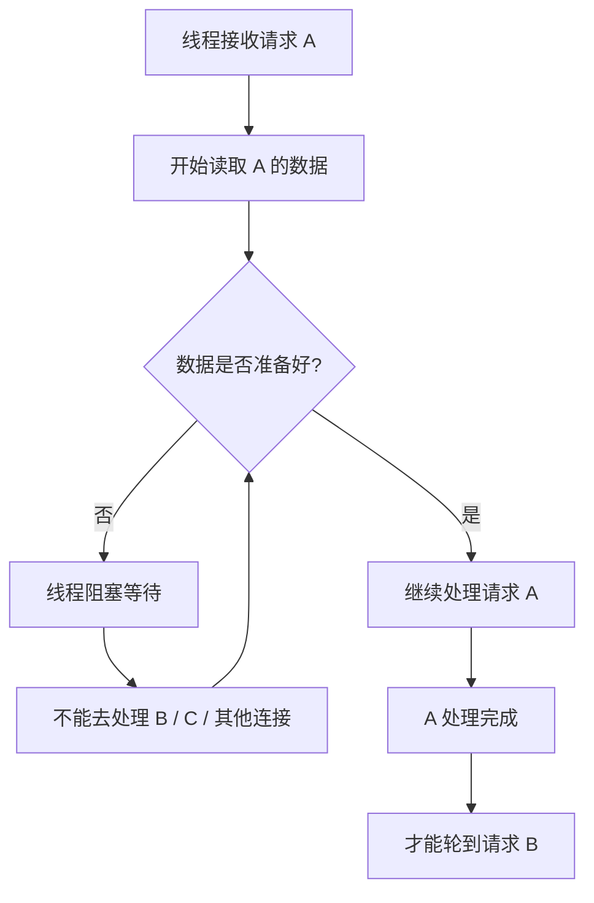
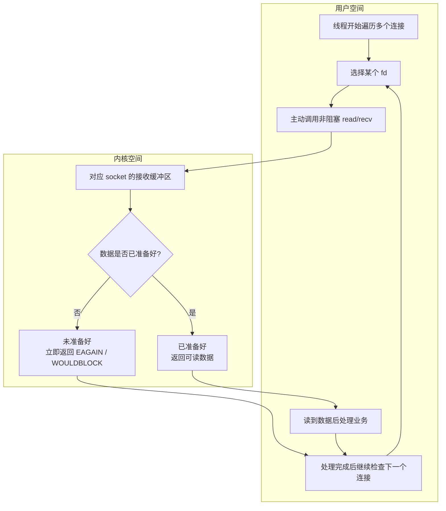
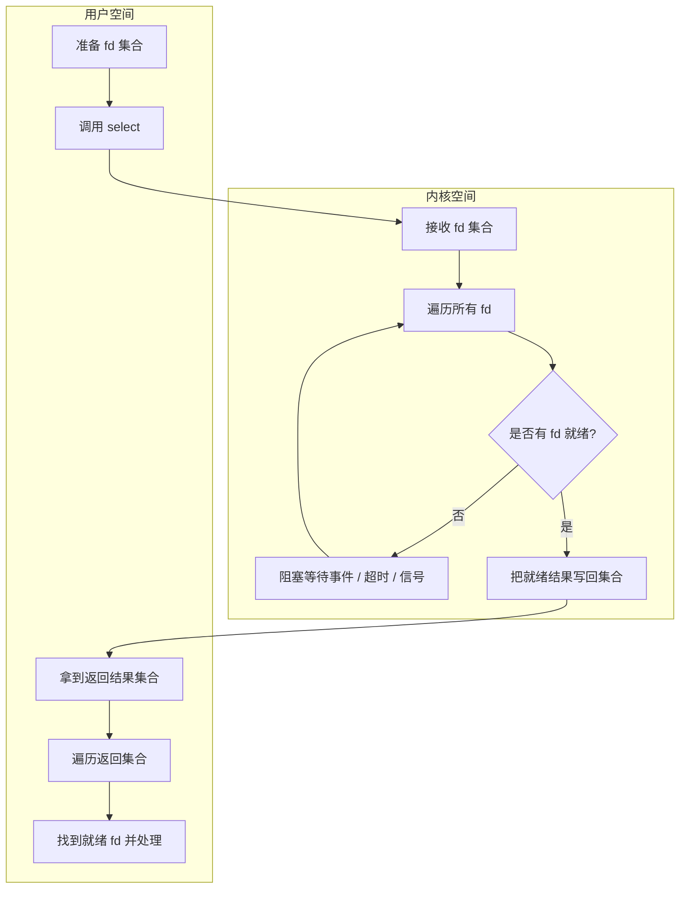
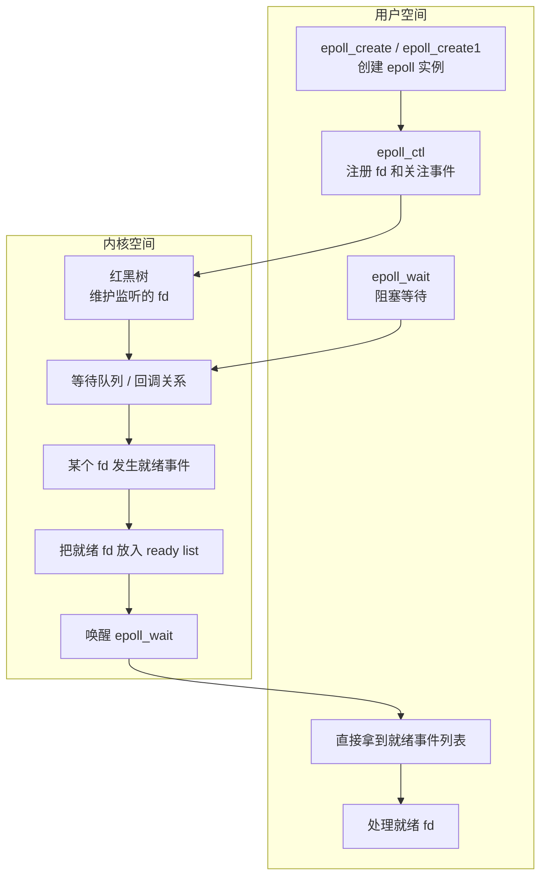

---
title: Netty 前置知识：从阻塞 IO 到 IO 多路复用
published: 2026-04-03
description: 从同步阻塞、同步非阻塞到 select 与 epoll，系统梳理 Netty 之前必须理解的 IO 模型与 IO 多路复用。
image: ""
tags: [Netty, NIO, IO多路复用, epoll]
category: 操作系统
draft: false
lang: ""
---

很多人刚接触 Netty 时，最容易产生的疑问就是：为什么它的非阻塞模型，通常会比传统 Web 框架下那种“一请求一线程”的处理方式更高效？

如果只停留在 “Netty 很快” 这个结论上，其实并不容易真正理解它为什么快，也不容易看明白它到底解决了什么问题。要把这个问题想清楚，必须先回到几个更基础的概念上：

- 同步阻塞
- 同步非阻塞
- `select`
- `poll`
- `epoll`

这些概念本质上都在回答同一个问题：

> 当一个线程同时面对很多连接时，它到底应该怎么等待、怎么检查、又怎么处理这些连接上的事件？

而 IO 多路复用，正是理解 Netty Reactor 模型的前置知识。

## 什么是 IO 多路复用

IO 多路复用可以先不用想得太复杂。你可以把它理解成：

> 一个线程不再死等某一个连接，而是同时关注多个连接；哪个连接真正准备好了，再去处理哪个。

它解决的核心问题不是“让 IO 变快”，而是“减少线程在无意义等待上的浪费”，让有限的线程能管理更多连接。

所以在理解 IO 多路复用之前，最好先把最传统的模型，也就是同步阻塞 IO，想明白。

## 同步阻塞

同步阻塞是最容易理解的一种模型。

假设现在有 `A`、`B`、`C` 三个请求，如果当前线程先处理 `A`，那么在 `A` 完成之前，`B` 和 `C` 都只能排队等待。

这里最关键的点在于：  
即使 `A` 当前并没有执行真正的业务逻辑，而只是卡在网络数据读取、客户端报文到达、或者等待内核把 `socket` 数据准备好，这个线程也依然不能去处理别的连接。

也就是说，在同步阻塞模型里，线程的状态往往是这样的：

1. 接收一个请求。
2. 读取数据。
3. 如果数据还没准备好，就继续等。
4. 数据准备好后继续处理。
5. 处理完成后才能轮到下一个请求。

可以把同步阻塞的处理过程简单画成下面这样：

这个模型的问题并不在于“它不能工作”，而在于它的等待成本太高。

如果系统里有大量连接，而这些连接大部分时间都处于“等数据”“等响应”“等网络”的状态，那么线程资源就会被大量消耗在等待上。尤其是在 WebSocket 这种场景里，很多请求本身并不重，可能只是一次心跳、一次状态同步，或者一次很轻量的消息转发，真正执行业务逻辑的时间非常短；但如果仍然使用传统阻塞模型，线程往往大部分时间都卡在等待 IO 上，结果就是“处理本身很短，等待却很长”，整体吞吐和连接承载能力都会被拖慢。

这也是传统阻塞模型在高并发连接场景下容易暴露出来的问题：

- 连接一多，大量线程都会卡在等待 IO 上
- 单次请求真正处理的时间可能很短，但线程空等的时间却很长
- 系统资源被大量消耗在“等待”而不是“处理”上

当连接继续增加时，线程数量、调度成本和整体吞吐问题才会进一步放大。

所以从这里开始，就会自然引出后面的问题：

> 如果一个线程在等待 `A` 请求的数据时，能不能先去看看 `B` 或 `C` 有没有已经准备好的数据？

这就是后面要继续展开的同步非阻塞和 IO 多路复用的出发点。

## 同步非阻塞

基于上面的同步阻塞模型，一个很自然的改进思路就是：

> 既然线程卡在 `A` 上等待数据时不能做别的事，那我能不能不要一直傻等，而是主动去看看其他连接有没有已经准备好的数据？

这就是同步非阻塞的基本想法。

在这种模型里，线程不会在某一个连接上一直阻塞住，而是会主动去调用非阻塞的 `read` / `recv`。如果某个连接的数据还没有准备好，内核不会像同步阻塞那样让线程睡在那里等待，而是立即返回一个“现在还不能读”的结果，然后线程再继续检查下一个连接。

也就是说，线程的工作方式从原来的：

- 卡在一个连接上等数据

变成了：

- 主动尝试读取某个连接
- 读不到就立刻返回，不阻塞当前线程
- 线程继续检查下一个连接
- 哪个连接真正读到了数据，再处理哪个连接

这样一来，同步阻塞模型里那种“等待期间完全不能处理其他请求”的问题，确实被缓解了。对于连接很多、单次处理又很轻的场景，比如 WebSocket 心跳、在线状态同步、简单消息转发，这种方式至少能让线程在等待 `A` 的时候，不至于完全闲着。

如果既想看“同步非阻塞的执行流程”，又想从“用户空间 / 内核空间”的角度去理解它，可以把它合在一张图里来看：

不过，同步非阻塞虽然解决了“一个连接把线程彻底卡死”的问题，但它很快又会暴露出新的成本：

- 线程需要反复遍历大量连接
- 即使大部分连接根本没有数据，也还是要不断发起非阻塞读调用
- 每次调用都可能触发一次用户态和内核态之间的系统调用交互

所以当连接数量继续增加时，这种“不断遍历、不断询问”的方式本身就会变成一个很大的开销。

换句话说，同步非阻塞并不是没有等待了，而是把“阻塞等待一个连接”变成了“反复对很多连接做非阻塞检查”。  
前者的问题是线程被卡住，后者的问题则是线程虽然没被卡住，但会浪费大量时间做无效检查。

这也正是后面 `select`、`poll`、`epoll` 要继续解决的问题：

> 能不能不要让我自己一遍遍地主动去问，而是由内核更高效地告诉我，哪些连接真的准备好了？

## `select`

在同步非阻塞模型里，问题的关键已经不再是“线程会不会被一个连接卡死”，而是：

> 我为了知道哪些连接有数据，不得不反复对每个连接发起检查，这种检查本身太浪费了。

`select` 的出现，就是为了改善这个问题。

它的核心思路是：  
不要再让用户线程自己一个一个去检查所有连接，而是把“检查哪些 `fd` 已经准备好”这件事交给内核去做。

### `select` 的基本工作方式

使用 `select` 时，应用会先把自己关心的 `fd` 放进一个集合里，比如：

- 哪些 `fd` 需要检查可读
- 哪些 `fd` 需要检查可写
- 哪些 `fd` 需要检查异常状态

然后把这些集合传给 `select`。接下来发生的事情大致是：

1. 用户态把 `fd` 集合拷贝到内核态。
2. 内核遍历这批 `fd`，检查哪些已经就绪。
3. 如果当前没有任何 `fd` 就绪：
   - 如果是阻塞方式，`select` 就会睡眠等待，直到有事件到来、超时或者被信号打断。
   - 如果是非阻塞方式，`select` 会立即返回。
4. 一旦有 `fd` 就绪，内核会把结果写回到返回集合里。
5. 用户态拿到结果后，再遍历一遍返回集合，找出到底是哪些 `fd` 可以处理。

也就是说，`select` 并不是直接把“哪一个连接可读”以一个现成列表塞给你，而是返回一个“哪些位被置位”的结果集合，你仍然需要自己再扫描一遍。

这里还有一个很容易误解的点：  
`select` 在阻塞等待时，确实可以在事件到来后被内核唤醒；但它被唤醒之后，并不是直接拿到一个现成的“就绪 fd 列表”，而是仍然要重新遍历这整批被监听的 `fd`，再判断到底哪些真的已经就绪，然后再把结果写回返回集合。

### 可以怎样理解它

如果说同步非阻塞是在做：

- 应用线程自己挨个问：`fd1` 好了吗？`fd2` 好了吗？`fd3` 好了吗？

那么 `select` 更像是在做：

- 应用线程先把一批 `fd` 交给内核
- 然后问一句：这批里面谁准备好了？
- 内核检查完后，把结果返回给你

这样做的好处是，至少不用由用户线程反复对每个连接单独发起检查了，查找可操作对象的职责被转移到了内核态。

### `select` 的处理流程

### `select` 的优点

- 避免了应用线程自己对每个连接逐个发起非阻塞检查
- 把“哪些连接已经就绪”的判断交给内核统一处理
- 比最原始的同步非阻塞轮询更高效，也更像真正的事件等待模型

### `select` 的问题

不过，`select` 并没有彻底解决问题，它只是把问题往前推进了一步。

它的主要缺点有几个：

- 每次调用 `select`，都要把 `fd` 集合从用户态拷贝到内核态
- 内核每次仍然需要遍历整批 `fd`
- 即使已经有事件把 `select` 唤醒了，醒来之后仍然要再扫描整批 `fd`
- 返回之后，用户态还要再遍历一遍结果集合，才能找到具体是哪几个 `fd` 就绪
- 当连接数量很多时，这种“内核遍历一次，用户再遍历一次”的模式依旧会很耗时

还有一个很经典的限制：

- 在常见 Linux 环境里，`select` 受 `fd_set` 大小限制，默认通常只能处理 `1024` 个 `fd`

所以 `select` 的意义并不是“已经足够完美”，而是它第一次把“等待事件”这件事从用户层的无脑轮询，推进到了“由内核统一帮你检查”这一步。

也正因为它仍然存在集合拷贝、线性遍历和 `fd` 数量限制，后面才会继续出现 `poll` 和 `epoll`。

## `epoll`

如果说 `select` 已经把“检查哪些连接就绪”这件事交给了内核，那么 `epoll` 要解决的就是 `select` 还没解决完的那部分问题：

- 不想每次都把整批 `fd` 集合从用户态拷贝到内核态
- 不想每次被唤醒后还要重新扫描整批 `fd`
- 希望内核能更直接地把“真正已经就绪的连接”交给用户态

`epoll` 正是在这样的背景下出现的。

### `epoll` 的三个核心调用

`epoll` 最常见的三个接口是：

- `epoll_create` / `epoll_create1`
- `epoll_ctl`
- `epoll_wait`

它们各自负责的事情可以简单理解成：

- `epoll_create` / `epoll_create1`
  创建一个 `epoll` 实例，也可以理解为创建一个专门用来做事件管理的“内核对象”
- `epoll_ctl`
  把某个 `fd` 注册到这个 `epoll` 实例上，或者修改、删除它关心的事件
- `epoll_wait`
  等待事件发生，并直接拿到“已经就绪的事件列表”

### `epoll` 的核心思路

和 `select` 最大的区别在于，`epoll` 不是每次调用时临时把整批 `fd` 传进去，而是先把“我长期关心哪些 `fd`、关心哪些事件”注册到内核里。

从概念上看，可以把它理解成内核里维护了两类东西：

- 一棵用于管理监听对象的结构
  常见实现会用红黑树来组织已经注册的 `fd`
- 一个就绪队列
  哪些监听项真正发生了事件，就把对应对象加入这个队列，同时保留原有的监听关系

也就是说，`epoll` 更像是：

- 平时先把监听关系维护好
- 真有事件发生时，把对应的就绪对象挂到 ready list
- `epoll_wait` 醒来后，直接把 ready list 里的结果交给用户态

这也是它和 `select` 的本质差异。

### 为什么这里会有红黑树和回调关系

这里有一个很容易混淆的点：  
`epoll` 高效，并不是因为“事件来了以后，再去红黑树里精准查找 ready 的对象”。

更准确的分工应该是：

- 红黑树这类结构，主要负责维护“当前到底监听了哪些 `fd`”
- ready list 负责保存“这一次真正已经就绪的对象”
- 回调关系 / 等待队列，则负责把“某个 `fd` 发生事件”这件事通知给 `epoll`

也就是说，红黑树更像是在管理一份长期存在的监听集合，而不是在事件发生后临时拿来做全量扫描。

那为什么不直接用一个普通线性表来保存监听对象？  
因为这些监听项并不是注册完就再也不动了，后面还会不断发生：

- `epoll_ctl ADD` 新增监听
- `epoll_ctl MOD` 修改关注事件
- `epoll_ctl DEL` 删除监听
- 判断某个 `fd` 是否已经注册
- 根据 `fd` 找到对应监听项并更新它的状态

如果只是普通线性表，这些增删改查在监听对象很多时都会越来越低效。  
所以从实现角度看，内核更需要一套适合维护监听集合的数据结构，常见实现就会用红黑树来组织这些对象。

这里还要再强调一句：

> 同一个 `epoll`` 实例里的 `fd`，只是“一起被管理”，并不代表“它们会一起触发”。

每个 `fd` 是否可读、可写，取决于它自己对应的 socket 或文件对象状态。  
当某个 `fd` 真正发生事件时，内核会通过已经建立好的等待关系或回调路径，把这个就绪对象挂到 ready list 中。  
所以 `epoll_wait` 返回时，用户态拿到的是 ready list 里的结果，而不是再去把整棵树重扫一遍。

再进一步说，也不是“整个系统只有一棵红黑树”。  
更适合写进博客里的说法是：

> 一个 `epoll` 实例通常可以看成一个独立的事件管理器，它会维护自己的监听对象结构和自己的 ready list。

### 事件触发时到底发生了什么

`epoll` 在事件到来时的高效，并不是因为它重新去扫描整棵红黑树，也不是因为它像数组下标那样做一次简单索引。  
真正的关键在于：在 `fd` 注册到 `epoll` 的那一刻，内核就已经把这个 `fd`、它关注的事件，以及对应的等待关系建立好了。

因此，当某个 socket 真正发生状态变化时，整体流程更接近下面这样：

1. 某个 `fd` 对应的 socket 状态发生变化，例如接收缓冲区里有数据到达，变成可读
2. 内核沿着这个对象已经建立好的回调关系或等待队列，定位到和它关联的 `epoll` 监听项
3. 对应的监听项被标记为 ready，并挂入 `epoll` 的 ready list，同时仍然保留在监听集合中
4. 如果此时有线程正在 `epoll_wait` 上阻塞等待，就会被唤醒
5. `epoll_wait` 返回时，用户态拿到的就是 ready list 中已经就绪的事件集合

这里最重要的一点是：  
事件发生后，内核并不会重新把整批监听对象扫描一遍，而是沿着预先建立好的关联路径，把真正发生事件的对象直接加入 ready list。

### `epoll` 的处理流程

### 这和 `select` 到底差在哪

`select` 的模式更接近：

- 每次都带着整批 `fd` 去问内核
- 内核扫描整批 `fd`
- 醒来后用户再扫描一遍结果

而 `epoll` 的模式更接近：

- 先把监听关系注册到内核
- 真有事件发生时，内核把对应 `fd` 放进 ready list
- `epoll_wait` 返回时，用户态拿到的已经是“就绪事件集合”

所以对用户态来说，`epoll_wait` 返回后不需要再像 `select` 那样去扫描整批监听集合，而是只处理真正 ready 的那些对象。

### 复杂度应该怎么理解

`epoll` 的高效，核心就在于避免了对整批监听对象的重复扫描，并且能够把真正 ready 的对象直接返回给用户态。

从复杂度角度看：

- `epoll_ctl` 的添加、删除、修改，通常可以理解为和红黑树操作相关，复杂度接近 `O(logN)`
- `epoll_wait` 返回结果时，更接近于按“就绪事件数量”工作，也就是常说的 `O(ready)`
- 它并不是严格意义上的“用户态复杂度就是 `O(1)`”

所以 `epoll` 最值得强调的不是某一个绝对复杂度数字，而是：

> 它避免了像 `select` 那样每次都对整批监听对象做线性扫描，而是把工作重点收敛到了真正发生事件的那些连接上。

### `epoll` 的优点

- 不需要像 `select` 那样每次都重复传整批 `fd` 集合
- 不需要在返回后再由用户态扫描整批监听集合
- 更适合大量连接、长连接、高并发事件通知场景
- 在网络服务器场景下，尤其适合 WebSocket、IM、网关、RPC 这类连接很多的系统

### `epoll` 的边界和注意点

`epoll` 也不是“任何场景都无脑更好”。

更合适的理解是：

- 它的机制更复杂
- 它在 Linux 下非常适合高并发连接场景
- 当连接数量多、活跃连接比例相对较低时，它的优势会特别明显

但如果只是连接很少、模型很简单，那它带来的收益可能不会像高并发场景那么显著。  
所以不应该简单理解成“连接少时 epoll 一定不如 select”，而应该理解成：它的优势主要体现在大规模事件驱动场景里。

### 小结

一句话概括 `epoll`：

> `select` 是“每次都把整批 fd 拿去检查一遍”，而 `epoll` 更像是“先把监听关系注册好，真正发生事件时，只把 ready 的对象返回给你”。

Netty 在 Linux 下会优先利用 `epoll` 能力，本质上也是因为它和高并发、事件驱动、长连接管理这几个目标天然更匹配。
