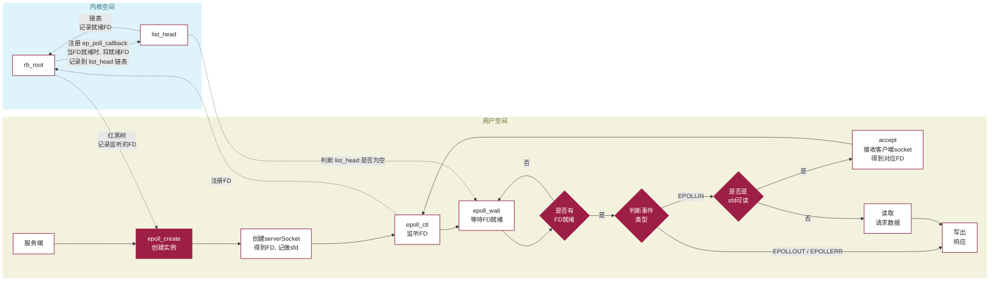
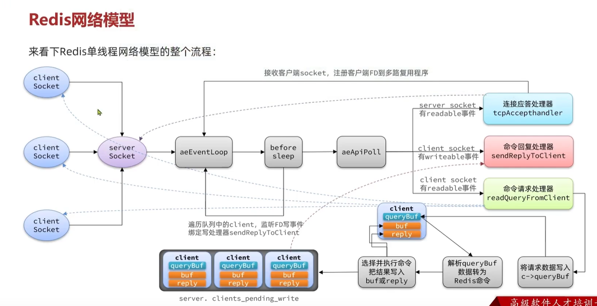

## 基于epoll模式的web服务的基本流程

这张图描述的是一个简化后的 epoll 驱动 Web 服务流程。主线可以分成两部分来看：一部分是监听关系的建立，另一部分是事件到来后的派发与处理。

服务端启动后，会先通过 `epoll_create` 创建一个 epoll 实例，然后创建 `serverSocket`，拿到监听套接字对应的 `sfd`。接下来通过 `epoll_ctl` 把这个 `sfd` 注册到 epoll 里。对 Linux 的常见实现来说，监听项会被组织在内核维护的红黑树中，用来管理“当前到底监听了哪些 fd”；而真正已经就绪的对象，则会通过回调路径被挂到 `list_head` 对应的 ready list 中。

之后服务线程进入 `epoll_wait`。如果 ready list 里还没有就绪对象，线程就继续等待；一旦有 `fd` 就绪，`epoll_wait` 就会返回这些 ready 事件。返回之后，用户态不会再去扫描全部监听对象，而是直接处理这批已经 ready 的 `fd`。

接下来的分支判断，决定了服务端应该如何处理这次事件。如果是监听 `sfd` 的可读事件，通常意味着有新的客户端连接到来，这时会调用 `accept` 拿到新的客户端 socket，并把新的连接 `fd` 再次通过 `epoll_ctl` 注册到 epoll 中。如果不是监听 socket 的建连事件，而是普通连接上的读事件，那么就继续读取请求数据、解析命令并准备响应；如果连接已经可写，或者需要在异常分支里做收尾处理，则进入写回或关闭逻辑。

从这个角度看，epoll 模式下的 Web 服务并不是“一个线程只盯着一个连接”，而是先把监听关系长期注册好，再由内核在事件真正到来时把 ready 对象返回给用户态处理。这也是它能够在大量连接场景下比传统阻塞模型更高效的关键原因。

## redis网络模型 

这张图比前面的“通用 epoll Web 服务流程”更进一步，它描述的是 Redis 单线程网络模型里，IO 多路复用和事件派发是如何与命令执行过程结合起来的。

Redis 启动后，会先创建 `server socket`，然后把它注册到事件循环中。事件循环本身可以理解为“IO 多路复用 + 事件派发”的组合：前者负责等待哪些 `fd` 就绪，后者负责根据事件类型调用对应的处理器。只要监听 socket 上出现可读事件，就说明有新的客户端连接到来，这时会进入 `tcpAcceptHandler`，调用 `accept` 拿到新的客户端 socket。随后，Redis 会为这条新连接创建一个对应的 `client` 结构，并把新的客户端 `fd` 继续注册到多路复用程序中。后续这条连接上的输入缓冲、输出缓冲以及请求处理状态，都会挂在这个 `client` 对象上。

当某个客户端连接上出现可读事件时，事件循环会把它分派给 `readQueryFromClient`。这个处理器会先把请求数据写入对应客户端结构里的 `queryBuf`，然后继续解析 `queryBuf` 中的内容，把它转换成 Redis 命令。命令真正执行完成后，结果不会直接立刻写回，而是先写入客户端对象的 `reply` 缓冲区。

这时 Redis 会把“当前需要尝试发送回复的客户端”挂到 `server.clients_pending_write` 这类待写队列中。这个队列里存放的是一批不同的 `client` 对象，每一项都对应一条具体客户端连接，而不是某一个 `client` 的多个阶段状态。这里的“队列”也不是“攒够一定数量再统一发送”的批处理缓存，它更像是一张待处理列表，用来记录“哪些 client 现在值得先试着写一次”。

接下来 Redis 并不会立刻重新阻塞进多路复用等待，而是会先进入事件循环每一轮结束前的 `beforeSleep` 阶段。之所以有这个阶段，是因为事件循环并不是始终都有事情可做：如果当前没有新的连接、没有新的读写事件、也没有立即要执行的任务，线程就应该进入一次阻塞等待，而不是空转消耗 CPU。Redis 正是在真正再次进入 `epoll_wait` 之前，先利用 `beforeSleep` 做一轮额外的收尾处理，其中就包括遍历 `clients_pending_write`，逐个 `client` 先尝试直接把回复写到对应 socket 上。

这个“尝试直接写”的阶段本身是主线程串行进行的，但它并不要求某个 `client` 一定一次写完，也不要求整个队列必须严格按先后顺序完整清空。因为这里的“socket 可写”只表示当前还可以继续发送一部分数据，并不保证一次就能把整个 `reply` 缓冲区全部清空。也正因为如此，Redis 才会把发送流程拆成两个阶段：

1. 先在 `beforeSleep` 阶段，对待写队列里的 `client` 逐个做一次“直接写”的尝试。
2. 如果某个 `client` 在这一步已经全部写完，那么这次发送流程就结束了；只有当某个 `client` 的回复仍然没有写完时，Redis 才会为它注册写事件处理器，也就是 `sendReplyToClient`，等这个 `client` 对应的 socket 后续再次变成可写时，再继续把剩余内容写回去。

这也是 Redis 输出链路里一个很重要的细节：写事件处理器并不是每个 `client` 默认都会挂上，它更像是一种“续写机制”或“兜底路径”。只有直接写一次还不够时，才需要依赖可写事件继续发送剩余数据。

如果把这个过程再拆细一点，可以用两个客户端的例子来理解。假设某一轮 `epoll_wait` 返回时，`client A` 和 `client B` 的读事件都已经 ready。虽然 Redis 主线程在任意一个具体时刻只能处理一个 `fd`，但它可以在这一轮里按顺序先处理 `A`，再处理 `B`。如果 `A` 执行完命令后产生了回复，就先把 `A` 挂进 `clients_pending_write`；随后 `B` 也执行完并产生回复，那么 `B` 也会进入这个待写列表。于是当这一轮读事件处理结束时，待写队列里完全可能已经同时有多个 `client`，这和“主线程一次只处理一个事件”并不矛盾。

真正的遍历时机也不是“每处理一个 `fd` 就立刻遍历待写队列”，而是当前一轮事件处理结束后，在 Redis 重新进入阻塞等待之前，由 `beforeSleep` 阶段统一遍历当前已经挂入队列的待写客户端。这样做的目的，是先顺手把这批已经准备好回复的 `client` 尝试写一次，看看能不能直接发完，尽量减少额外注册可写事件处理器的次数。

这里还要再强调一点：`socket` 的“可写”并不等于“一次一定能把全部数据写完”。可写只表示当前发送缓冲区还有一部分可用空间，因此一次写操作很可能只推进了部分字节，而不是把整个 `reply` 缓冲区完全清空。也正因为如此，Redis 才会区分“先直接尝试写一次”和“后续靠 `sendReplyToClient` 继续补发”这两个阶段。

从机制上看，Redis 这套网络模型之所以能在单线程下支撑大量连接，关键并不是“处理器本身都在内核空间里执行”，而是它建立在非阻塞 socket 和 IO 多路复用之上。`socket` 是否可读、可写，是由内核根据连接当前状态判断的；当这些事件真正就绪后，`epoll` 才会把 ready 事件返回给用户态，Redis 主线程再据此调用 `tcpAcceptHandler`、`readQueryFromClient`、`sendReplyToClient` 等处理逻辑。也就是说，内核空间负责的是“等待、判断和通知”，而真正的命令读取、协议解析、命令执行和回复组织，仍然发生在用户态。

这也是 Redis 网络部分能够保持非阻塞的根本原因：主线程不会在“这条连接暂时没数据”或者“这次暂时写不进去”时被卡住，而是把等待网络事件这件事交给内核，自己只在事件真正 ready 时再进入处理逻辑。这样做确实大幅减少了线程空等网络的时间，但它并不意味着所有网络相关瓶颈都被彻底消灭。更准确地说，非阻塞 IO 解决的是“线程如何等待网络事件”的问题，而真正的网络吞吐、对端接收速度、以及命令执行本身，依然可能成为系统的性能上限。

从这个流程可以看出，Redis 单线程并不是“收到请求后立刻一路同步写回”，而是把网络读、命令执行、结果暂存、网络写这几个阶段拆开，再通过事件循环把它们串起来。这样做的好处是，单线程不需要为每个连接单独分配线程，却依然可以同时管理大量客户端连接，并把真正的 CPU 时间集中用在命令解析和命令执行上。
