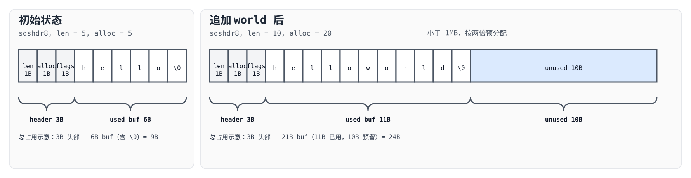
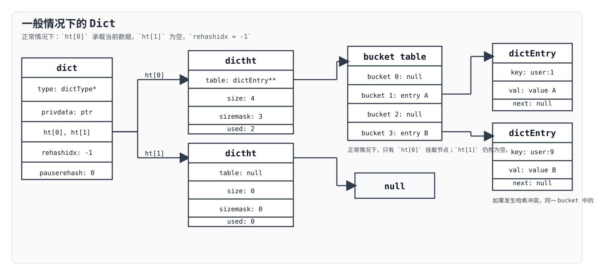
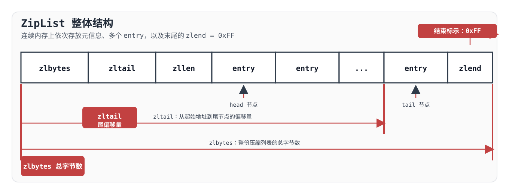
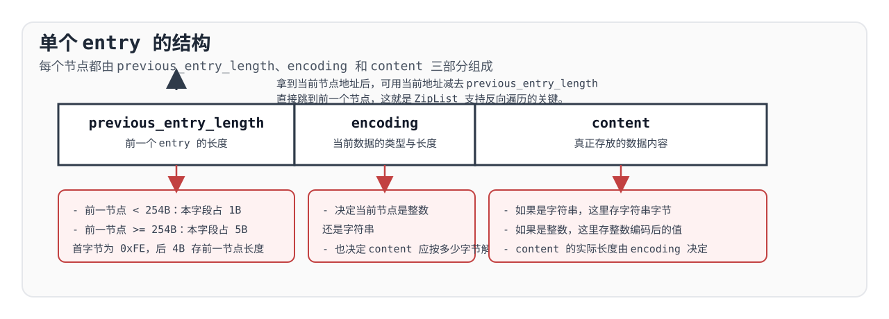
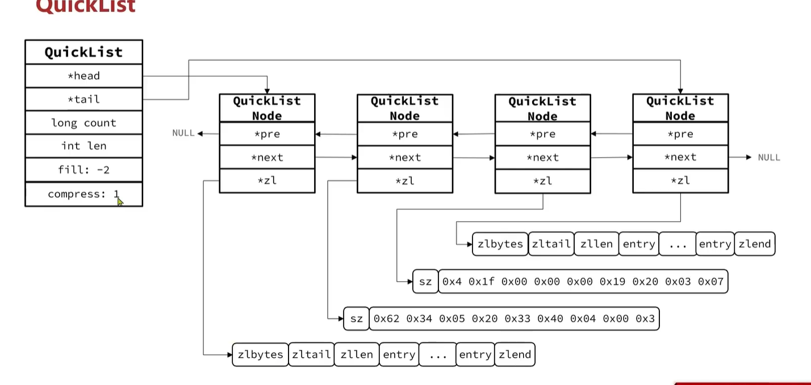
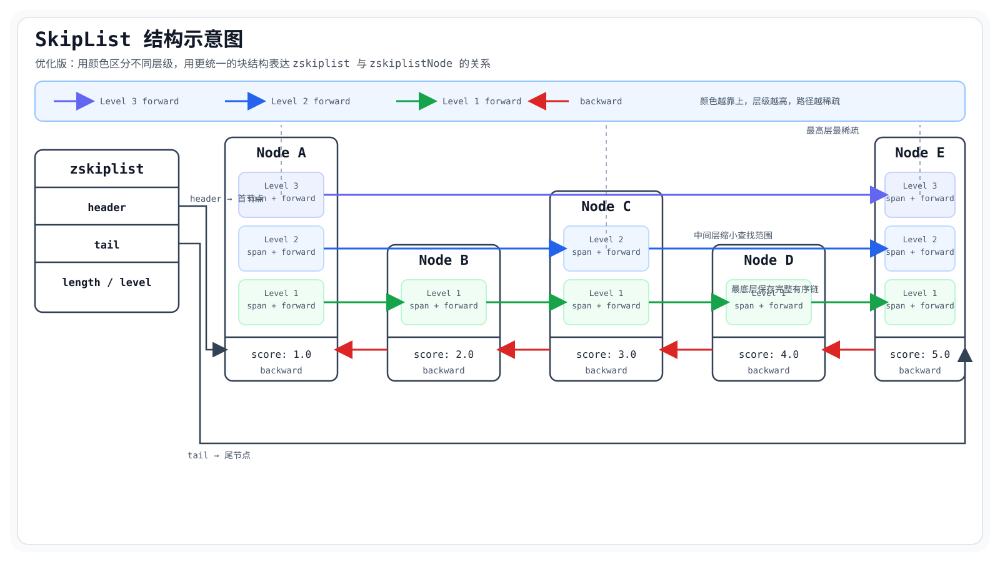

redis的set，list等这些结构也是由一个个底层的数据结构组合起来的 

## SDS（动态字符串）

Redis 没有直接使用 C 语言原生的 `char*` 来表示字符串，而是封装了一层 `SDS`（Simple Dynamic String）。它本质上是在字符数组前面再附加一段元数据，用来记录字符串长度和可用空间。

以 `sdshdr16` 为例，它的结构大致如下：

```c
struct sdshdr16 {
    uint16_t len;
    uint16_t alloc;
    unsigned char flags;
    char buf[];
};
```

除了 `sdshdr16`，Redis 还定义了 `sdshdr5`、`sdshdr8`、`sdshdr32` 和 `sdshdr64` 等几种变体。它们的核心思路是一致的，只是用不同位宽来保存长度和容量信息，从而在“小字符串减少头部开销”和“大字符串支持更大容量”之间取得平衡。

理解 SDS 时，`len`、`alloc`、`flags` 和 `buf` 这四个部分其实同样重要，它们分别承担了不同职责：

- `len` 表示当前已经使用了多少字节，也就是字符串的实际长度。因为长度被直接记录下来，所以 Redis 获取字符串长度时不需要像 C 字符串那样一路扫描到 `\0`。
- `alloc` 表示 `buf` 当前一共分配了多少可用空间。它统计的是字符数组本身的容量，不包含头部，也不包含末尾额外预留的 `\0`。因此在追加内容时，Redis 可以先检查 `alloc` 是否足够，再决定是否扩容。
- `flags` 用来标识当前 SDS 采用的是哪一种头部类型。由于 Redis 对外通常暴露的是 `buf` 的地址，也就是一个 `char*`，所以它需要依靠 `flags` 才能反推出前面的头部结构。比如，`s[-1]` 取到的就是紧挨在 `buf` 前面的 `flags` 字节；Redis 再根据这个类型标记，判断当前字符串对应的是 `sdshdr8`、`sdshdr16`、`sdshdr32` 还是 `sdshdr64`，从而继续读取正确的 `len` 和 `alloc`。
- `buf` 才是真正存放字符内容的区域，并且仍然会以 `\0` 结尾。这样设计的好处是，SDS 一方面能用 `len` 做到二进制安全和高效取长，另一方面又能在很多场景下兼容 C 风格字符串接口。

这里还要注意一点：SDS 的头部类型并不是一旦确定就永远不变。如果原本是 `sdshdr8`，但某次追加的数据很多，导致新的目标长度已经超出了当前类型的可表示范围，那么 Redis 就会在扩容时重新选择更大的头部类型，比如升级为 `sdshdr16`。再往上也是同样的道理，必要时还可以继续升级到 `sdshdr32` 或 `sdshdr64`。也就是说，`flags` 不只是“标记当前类型”，它还让 Redis 能在字符串变长之后切换到更合适的 SDS 结构。

正是因为这几个字段协同工作，SDS 才同时具备了几个关键能力：

- 获取长度快，因为可以直接读取 `len`
- 追加效率高，因为可以利用 `alloc` 判断是否需要扩容
- 扩容成本更可控，因为 Redis 会基于剩余空间和预分配策略减少频繁 `realloc`
- 类型定位明确，因为可以通过 `flags` 和 `s[-1]` 反推出实际头部结构

Redis 在 SDS 扩容上采用了预分配策略：

- 如果扩容后的目标长度小于 `1MB`，通常按两倍方式扩容
- 如果扩容后的目标长度大于等于 `1MB`，则不再继续翻倍，而是在目标长度基础上额外多分配 `1MB`

这样做的目的，是在小字符串场景下尽量减少重复扩容，而在大字符串场景下避免因为持续翻倍而浪费过多内存。

下面再看一个具体例子。

### 一个具体例子

假设当前 SDS 中存放的是 `hello`。如果先按“刚好够用”的方式来理解，那么这时可以写成：

- `len = 5`
- `alloc = 5`
- `buf = "hello\0"`

这里的含义是：

- 当前实际内容长度是 5
- `buf` 的可用容量也是 5
- 末尾额外保留一个 `\0`，用于兼容 C 风格字符串接口

如果接下来再追加 `world`，那么新的实际内容就会变成 `helloworld`，长度是 `10`。由于 `10 < 1MB`，此时 Redis 会按照小于 `1MB` 的预分配策略处理，一般会把容量扩到目标长度的两倍，也就是：

- `len = 10`
- `alloc = 20`
- `buf = "helloworld\0"`



上图使用 `sdshdr8` 作为示意。左侧是初始状态，右侧是追加 `world` 之后的状态。可以看到，扩容后不仅 `len` 从 `5` 增长到 `10`，`buf` 后面还额外多出了一段 `unused` 区域，这部分就是预分配出来的空闲空间，用来减少后续继续追加时的重复扩容。

如果不是这个小例子，而是某次追加后目标长度已经达到或超过 `1MB`，那么扩容策略就会切换。此时不会再把容量直接翻倍，而是改为：

- 新的 `alloc = 目标长度 + 1MB`

例如，如果扩容后的目标长度是 `1.2MB`，那么新的可用容量通常会分配到大约 `2.2MB`。这样既保留了一定的追加空间，也避免了大字符串继续按倍数增长带来的内存膨胀。

这种设计让 SDS 既保留了 C 字符串“可直接传递 `char*`”的使用方式，又补上了原生字符串无法高效获取长度、扩容不安全等问题，因此成为 Redis 内部字符串实现的基础。  

## intset

`intset` 是 Redis 用来保存整数集合的一种紧凑结构，底层本质上是一块连续内存。它的结构定义如下：

```c
typedef struct intset {
    uint32_t encoding;  // 当前集合的编码方式
    uint32_t length;    // 当前集合中的元素个数
    int8_t contents[];  // 实际保存元素的连续内存区域
} intset;
```

理解 `intset` 时，最关键的是 `encoding`、`length` 和 `contents` 这三个部分。

- `encoding` 表示当前集合中每个元素采用多少字节来存储。虽然 `contents` 被声明成了 `int8_t[]`，但它并不意味着集合里真的只存 8 位整数。真正决定元素类型的是 `encoding`。在 Redis 中，常见的编码方式有 `INTSET_ENC_INT16`、`INTSET_ENC_INT32` 和 `INTSET_ENC_INT64`，分别表示每个元素占用 `2`、`4`、`8` 字节。
- `length` 表示当前集合中的元素个数，而不是字节数。比如一个 `length = 3` 的 `intset`，如果当前编码是 `INTSET_ENC_INT64`，那么它表示集合里有 3 个整数，只不过每个整数都要占 8 字节。
- `contents` 才是真正存放整数值的区域。Redis 会根据 `encoding` 把这段连续内存按 `int16_t[]`、`int32_t[]` 或 `int64_t[]` 的方式去解释和访问。

`intset` 能成立的前提，是它始终保持两条约束：

- 集合中的元素按从小到大有序排列
- 集合中的元素不能重复

正因为这两个条件同时成立，Redis 在查找某个整数时就可以直接使用二分查找来定位；如果要插入一个不存在的新值，也可以先通过二分查找确定它应该落在哪个位置，再把后面的元素整体后移。

`intset` 的另一个关键点，是整个集合必须使用统一的编码方式。也就是说，集合里所有元素都按同一种位宽存储，而这个位宽取决于当前集合中“最占空间”的那个值。

例如，若集合中的元素是 `[1, 3, 10000000]`，那么由于 `10000000` 已经超出了 `int16_t` 的表示范围，整个集合就不能继续使用 `INTSET_ENC_INT16`，而是至少要升级到 `INTSET_ENC_INT32`。

![intset 中 [1, 3, 10000000] 的最终内存布局示意图](./intset-layout.svg)

上图展示的是这个例子的最终结构。此时 `encoding = 4`，表示整个 `contents` 区域都要按 `int32` 的方式解释；`length = 3`，表示当前集合中一共有 3 个逻辑元素。虽然 `contents` 在结构体里声明为 `int8_t[]`，但它本质上只是“一段连续字节内存”。在这个例子里，这段内存总长度是 `12` 字节，因为 3 个元素都按 `int32` 存储，所以每个元素都会占用连续 `4` 个 `contents` 字节。换句话说，`element 0` 对应 `contents[0..3]`，`element 1` 对应 `contents[4..7]`，`element 2` 对应 `contents[8..11]`。从总占用上看，`encoding` 和 `length` 各占 `4` 字节，头部一共 `8` 字节；`contents` 一共 `12` 字节，因此这份 `intset` 的实际分配大小可以理解为 `20` 字节。

如果一个原本使用 `INTSET_ENC_INT16` 的集合，突然插入了一个只能用 `INTSET_ENC_INT64` 表示的新值，那么 Redis 会执行一次编码升级。这个过程可以概括为：

1. 先根据新值计算出所需的更大编码类型
2. 按新编码重新申请一块更大的连续内存
3. 从尾部开始搬运旧元素，避免在搬运过程中覆盖还未处理的数据
4. 把新值插入到正确的位置

这里从尾部开始搬运并不是随意选择的细节，而是升级过程中的关键点。因为旧数组和新数组的数据区域可能发生重叠，如果从前往后写，就有可能把后面还没搬的数据先覆盖掉；而从后往前搬，可以避免这个问题。

还有一个很有意思的细节是：如果新插入的值导致编码升级，那么这个值一定会落在集合的最前面或最后面。原因是它既然已经超出了当前编码可表示的范围，那么它的数值一定比原集合里的所有值都更小，或者都更大。因此，Redis 在升级时只需要处理“头插”或“尾插”这两种情况，不需要在中间位置做复杂插入。

整体来看，`intset` 适合元素数量不大、并且所有成员都是整数的场景。它利用“有序 + 唯一 + 统一编码”这几个条件，把空间占用压得比较低，同时也让查找和插入逻辑保持在一个相对可控的复杂度内。

## DICT
DICT 主要可以拆成三个层次来看，分别是哈希节点 `DictEntry`、哈希表 `DictHashTable` 和最外层的字典 `Dict`。理解时比较自然的顺序是从下往上，也就是先看单个节点是怎么存的，再看这些节点如何组织成哈希表，最后再看整个字典结构如何管理它们。

### 哈希节点(DictEntry)
哈希节点是 DICT 中最基础的存储单元，它的数据结构如下：

```c
typedef struct dictEntry {
    void *key;                // 键 (通常是指向一个 SDS 字符串)
    union {                   // 值 (联合体，节省空间)
        void *val;            // 指向复杂对象 (如 Redis Object)
        uint64_t u64;         // 无符号 64 位整数
        int64_t s64;          // 有符号 64 位整数
        double d;             // 浮点数
    } v;
    struct dictEntry *next;   // 指向下一个哈希节点 (用于解决哈希冲突)
} dictEntry;
```

这个结构里最关键的是 `key`、`v` 和 `next` 三个部分。

- `key` 指向当前节点保存的键。在 Redis 中，这个键很多时候会是一个 SDS 字符串。Redis 会先根据 `key` 计算哈希值，再结合哈希表长度和掩码，把这个节点放进对应的桶里。
- `v` 是一个联合体 `union`，表示当前节点对应的值。这里之所以使用联合体，而不是把 `void *`、`uint64_t`、`int64_t`、`double` 全部同时放进结构体里，是因为一个节点在任意时刻只需要使用其中一种表示方式。联合体的含义是“这些字段共用同一块内存”，因此 `v` 可以是指针、无符号整数、有符号整数或浮点数中的任意一种，但它本身只占一份最大成员所需的空间，而不是四份都加起来。
- `next` 用来指向同一个桶中的下一个节点。这是 Redis 处理哈希冲突的方式之一，也就是链地址法。两个不同的键经过哈希计算后，可能会因为桶数量有限、以及与掩码运算后的结果相同，被分配到同一个桶里。此时后插入的节点不会覆盖前面的节点，而是通过 `next` 串成一条链。

也就是说，一个桶里并不一定只放一个 `dictEntry`。如果没有冲突，那么这个桶里可能只有一个节点；如果发生冲突，那么这个桶里就会形成一条链表，而 `next` 正是把这条链表连接起来的指针。

### 哈希表 （DictHashTable）
哈希节点再往上一层，就是哈希表 `DictHashTable`。它负责管理一组桶，并把多个 `dictEntry` 组织起来。它的数据结构如下：

```c
typedef struct dictht {
    dictEntry **table;      // 哈希表数组（指向 一个个dictEntry 指针）
    unsigned long size;     // 哈希表大小（数组长度）
    unsigned long sizemask; // 哈希表大小掩码，用于计算索引（等于 size - 1）
    unsigned long used;     // 该哈希表已有节点的数量
} dictht;
```

理解 `dictht` 时，最关键的是 `table`、`size`、`sizemask` 和 `used` 这四个字段。

- `table` 指向整个哈希表的桶数组。数组中的每个位置并不是直接存键值对本身，而是存一个 `dictEntry*`。如果某个桶里只有一个节点，那么这个指针就直接指向那个节点；如果某个桶里有多个节点发生冲突，那么这个指针就指向链表头节点，后续节点再通过 `next` 串起来。
- `size` 表示当前哈希表中桶的总数，也就是 `table` 数组的长度。Redis 的哈希表长度通常会保持为 `2` 的幂，这样后面就可以配合 `sizemask` 用位运算来快速计算桶下标。
- `sizemask` 通常等于 `size - 1`。Redis 在定位桶位置时，并不是直接做普通意义上的“取模”，而是利用 `hash & sizemask` 来得到索引。只有当 `size` 是 `2` 的幂时，这种写法才成立，并且效率也更高。
- `used` 表示当前哈希表里已经存了多少个节点。这里统计的是节点总数，不是非空桶的数量。也就是说，即使多个节点因为哈希冲突落到同一个桶里，`used` 依然会把它们全部计入。

可以把 `dictht` 理解成“桶数组 + 一组统计信息”的组合：`table` 负责真正挂载节点，`size` 和 `sizemask` 决定节点应该落到哪个桶里，`used` 则负责记录当前这张哈希表已经使用到了什么程度。

### 字典（Dict）
再往上一层，就是最外层的字典 `Dict`。如果说 `dictEntry` 负责保存单个键值对，`dictht` 负责组织桶和节点，那么 `dict` 负责管理整张哈希表的行为，包括如何计算哈希、如何比较键，以及何时进行 rehash。为了便于理解，可以先抓住它的几个核心字段：

```c
typedef struct dict {
    dictType *type;      // 类型相关函数，如计算哈希、比较 key 等
    void *privdata;      // 传给 type 中回调函数的私有数据
    dictht ht[2];        // 两张哈希表，渐进式 rehash 时同时使用
    long rehashidx;      // 当前 rehash 迁移到的位置；不在 rehash 时为 -1
    int16_t pauserehash; // rehash 是否被暂停，或暂停计数
} dict;
```

理解 `dict` 时，最关键的是 `type`、`privdata`、`ht[2]`、`rehashidx` 和 `pauserehash` 这几个部分。

- `type` 指向一组和具体键值类型相关的函数。比如，键应该如何计算哈希值、两个键应该如何比较、键和值在释放时是否需要特殊处理，这些行为都不是写死在哈希表里的，而是通过 `dictType` 提供的回调函数来决定。也正因为如此，Redis 的同一套字典实现才能复用在不同场景下。
- `privdata` 是传给这些回调函数使用的私有数据。它本身并不直接参与哈希表存储，而是为 `type` 里的函数提供额外上下文。
- `ht[2]` 是 `dict` 里最关键的字段之一。这里并不是永远都同时保存两张完整的哈希表。通常情况下，只有 `ht[0]` 在承载当前数据，`ht[1]` 为空；而当字典需要扩容或缩容时，Redis 会为 `ht[1]` 准备一张新的哈希表，然后把旧表中的节点逐步迁移过去。这也是 Redis 支持渐进式 rehash 的基础。
- `rehashidx` 用来记录当前 rehash 进行到了哪一个桶。当它等于 `-1` 时，说明当前没有在进行 rehash；一旦开始 rehash，它就会指向当前正在迁移的桶下标。随着每次操作顺带搬运一部分数据，这个索引会不断向后推进，直到旧表迁移完成。
- `pauserehash` 表示 rehash 当前是否被暂停。在概念上，可以先把它理解成“暂停状态”或“暂停计数”：当它处于暂停状态时，字典不会继续推进 rehash；恢复之后，迁移过程才会继续进行。

因此，`dict` 的角色并不是简单“再包一层结构体”，而是把“节点如何存”“桶如何组织”和“整张表如何迁移”这些问题统一管理起来。特别是 `ht[2] + rehashidx` 这一组字段，正是 Redis 能把一次大规模扩容拆成多次小迁移、避免阻塞式重哈希的关键。

## 一般情况下的Dict
下面这张图可以把前面三层结构放在一起看。正常情况下，`dict` 中真正承载数据的是 `ht[0]`，而 `ht[1]` 仍然保持为空，因此 `rehashidx = -1`。`ht[0]` 的 `table` 会指向桶数组，桶数组中的非空位置再进一步指向具体的 `dictEntry` 节点。



从这个视角看，`DictEntry`、`DictHashTable` 和 `Dict` 三者的关系会更清楚：`dictEntry` 是单个键值对节点，`dictht` 负责组织桶数组和节点分布，而最外层的 `dict` 则负责管理两张哈希表以及整个 rehash 状态。


### 渐进式rehash
前面已经看到，哈希表中的一个桶并不一定只挂一个节点。当冲突越来越多时，同一个桶上的链会变长，查找成本也会随之上升。因此，字典在元素数量变化到一定程度后，需要通过扩容或缩容来调整哈希表大小，而这背后的核心过程就是 `rehash`。

先看负载因子。它可以简单理解为：

```text
LoadFactor = used / size
```

其中，`used` 表示当前节点总数，`size` 表示桶总数。负载因子越大，平均每个桶上挂的节点就越多，发生冲突的概率也越高。

在当前 Redis 源码实现里，字典是否触发扩容或缩容，与负载因子以及当前是否允许 resize 有关。可以先抓住两个核心方向：

- 当负载因子上升到一定程度时，字典需要扩容，避免过多节点堆积到同一个桶里
- 当负载因子下降到很低时，字典会考虑缩容，避免桶太多而元素太少，造成空间浪费

无论是扩容还是缩容，本质上都会创建一张新的哈希表。由于新表的 `size` 和 `sizemask` 都会变化，而键的桶下标又依赖 `sizemask` 来计算，因此旧表中的每一个键都必须重新计算索引并迁移到新表里，这个过程就叫做 `rehash`。

在 Redis 中，这个过程不是一次性完成的，而是采用渐进式 rehash。整体流程可以概括为：

1. 先根据当前是扩容还是缩容，计算新哈希表的大小。新表大小通常会取到不小于目标元素数量的下一个 `2` 的幂，并且不会小于最小限制。
2. 按新的 `size` 申请内存，创建新表，并把它挂到 `dict.ht[1]`。
3. 把 `rehashidx` 设为 `0`，表示开始从旧表 `ht[0]` 的第一个桶向后迁移。
4. 后续每次执行新增、查询、修改、删除等常见操作时，Redis 都会顺带搬迁一部分桶中的数据，而不是一次把整张表全部迁完。
5. 当 `ht[0]` 中的节点全部迁移完成后，Redis 会让 `ht[1]` 接管为新的 `ht[0]`，再把 `ht[1]` 重新置空，同时把 `rehashidx` 设回 `-1`，表示 rehash 结束。

渐进式 rehash 的关键，不在于“把数据搬过去”这件事本身，而在于“把一次大迁移拆成很多次小迁移”。这样做可以避免单次操作承担过大的搬运成本，从而减少阻塞风险。

在 rehash 进行过程中，字典的读写规则也会发生一点变化：

- 新增操作会直接写入 `ht[1]`，而不再写入旧表 `ht[0]`
- 查询、修改和删除操作则需要同时在 `ht[0]` 和 `ht[1]` 中查找

这样设计的目的，是让旧表只减不增。随着 rehash 持续推进，`ht[0]` 中的数据会越来越少，直到最终完全清空。

因此，渐进式 rehash 可以看成 Redis 字典的一种“边用边迁移”机制：表面上字典仍然正常提供增删改查能力，底层却在悄悄把数据从旧表搬到新表中。这也是 Redis 能在哈希表需要扩缩容时，尽量避免一次性重排整张表的关键原因。

## ZipList（双端链表）
`ZipList` 可以理解成一种“紧凑连续内存”上的双端结构。它并不像传统双向链表那样把每个节点分散地挂在堆内存里，而是把整份数据压缩进一块连续空间中，因此更节省内存，但中间位置插入、删除或遍历的成本也会更高。

一个完整的 `ZipList` 主要由五个部分组成：

- `zlbytes`，占 `4` 字节，用来记录整个压缩列表当前一共占用了多少字节内存。
- `zltail`，占 `4` 字节，用来记录尾节点距离起始地址的偏移量。借助这个字段，程序可以直接定位到最后一个 `entry`，因此尾插、尾删会比较方便。
- `zllen`，占 `2` 字节，用来记录当前节点数量。当节点数小于 `65535` 时，这个值就是准确数量；如果超过这个范围，就需要通过遍历整张表来得到真实节点数。
- `entry`，长度不固定，是真正存放数据的节点区域。压缩列表里的所有元素都会依次放在这里。
- `zlend`，占 `1` 字节，固定为 `0xFF`，表示整个压缩列表的结束位置。



从使用特点上看，`ZipList` 更适合“从头部或尾部操作”的场景。因为它内部是一块连续内存，虽然首尾定位比较方便，但如果在中间位置频繁插入、删除，或者大量遍历，整体性能并不理想。

`ZipList` 中最核心的部分是 `entry`。每个 `entry` 又可以拆成三个部分来理解：



1. `previous_entry_length`
   这个字段用来记录前一个节点的长度。如果前一个节点长度小于 `254` 字节，那么这个字段只占 `1` 字节；如果前一个节点长度大于等于 `254` 字节，那么这个字段就会扩展成 `5` 字节，其中首字节固定为 `0xFE`，后面 `4` 个字节用来保存前一个节点的实际长度。它的作用很关键：程序拿到当前节点地址后，只要减去这个长度，就可以直接跳到前一个节点，从而支持从尾到头的反向遍历。

2. `encoding`
   这个字段用来记录当前节点数据的类型和长度。Redis 会根据当前存储的是整数还是字符串、以及数据本身的大小，选择不同的编码方式。也就是说，`encoding` 不只是“标记类型”，还决定了后面的内容应该按多少字节来解析。

3. `content`
   这部分才是真正存放数据的区域。如果当前节点保存的是字符串，那么这里存的就是字符串字节；如果当前节点保存的是整数，那么这里存的就是对应整数编码后的内容。

可以看到，`ZipList` 的设计核心在于“尽量把元信息压缩到最少，同时又保留双端访问能力”。`zlbytes`、`zltail` 和 `zlend` 负责管理整份列表，`entry` 内部再通过 `previous_entry_length + encoding + content` 描述每一个节点。正因为这些信息都紧贴在一起存放，`ZipList` 才能在空间利用率上做得比较极致。

不过，ZipList 的正向遍历并不算特别方便。程序必须从前往后逐个解析每一个 `entry`，才能定位下一个节点；它不像反向遍历那样，能够直接借助 `previous_entry_length` 快速回退。

### ZipList的连锁更新问题
ZipList 最著名的问题之一，就是连锁更新（cascade update）。它并不是每次插入都会发生，而是只会在某些节点长度恰好跨过临界值时被触发。但一旦触发，就可能把一次本来局部的修改，放大成后续多个节点的连续重写。

这个问题的根源，正好就在前面提到的 `previous_entry_length` 字段上。

前面已经说过，`previous_entry_length` 有两种编码方式：

- 如果前一个节点长度小于 `254` 字节，那么当前节点只需要用 `1` 字节记录它
- 如果前一个节点长度大于等于 `254` 字节，那么当前节点就必须用 `5` 字节来记录它

问题就出在这个“`1` 字节和 `5` 字节之间切换”的边界上。

假设原来某个节点长度比较小，后一个节点的 `previous_entry_length` 只用了 `1` 字节来记录它。现在如果我们在前面插入一个更大的节点，或者让原节点本身变长，使得它的长度从“小于 `254`”变成了“大于等于 `254`”，那么后一个节点原来的 `1` 字节 `previous_entry_length` 就不够用了，必须扩展为 `5` 字节。

而一旦这个后一个节点因为扩展 `previous_entry_length` 自己也变长了，它后面的下一个节点就又可能受到影响：

- 原本记录前一节点长度时，`1` 字节够用
- 现在前一节点因为扩容多了 `4` 个字节
- 结果当前节点的 `previous_entry_length` 也可能需要从 `1` 字节升级到 `5` 字节

这样一来，更新就会像多米诺骨牌一样向后传播，这就是所谓的“连锁更新”。

可以把它理解成这样：

1. 前面某个节点变长
2. 后面节点的 `previous_entry_length` 不够用，必须扩容
3. 这个后面节点自己也随之变长
4. 再继续影响它后面的节点

如果后面连续很多个节点原本都处在这个临界附近，那么一次插入或修改，就可能导致后续一长串节点都要重新调整位置和长度。

这也是 ZipList 的一个典型缺点：它虽然在空间利用率上很紧凑，但因为整份结构是一块连续内存，所以一旦发生这种连锁更新，就不仅仅是“改一个节点”，而是可能触发一连串内存重分配和数据搬移。节点越多，这个代价就越明显。

也正因为这个问题，ZipList 后来逐渐被更适合紧凑存储的新结构替代。在理解 ZipList 时，连锁更新几乎是绕不过去的一个点，因为它非常典型地体现了这种数据结构的设计权衡：省空间，但某些修改操作的代价可能会被放大。

## QuickList
前面已经看到，`ZipList` 虽然节省内存，但它本质上仍然是一块连续空间。一旦节点数量变多，或者中间位置频繁插入、删除，整体搬移成本就会比较高。为了兼顾“紧凑存储”和“更可控的修改成本”，Redis 又引入了 `QuickList`。

可以把 `QuickList` 理解成：它不再把整份列表压成一整块连续内存，而是拆成多个较小的紧凑块，再用双向链表把这些块串起来。这样一来，单个块内部仍然保持较高的空间利用率，而整个列表在扩展和修改时，也不必像单一 `ZipList` 那样频繁搬动整块数据。

从历史实现上看，早期 `QuickList` 节点内部挂载的是 `ZipList`；而在较新的 Redis 版本里，这种紧凑块已经进一步演进成了 `listpack`。不过从设计思路上看，它们表达的核心思想是一致的：**用“链表组织多个紧凑存储块”，来替代“单一超大连续块”**。



以常见的 `quicklist` 结构为例，可以先抓住下面这些核心字段：

```c
typedef struct quicklist {
    quicklistNode *head;        // 指向头节点
    quicklistNode *tail;        // 指向尾节点
    unsigned long count;        // 所有紧凑节点中元素总数
    unsigned long len;          // quicklistNode 节点数量
    int fill : QL_FILL_BITS;    // 单个节点的大小或元素数量限制
    unsigned int compress : QL_COMP_BITS; // 两端保留未压缩节点的深度
} quicklist;
```

理解 `quicklist` 时，最关键的是 `head`、`tail`、`count`、`len`、`fill` 和 `compress` 这几个字段。

- `head` 和 `tail` 分别指向双向链表的头节点和尾节点。有了这两个指针，列表就可以方便地从两端进行插入、删除和遍历。
- `count` 表示整个 `QuickList` 中一共保存了多少个元素。它统计的是所有紧凑节点内部元素数量的总和，而不是节点个数。
- `len` 表示当前 `QuickList` 一共有多少个 `quicklistNode`。也就是说，`count` 看的是“元素总数”，`len` 看的是“块的数量”。
- `fill` 用来限制单个节点内部能装多少内容。它和配置项 `list-max-ziplist-size`（在较新实现中则对应紧凑节点大小限制）有关，本质上是在控制“每个块到底装多大”，避免单个节点重新变成过大的连续内存块。
- `compress` 用来控制压缩深度。一般来说，靠近头尾的若干节点会保持未压缩，便于频繁访问；中间较远的节点则可以被压缩，以进一步节省内存。

因此，`QuickList` 可以看成是 Redis 对列表结构的一次折中设计：它不像传统链表那样每个元素都单独分配节点，也不像 `ZipList` 那样把全部元素硬塞进一块连续内存，而是把“链表的灵活性”和“紧凑存储的高密度”结合在了一起。

再往下一层看，`QuickList` 中真正串起来的，其实是一个个 `quicklistNode`。它的数据结构可以概括成下面这样：

```c
typedef struct quicklistNode {
    struct quicklistNode *prev; // 前驱节点指针
    struct quicklistNode *next; // 后继节点指针
    unsigned char *zl;          // 指向具体的紧凑存储块
    unsigned int sz;            // 当前紧凑块占用的字节数
    unsigned int count : 16;    // 当前节点中存储的元素个数
    unsigned int encoding : 2;  // 编码方式：原始存储或压缩存储
    // ... 其他标志位
} quicklistNode;
```

理解 `quicklistNode` 时，可以把它看成“链表节点 + 紧凑数据块描述信息”的组合。

- `prev` 和 `next` 分别指向前驱节点和后继节点，它们共同把多个 `quicklistNode` 串成一个双向链表。这部分继承的是链表结构的灵活性。
- `zl` 指向当前节点内部挂载的紧凑存储块。在早期实现里，这里通常指向一个 `ziplist`；而在较新的实现中，底层紧凑块已经演进成了 `listpack`。不过从设计角度看，这个指针表达的含义是一致的：**一个 `quicklistNode` 并不只存一个元素，而是指向一整块紧凑数据。**
- `sz` 表示当前这块紧凑存储区域一共占用了多少字节。这个字段的作用是让系统快速知道当前节点内部数据块的大小，从而辅助判断是否还适合继续往这个节点里塞数据。
- `count` 表示当前这个节点里一共存了多少个元素。注意这里统计的是“当前节点内部”的元素个数，而不是整个 `QuickList` 的总数；整个列表的总元素数由外层 `quicklist.count` 维护。
- `encoding` 表示当前节点内部数据是以原始形式保存，还是已经经过压缩。比如在支持 LZF 压缩的场景下，中间节点可能会被压缩，而靠近两端、需要高频访问的节点则保持原始状态。

可以看到，`quicklistNode` 本身并不是一个普通链表节点。普通链表节点通常只挂一个元素，而 `quicklistNode` 挂的是“一整块元素集合”。也正因为如此，`QuickList` 才能在结构上保持链表的可扩展性，同时在节点内部保留紧凑存储的优势。

## SkipList

跳表（`SkipList`）是 Redis 在有序集合等场景中非常重要的一种结构。它可以理解成“建立了多层索引的有序链表”：最底层保存完整数据，上层则通过更稀疏的前进指针来加速查找。这样做的结果是，查找时不必像普通有序链表那样从头一个个走，而是可以先在高层快速跳跃，再逐层下降定位目标。

Redis 中跳表的外层结构通常可以概括为：

```c
typedef struct zskiplist {
    struct zskiplistNode *header, *tail; // 指向跳跃表的表头和表尾
    unsigned long length;                // 表中节点数量
    int level;                           // 当前跳表中最高层数
} zskiplist;
```

理解 `zskiplist` 时，最关键的是 `header`、`tail`、`length` 和 `level` 这几个字段。

- `header` 指向跳表的头节点。这个头节点本身通常不承载真实业务数据，而是作为所有层级的统一起点，方便从最高层开始往下查找。
- `tail` 指向跳表的尾节点。有了它之后，程序在某些场景下可以更方便地定位最后一个真实节点。
- `length` 表示当前跳表中一共有多少个元素节点。
- `level` 表示当前整张跳表里最高的层数。注意它描述的是“当前跳表实际用到了多少层”，而不是理论允许的最大层高。

如果说 `zskiplist` 管理的是整张跳表，那么真正保存数据的就是 `zskiplistNode`：

```c
typedef struct zskiplistNode {
    sds ele;                          // 成员对象
    double score;                     // 分值
    struct zskiplistNode *backward;   // 后退指针
    struct zskiplistLevel {
        struct zskiplistNode *forward; // 前进指针
        unsigned long span;            // 跨度
    } level[];                        // 层级数组
} zskiplistNode;
```



理解 `zskiplistNode` 时，重点要放在 `ele`、`score`、`backward` 和 `level[]` 上。

- `ele` 表示节点实际保存的成员对象。在 Redis 中，它通常是一个 SDS 字符串。
- `score` 表示当前成员对应的分值。跳表中的节点排序，主要就是按 `score` 来进行的；当 `score` 相同时，再结合成员内容做进一步比较。
- `backward` 是后退指针，它只保留在最底层链路上，用来支持从尾到头的反向遍历。也就是说，跳表虽然有很多层，但并不是每一层都维护双向指针，真正负责反向移动的是底层链表。
- `level[]` 是这个结构最核心的部分。它是一个柔性数组，数组中的每个元素都代表节点在某一层上的状态，而每一层里又包含两个字段：`forward` 和 `span`。

这两个字段的职责需要分开理解：

- `forward` 表示当前层上指向下一个节点的前进指针。跳表之所以能“跳”，靠的就是这些不同层级上的 `forward` 指针。
- `span` 表示当前层这个前进指针一次跨过了多少个底层节点。它的作用并不只是辅助跳转，更重要的是支持“按排名”相关的操作。因为 Redis 的有序集合不仅要按分值查找元素，还要支持求第几名、某个排名区间有哪些元素，这时 `span` 就非常有用。

从结构上看，跳表的查找过程可以概括成：

1. 先从最高层开始向前走
2. 当再往前会超过目标时，就下降一层
3. 重复这个过程，直到落到最底层并定位到目标节点附近

因此，跳表的本质并不是“很多层链表简单叠在一起”，而是“高层负责快速跳跃，底层负责完整有序存储”。Redis 在这个基础上再加上 `span` 和 `backward`，就让它不仅适合按分值查找，也适合做排名、区间遍历和反向遍历等操作。
