# MySQL 事务：ACID 特性、隔离级别与 MVCC 实现原理

## 事务的特性

事务看似简单，但要真正实现事务，必须满足 ACID 四个特性。

### 原子性（Atomicity）

一个事务中的所有操作，要么全部完成，要么全部不完成，不会结束在中间某个环节。事务在执行过程中发生错误时，会被回滚到事务开始前的状态，就像这个事务从来没有执行过一样。

### 一致性（Consistency）

事务操作前和操作后，数据必须满足完整性约束，数据库保持一致性状态。

以转账为例：用户 A 和用户 B 分别有 800 元和 600 元，总额 1400 元。用户 A 向用户 B 转账 200 元，分为两步：从 A 扣除 200 元、向 B 增加 200 元。一致性要求操作完成后，A 剩余 600 元、B 变为 800 元，总额仍为 1400 元。不会出现 A 扣款成功但 B 未到账的情况（否则总额变为 1200 元）。

### 隔离性（Isolation）

数据库允许多个并发事务同时对数据进行读写和修改。隔离性防止多个事务并发执行时由于交叉执行导致数据不一致——每个事务都有独立的数据空间，对其他并发事务是隔离的。

### 持久性（Durability）

事务处理结束后，对数据的修改就是永久的，即便系统故障也不会丢失。

### InnoDB 如何保证这四个特性

InnoDB 引擎通过以下技术来保证事务的 ACID 特性：

| 特性 | 实现机制 |
|------|----------|
| 持久性 | redo log（重做日志） |
| 原子性 | undo log（回滚日志） |
| 隔离性 | MVCC（多版本并发控制）或锁机制 |
| 一致性 | 由持久性 + 原子性 + 隔离性共同保证 |

## 并行事务引发的问题

### 脏读

如果一个事务「读到」了另一个「未提交事务修改过的数据」，就意味着发生了「脏读」。

假设有事务 A 和事务 B 同时处理：事务 A 先从数据库读取小林的余额数据，然后执行更新操作。此时事务 A 还没有提交，而事务 B 也从数据库读取小林的余额数据，那么事务 B 读取到的就是事务 A 更新后但未提交的数据。

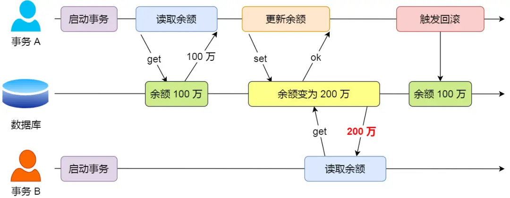

由于事务 A 随时可能回滚，如果发生回滚，事务 B 刚才得到的数据就是过期数据，这种现象就被称为脏读。

### 不可重复读

在一个事务内多次读取同一个数据，如果出现前后两次读到的数据不一样，就意味着发生了「不可重复读」。

假设有事务 A 和事务 B 同时处理：事务 A 先读取小林的余额数据，然后继续执行逻辑处理。在此期间，事务 B 更新了这条数据并提交了事务。当事务 A 再次读取该数据时，会发现前后两次读到的数据不一致，这种现象就被称为不可重复读。

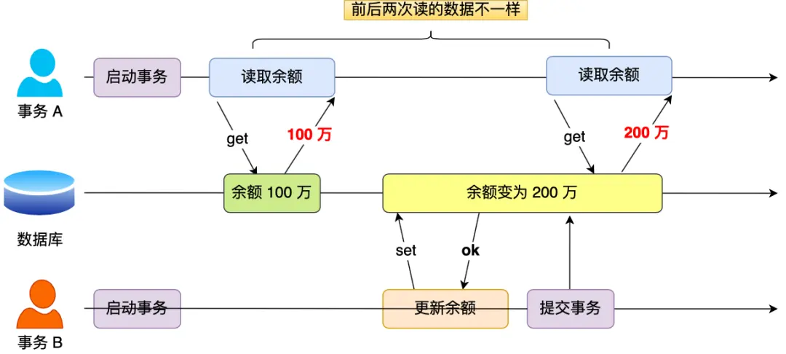


### 幻读

在一个事务内多次查询某个符合查询条件的「记录数量」，如果出现前后两次查询到的记录数量不一样，就意味着发生了「幻读」。

假设有事务 A 和事务 B 同时处理：事务 A 查询账户余额大于 100 万的记录，发现共 5 条；事务 B 按相同条件也查询出 5 条记录。

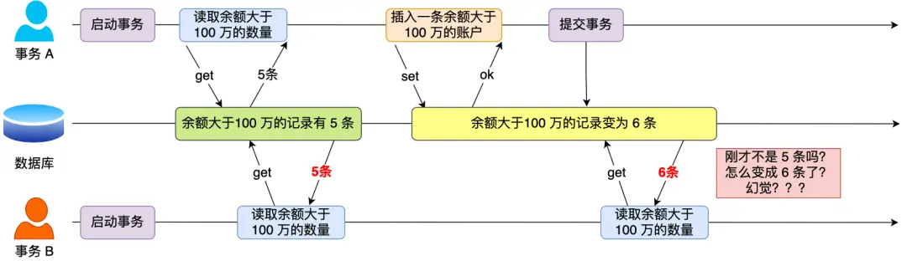

接下来，事务 A 插入了一条余额超过 100 万的账号并提交事务，此时数据库中超过 100 万余额的账号个数变为 6。事务 B 再次查询账户余额大于 100 万的记录，发现有 6 条，和前一次查询结果不一致，就像发生了幻觉一样，这种现象就被称为幻读。


## 事务的隔离级别

这三个现象的严重性排序如下：


SQL 标准提出了四种隔离级别来规避这些现象，隔离级别越高，性能效率就越低：

| 隔离级别 | 说明 |
|----------|------|
| 读未提交（Read Uncommitted） | 一个事务还没提交时，它做的变更就能被其他事务看到 |
| 读提交（Read Committed） | 一个事务提交之后，它做的变更才能被其他事务看到 |
| 可重复读（Repeatable Read） | 事务执行过程中看到的数据，一直跟事务启动时看到的数据一致。MySQL InnoDB 引擎的默认隔离级别 |
| 串行化（Serializable） | 对记录加上读写锁，多个事务对同一条记录进行读写操作时，后访问的事务必须等前一个事务执行完成才能继续 |

按隔离水平高低排序如下：


针对不同的隔离级别，并发事务时可能发生的现象也不同：

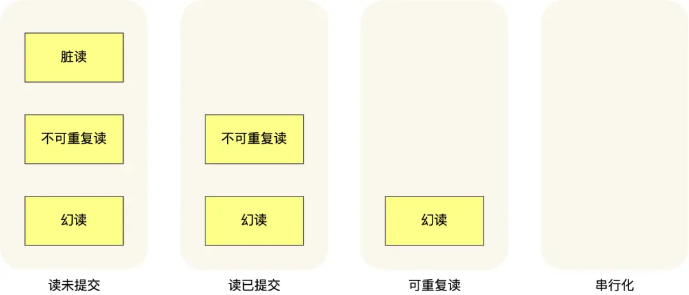

| 隔离级别 | 脏读 | 不可重复读 | 幻读 |
|----------|------|------------|------|
| 读未提交 | 可能发生 | 可能发生 | 可能发生 |
| 读提交 | 不可能 | 可能发生 | 可能发生 |
| 可重复读 | 不可能 | 不可能 | 可能发生 |
| 串行化 | 不可能 | 不可能 | 不可能 |

MySQL 在「可重复读」隔离级别下，可以很大程度上避免幻读现象的发生（注意是很大程度避免，并非彻底避免）。因此 MySQL 并不会使用「串行化」隔离级别来避免幻读，因为串行化会影响性能。


### 可重复读下如何解决幻读

- **快照读**（普通 `SELECT` 语句）：通过 MVCC 方式解决幻读。在可重复读隔离级别下，事务执行过程中看到的数据一直跟事务启动时看到的数据一致，即使中途有其他事务插入了数据，也查询不出来，从而避免了幻读。

- **当前读**（`SELECT ... FOR UPDATE` 等语句）：通过 next-key lock（记录锁 + 间隙锁）解决幻读。执行 `SELECT ... FOR UPDATE` 时会加上 next-key lock，如果有其他事务在锁范围内插入记录，插入语句会被阻塞，从而避免了幻读。

**但混合使用快照读和当前读仍可能出现幻读**，因为两种读取方式作用在不同层级：

```sql
-- 事务 A
BEGIN;
SELECT * FROM user WHERE age = 18;  -- 快照读，结果：0 条

-- 事务 B
INSERT INTO user(id, age, name) VALUES(1, 18, 'tom');
COMMIT;

-- 事务 A
UPDATE user SET name = 'changed' WHERE age = 18;  -- 当前读，可能影响 1 行
```

前面 `SELECT` 看不到 `age = 18` 的记录，后面的 `UPDATE` 却更新到了这条新插入的记录——因为 `SELECT` 是快照读，`UPDATE` 是当前读。

### 四种隔离级别的具体示例

有一张账户余额表，里面有一条账户余额为 100 万的记录。两个并发事务：事务 A 只负责查询余额，事务 B 将余额改成 200 万。按时间顺序执行如下：

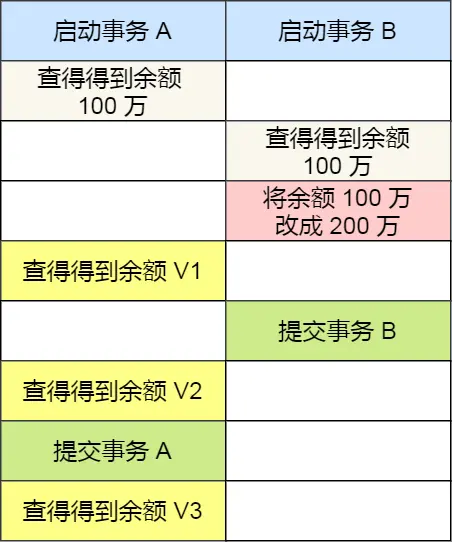

- **读未提交**：事务 B 修改余额后，虽然没有提交事务，但此时的余额已经可以被事务 A 看见。事务 A 中余额 V1 查询的值是 200 万，V2、V3 自然也是 200 万。

- **读提交**：事务 B 修改余额后，因为没有提交事务，事务 A 中余额 V1 的值还是 100 万。等事务 B 提交后，最新的余额数据才能被事务 A 看见，因此 V2、V3 都是 200 万。

- **可重复读**：事务 A 只能看见启动事务时的数据，余额 V1、V2 的值都是 100 万。当事务 A 提交事务后，才能看见最新的余额数据，所以 V3 的值是 200 万。

- **串行化**：事务 B 在执行将余额 100 万修改为 200 万时，由于此前事务 A 执行了读操作，发生了读写冲突，事务 B 会被锁住，直到事务 A 提交后才能继续执行。从 A 的角度看，余额 V1、V2 的值是 100 万，V3 的值是 200 万。


## Read View

Read View 是 MVCC 实现的核心数据结构，用于判断事务对记录的可见性。

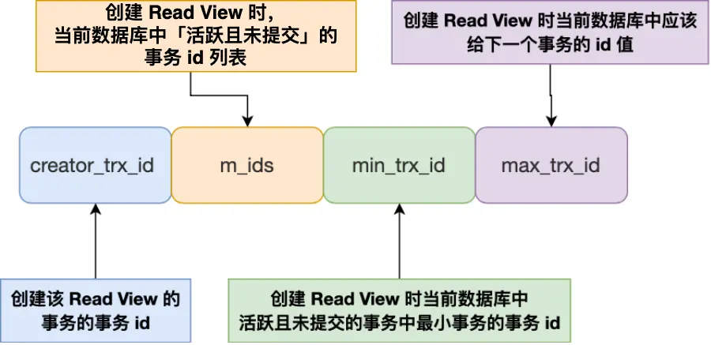

当 SQL 执行快照读时就会产生 Read View，如 `SELECT * FROM user WHERE id = 1`。普通的写操作不会产生 Read View，如：

```sql
BEGIN;
UPDATE user SET age = 20 WHERE id = 1;
COMMIT;
```

### Read View 的四个字段

| 字段 | 说明 |
|------|------|
| m_ids | 创建 Read View 时，当前数据库中「活跃事务」的事务 ID 列表（不包括创建该 Read View 的事务自身） |
| min_trx_id | 创建 Read View 时，当前活跃事务中事务 ID 的最小值，即 m_ids 的最小值 |
| max_trx_id | 创建 Read View 时，下一个将要分配给新事务的事务 ID 值（全局事务 ID 计数器的当前值） |
| creator_trx_id | 创建该 Read View 的事务的事务 ID |

事务 ID 按时间严格递增。

### 聚簇索引的两个隐藏列

假设在账户余额表插入一条小林余额为 100 万的记录，该记录的示意图如下：

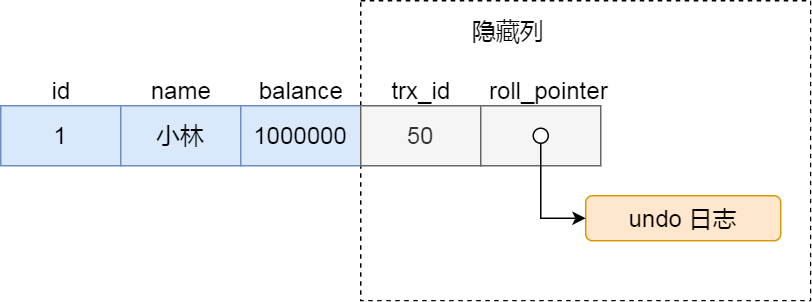

InnoDB 存储引擎的聚簇索引记录中包含两个隐藏列：

- **trx_id**：当一个事务对某条聚簇索引记录进行改动时，会把该事务的事务 ID 记录在 trx_id 隐藏列里。
- **roll_pointer**：每次对某条聚簇索引记录进行改动时，都会把旧版本的记录写入到 undo log 中，这个隐藏列是指针，指向每一个旧版本记录，可以通过它找到修改前的记录。

### 可见性判断规则

在创建 Read View 后，可以根据记录中的 trx_id 划分为三种情况：

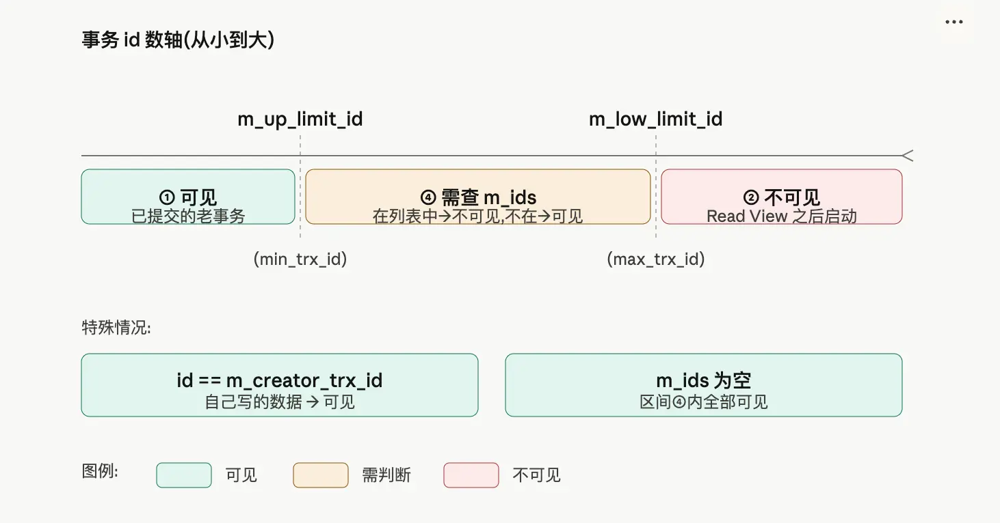

一个事务访问记录时，除了「自己的更新记录总是可见」（即 `trx_id == creator_trx_id` 时可见）之外，还有以下情况：

1. **trx_id < min_trx_id**：该版本由「创建 Read View 之前就已提交的事务」生成，对当前事务**可见**。

2. **trx_id >= max_trx_id**：该版本由「创建 Read View 之后才启动的事务」生成，对当前事务**不可见**。

3. **min_trx_id <= trx_id < max_trx_id**：该事务 ID 在 Read View 创建之前已分配，需要进一步判断 trx_id 是否在 m_ids 列表中：
   - **trx_id 在 m_ids 中**：生成该版本的事务在创建 Read View 时仍然活跃（尚未提交），对当前事务**不可见**。
   - **trx_id 不在 m_ids 中**：该事务虽然 ID 已分配，但在创建 Read View 时已经提交，对当前事务**可见**。

**这种通过「版本链」来控制并发事务访问同一个记录时的行为就叫 MVCC（多版本并发控制）。**

以下是可见性规则与 InnoDB 源码分支的对应关系：

| 规则描述 | 源码判断 |
|----------|----------|
| trx_id == creator_trx_id → 可见 | id == m_creator_trx_id → return true |
| trx_id < min_trx_id → 可见 | id < m_up_limit_id → return true |
| trx_id >= max_trx_id → 不可见 | id >= m_low_limit_id → return false |
| 在区间内且在 m_ids 中 → 不可见 | binary_search(...) 命中 → return false |
| 在区间内但不在 m_ids 中 → 可见 | binary_search(...) 未命中 → return true |


## 可重复读是如何工作的？

可重复读隔离级别在启动事务时生成一个 Read View，然后整个事务期间都使用这个 Read View。

### 启动事务

假设在此之前，已经有一个事务 ID 为 50 的事务完成了对记录的插入并提交。随后事务 A（事务 ID 为 51）启动，紧接着事务 B（事务 ID 为 52）也启动了，两个事务创建的 Read View 如下：

**事务 A 的 Read View（事务 ID 为 51）：**

| 字段 | 值 | 说明 |
|------|-----|------|
| creator_trx_id | 51 | - |
| m_ids | [] | 空列表（A 是当前唯一的活跃事务，且不含自身） |
| min_trx_id | 52 | m_ids 为空时，等于 max_trx_id |
| max_trx_id | 52 | 下一个将要分配的事务 ID |

**事务 B 的 Read View（事务 ID 为 52）：**

| 字段 | 值 | 说明 |
|------|-----|------|
| creator_trx_id | 52 | - |
| m_ids | [51] | 只包含 A，不含 B 自身 |
| min_trx_id | 51 | m_ids 的最小值 |
| max_trx_id | 53 | 下一个将要分配的事务 ID |

接着，在可重复读隔离级别下，事务 A 和事务 B 按顺序执行了以下操作：

1. 事务 B 读取小林的账户余额记录，读到余额是 100 万
2. 事务 A 将小林的账户余额记录修改成 200 万，并没有提交事务
3. 事务 B 读取小林的账户余额记录，读到余额还是 100 万
4. 事务 A 提交事务
5. 事务 B 读取小林的账户余额记录，读到余额依然还是 100 万

### 第一次读：事务 B 首次读取记录

事务 B 第一次读取小林的账户余额记录，找到记录后先看这条记录的 trx_id。此时发现 trx_id 为 50，比事务 B 的 Read View 中的 min_trx_id（51）还小，根据可见性规则，这意味着修改这条记录的事务早在事务 B 启动前就已提交，所以该版本对事务 B 可见，读到余额为 100 万。

### 事务 A 修改记录，形成版本链

接着，事务 A 通过 `UPDATE` 语句将这条记录修改（还未提交事务），将小林的余额改成 200 万。MySQL 会记录相应的 undo log，并以链表的方式串联起来，形成版本链：

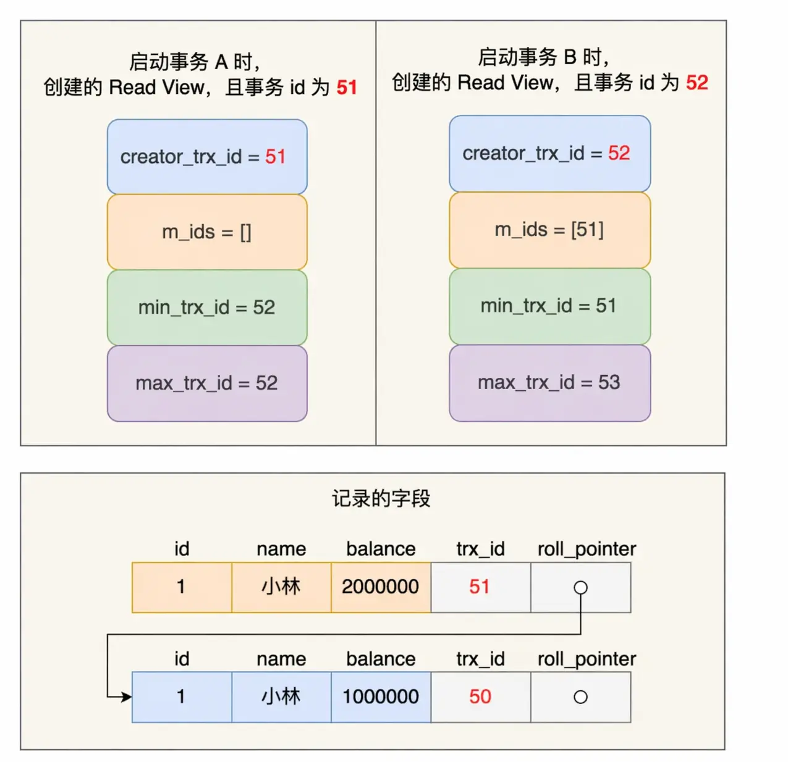

由于事务 A 修改了该记录，以前的记录变成旧版本记录，最新记录和旧版本记录通过 roll_pointer 以链表的方式串起来，最新记录的 trx_id 是事务 A 的事务 ID（trx_id = 51）。

### 第二次读：事务 B 再次读取记录（事务 A 未提交）

事务 B 第二次读取该记录，发现 trx_id 为 51。对照事务 B 的 Read View：

- trx_id（51）不小于 min_trx_id（51），不满足「直接可见」的条件
- trx_id（51）小于 max_trx_id（53），落在 [min_trx_id, max_trx_id) 区间内
- 需要判断 trx_id 是否在 m_ids = [51] 中——结果是在的

这说明这条记录是由事务 B 的 Read View 创建时仍然活跃的事务（即事务 A）修改的，对事务 B **不可见**。于是事务 B 沿着 roll_pointer 指向的 undo log 链条往下找旧版本记录，直到找到 trx_id 小于 min_trx_id 的第一条记录。

沿着链条往下一条是 trx_id = 50 的旧版本，满足 50 < min_trx_id（51），所以事务 B 读取到的是这条旧版本，余额为 100 万。

### 第三次读：事务 B 再次读取记录（事务 A 已提交）

当事务 A 提交事务后，由于隔离级别是「可重复读」，事务 B 再次读取记录时，依然使用启动事务时创建的那个 Read View 来判断可见性。这个 Read View 在事务 B 的整个生命周期内都不会变。

因此即使事务 A 已经把小林余额改成 200 万并提交，事务 B 的 Read View 里 m_ids 依然记录着 [51]，这条最新版本的 trx_id = 51 依旧会被判为不可见，依然会沿着 undo log 往下读到 trx_id = 50 的旧版本。

所以事务 B 第三次读取记录时，读到的仍然是小林余额为 100 万的记录。

通过这种方式，实现了在「可重复读」隔离级别下，事务期间读到的记录始终是事务启动前已提交的版本。

## 读提交是如何工作的？

**读提交隔离级别在每次读取数据时，都会生成一个新的 Read View**。

这意味着事务期间多次读取同一条数据，前后两次读的数据可能会出现不一致，因为可能这期间另外一个事务修改了该记录并提交了事务。

还是以前面的例子来说明。假设事务 A（事务 ID 为 51）启动后，紧接着事务 B（事务 ID 为 52）也启动了，按顺序执行以下操作：

1. 事务 B 读取数据（创建 Read View），小林的账户余额为 100 万
2. 事务 A 修改数据（还没提交事务），将小林的账户余额从 100 万修改成 200 万
3. 事务 B 读取数据（创建 Read View），小林的账户余额为 100 万
4. 事务 A 提交事务
5. 事务 B 读取数据（创建 Read View），小林的账户余额为 200 万

### 第一步：事务 B 读取数据

创建的 Read View（此时 A 未提交，仍活跃）：

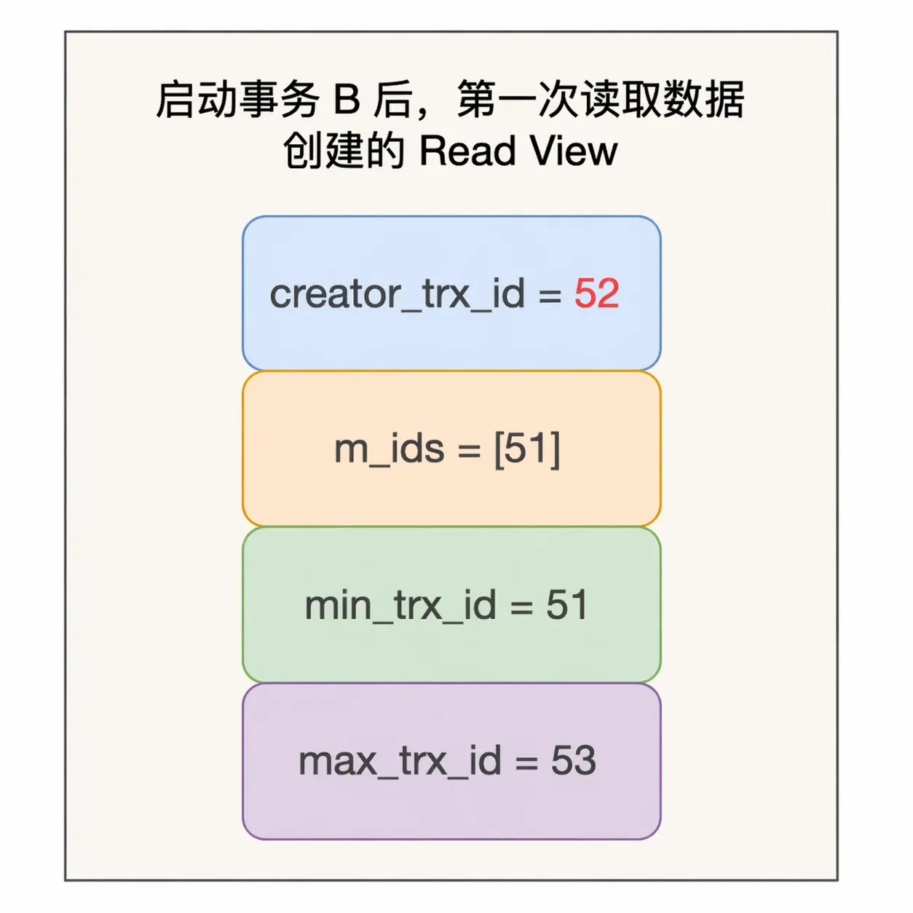

### 第二步：事务 A 修改数据（还未提交）

形成版本链：

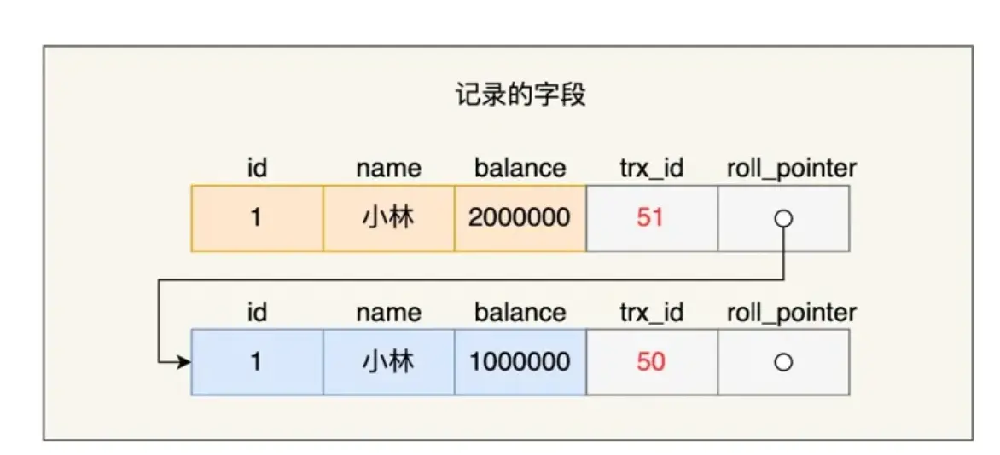

### 第三步：事务 B 再次读取数据

创建的 Read View（此时 A 仍未提交，仍活跃，所以这个 Read View 和第一步完全一样）：

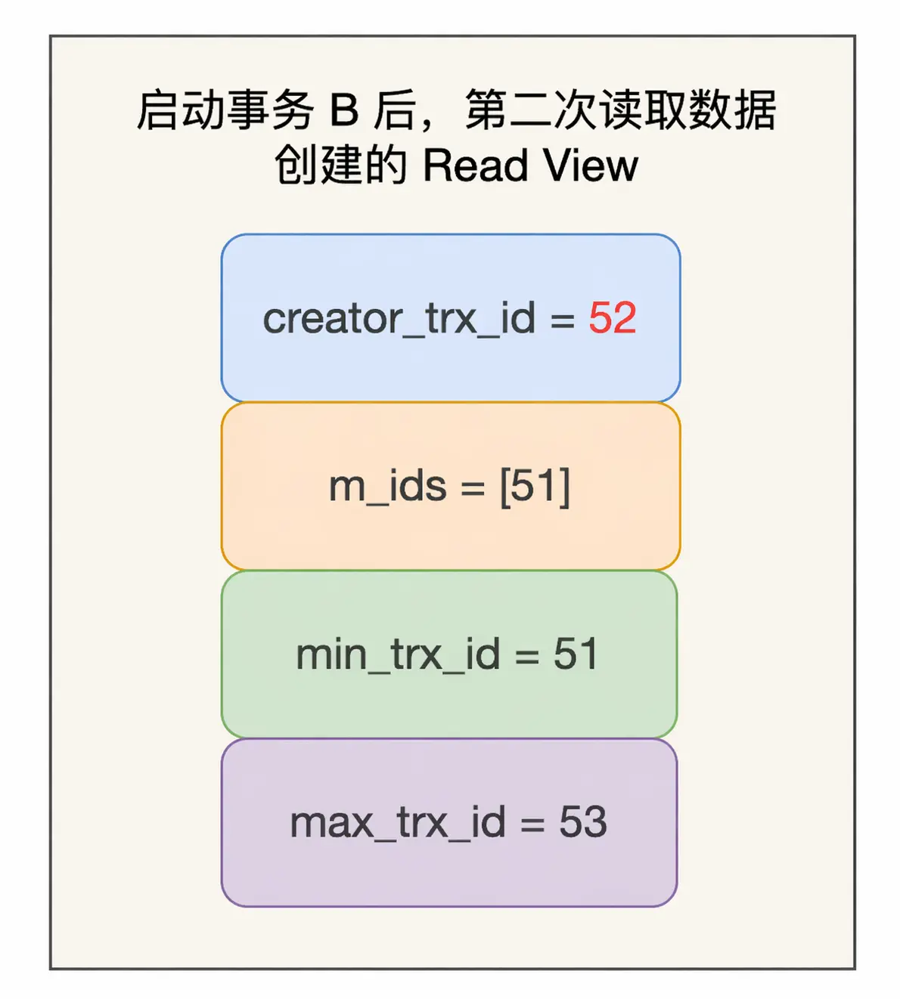

事务 B 找到小林这条记录时，会看 trx_id 是 51。对照新创建的 Read View：

- trx_id（51）不小于 min_trx_id（51），不满足「直接可见」
- trx_id（51）小于 max_trx_id（53），落在 [min_trx_id, max_trx_id) 区间内
- 需要判断 trx_id 是否在 m_ids 范围内——结果是在的

说明这条记录是被还未提交的事务修改的，事务 B 不会读取这个版本。于是沿着 undo log 链条往下找旧版本记录，直到找到 trx_id 小于 min_trx_id 的第一条记录，所以事务 B 读取到的是 trx_id 为 50 的记录，余额为 100 万。

### 第四步：事务 A 提交后，事务 B 再次读取

由于隔离级别是「读提交」，事务 B 每次读数据时会重新创建 Read View。此时事务 A 已经提交，不再是活跃事务，不会再出现在 m_ids 里。事务 B 第三次读取数据时创建的 Read View 如下：

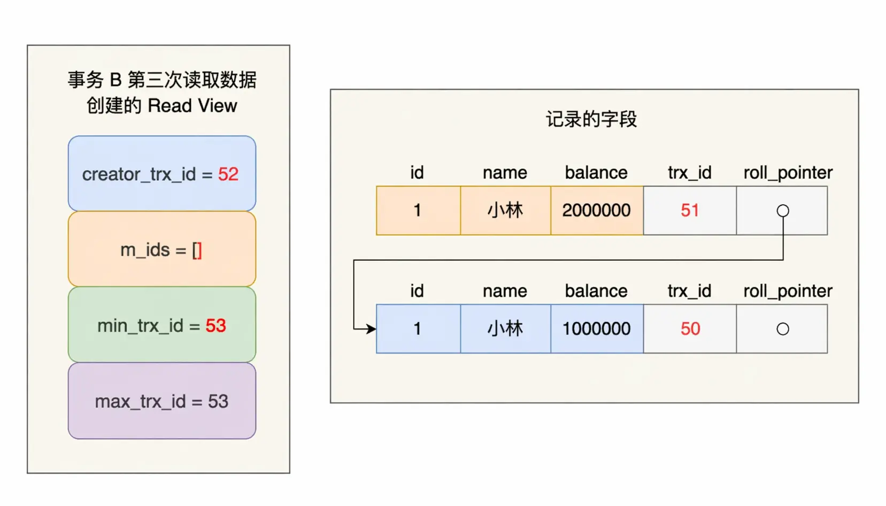

事务 B 找到小林这条记录时，发现 trx_id 是 51，比 Read View 中的 min_trx_id（53）还小，说明修改这条记录的事务早已在创建 Read View 前提交过了，该版本对事务 B **可见**。因此事务 B 能读到最新版本，余额为 200 万。

正是因为读提交隔离级别下事务每次读数据时都重新创建 Read View，所以事务期间多次读取同一条数据可能会出现不一致。

## 总结

事务在 MySQL 引擎层实现，InnoDB 引擎支持事务，其四大特性为原子性、一致性、隔离性、持久性，本文重点讲解的是隔离性。

当多个事务并发执行时，会引发脏读、不可重复读、幻读等问题。为避免这些问题，SQL 标准提出了四种隔离级别：读未提交、读提交、可重复读、串行化，从左往右隔离级别递增，隔离级别越高性能越差。InnoDB 引擎的默认隔离级别是可重复读。

- 要解决脏读，需将隔离级别升级到读提交及以上
- 要解决不可重复读，需将隔离级别升级到可重复读及以上

对于幻读，不建议升级为串行化（会导致并发性能很差）。MySQL InnoDB 在「可重复读」隔离级别下很大程度上避免了幻读（并非完全解决），方案有两种：

- **快照读**（普通 `SELECT` 语句）：通过 MVCC 解决幻读。可重复读隔离级别下，事务看到的数据始终与事务启动时一致，即使中途有其他事务插入数据也查询不出来。
- **当前读**（`SELECT ... FOR UPDATE` 等语句）：通过 next-key lock（记录锁 + 间隙锁）解决幻读。执行时会加 next-key lock，其他事务在锁范围内插入记录会被阻塞。

对于「读提交」和「可重复读」隔离级别，它们通过 Read View 来实现，区别在于创建 Read View 的时机不同：

- **读提交**：每次 `SELECT` 都会生成一个新的 Read View，因此事务期间多次读取同一条数据可能不一致。
- **可重复读**：启动事务时生成一个 Read View，整个事务期间都使用这个 Read View，保证事务期间读到的数据都是事务启动前的记录。

这两个隔离级别的实现，是通过 Read View 的字段与记录中两个隐藏列的比对来控制并发事务访问同一记录的行为，这就是 MVCC（多版本并发控制）。

在可重复读隔离级别中，普通 `SELECT` 语句是基于 MVCC 实现的快照读，不会加锁。而 `SELECT ... FOR UPDATE` 是当前读，每次读取最新版本的数据，并对读到的记录加上 next-key lock。
